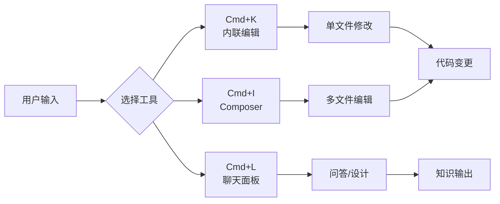
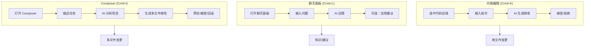
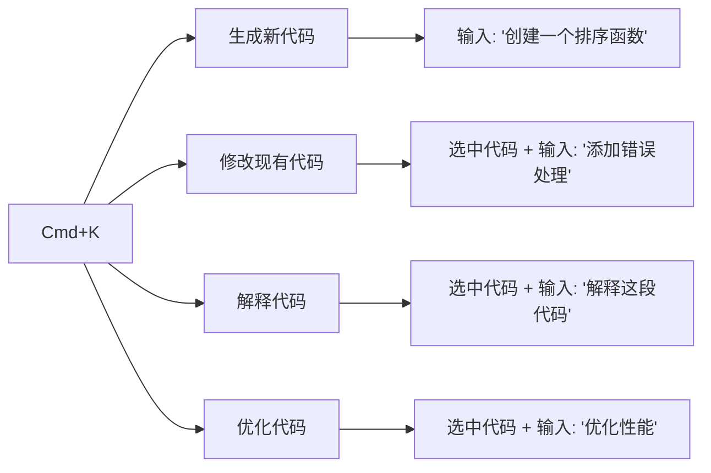
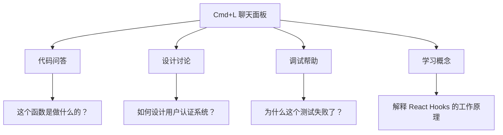
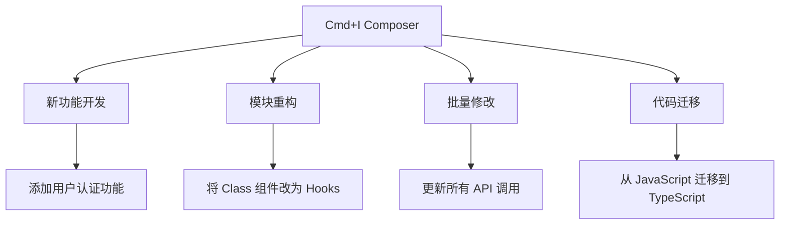
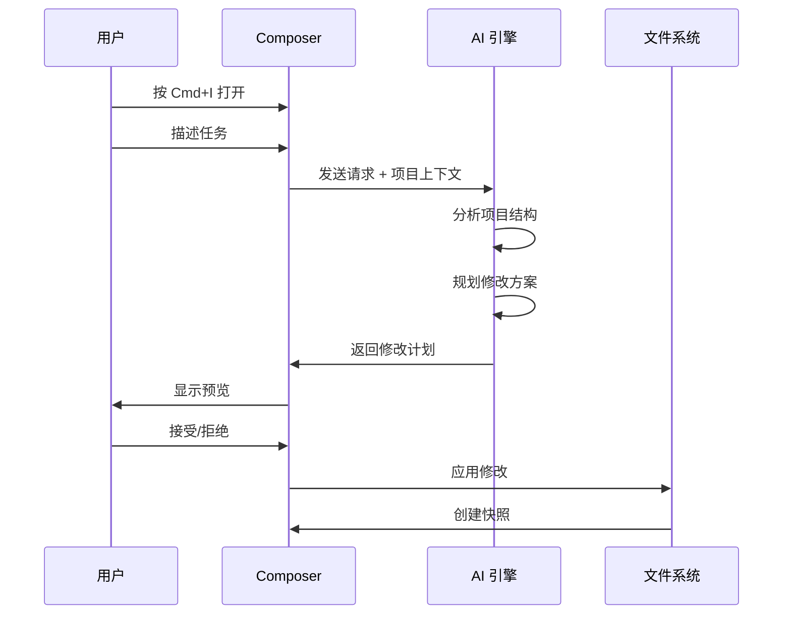
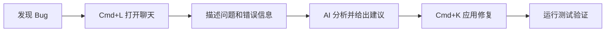

# 01. 快捷键

> **级别：** 初学者 | **时间：** 30 分钟 | **前置条件：** 已安装 Cursor

---

## 目录

- [概述](#概述)
- [核心快捷键](#核心快捷键)
- [工作机制](#工作机制)
- [内联编辑 (Cmd+K)](#内联编辑-cmdk)
- [聊天面板 (Cmd+L)](#聊天面板-cmdl)
- [Composer (Cmd+I)](#composer-cmdi)
- [其他重要快捷键](#其他重要快捷键)
- [实战示例](#实战示例)
- [最佳实践](#最佳实践)
- [故障排查](#故障排查)

---

## 概述

Cursor 的快捷键是你与 AI 交互的主要入口。掌握这三个核心快捷键，你已经解锁了 Cursor 80% 的能力：



---

## 核心快捷键

| 快捷键 | Mac | Windows | 功能 | 适用场景 |
|--------|-----|---------|------|----------|
| **内联编辑** | `Cmd+K` | `Ctrl+K` | 行内代码生成/修改 | 单文件快速编辑 |
| **聊天面板** | `Cmd+L` | `Ctrl+L` | AI 对话问答 | 设计讨论、调试思路 |
| **Composer** | `Cmd+I` | `Ctrl+I` | 多文件编辑模式 | 功能开发、模块重构 |
| **命令面板** | `Cmd+Shift+P` | `Ctrl+Shift+P` | 快速命令访问 | 执行各种命令 |
| **设置** | `Cmd+,` | `Ctrl+,` | 打开设置 | 配置 Cursor |

---

## 工作机制

### 内联编辑 vs 聊天 vs Composer



| 特性 | 内联编辑 | 聊天 | Composer |
|------|----------|------|----------|
| **文件范围** | 当前文件 | 可引用多文件 | 自动识别多文件 |
| **修改能力** | 直接修改 | 不修改（除非应用）| 直接修改多文件 |
| **上下文理解** | 有限 | 强 | 最强 |
| **适用场景** | 快速修复、优化 | 设计讨论、调试 | 功能开发、重构 |
| **可回滚性** | Git | N/A | 内置快照 |

---

## 内联编辑 (Cmd+K)

### 基本用法

1. **选中代码**（可选）或光标定位
2. 按 `Cmd+K`（Mac）或 `Ctrl+K`（Windows）
3. 输入你的指令
4. 预览生成的代码
5. 按 `Tab` 接受或 `Esc` 拒绝

### 使用场景



### 实战示例

#### 示例 1：生成新函数

```typescript
// 光标位置，按 Cmd+K
// 输入: "创建一个验证邮箱格式的函数"

// 生成的代码：
function validateEmail(email: string): boolean {
  const emailRegex = /^[^\s@]+@[^\s@]+\.[^\s@]+$/;
  return emailRegex.test(email);
}
```

#### 示例 2：修改现有代码

```typescript
// 选中这段代码，按 Cmd+K
// 输入: "添加参数验证和错误处理"

async function fetchUser(id: string) {
  const response = await fetch(`/api/users/${id}`);
  return response.json();
}

// 生成的代码：
async function fetchUser(id: string): Promise<User> {
  if (!id || typeof id !== 'string') {
    throw new Error('Invalid user ID');
  }
  
  try {
    const response = await fetch(`/api/users/${id}`);
    if (!response.ok) {
      throw new Error(`HTTP error! status: ${response.status}`);
    }
    return response.json();
  } catch (error) {
    console.error('Failed to fetch user:', error);
    throw error;
  }
}
```

#### 示例 3：代码解释

```typescript
// 选中复杂代码，按 Cmd+K
// 输入: "解释这段代码的工作原理"

// AI 会生成详细解释
```

### 内联编辑技巧

| 技巧 | 描述 | 示例 |
|------|------|------|
| **明确目标** | 清晰描述你想要什么 | "添加 TypeScript 类型" 而不是 "修改这个" |
| **提供上下文** | 说明用途和约束 | "用于 React 组件，需要处理空值" |
| **指定风格** | 参考项目风格 | "使用项目中的错误处理模式" |
| **迭代优化** | 不满意就继续对话 | "添加日志记录" → "也添加性能监控" |

---

## 聊天面板 (Cmd+L)

### 基本用法

1. 按 `Cmd+L`（Mac）或 `Ctrl+L`（Windows）
2. 在聊天面板中输入问题
3. AI 会基于项目上下文回答
4. 可以引用文件、代码片段

### 使用场景



### 引用文件和代码

在聊天中，你可以：

- **引用文件**：输入 `@` 后选择文件
- **引用代码**：选中代码后，聊天面板会自动引用
- **引用符号**：输入 `#` 后选择函数/类/变量

### 实战示例

#### 示例 1：代码问答

```
用户: @src/utils/auth.ts 这个文件中的 validateToken 函数有什么问题？

AI: 分析 validateToken 函数后，我发现以下潜在问题：

1. 没有处理 token 为 null 或 undefined 的情况
2. 过期时间检查使用了不安全的比较
3. 缺少类型定义

建议修改：
[提供具体代码建议]
```

#### 示例 2：设计讨论

```
用户: 我需要为这个项目添加多语言支持，应该怎么做？

AI: 基于你的项目结构（Next.js + TypeScript），我建议：

1. 使用 next-intl 库
2. 创建语言资源文件
3. 配置中间件处理语言切换

详细步骤：
[提供完整实现方案]
```

#### 示例 3：调试帮助

```
用户: @src/tests/user.test.ts 这个测试失败了，错误是 "Expected true, received false"

AI: 分析测试代码后，问题可能出在：

1. Mock 数据没有正确设置
2. 异步操作没有正确等待
3. 测试环境变量未配置

建议修复：
[提供修复代码]
```

### 聊天技巧

| 技巧 | 描述 |
|------|------|
| **提供上下文** | 引用相关文件和代码 |
| **具体问题** | 问具体问题而非模糊描述 |
| **追问** | 不满意就继续追问 |
| **应用建议** | 可以让 AI 直接应用建议到代码 |

---

## Composer (Cmd+I)

### 基本用法

1. 按 `Cmd+I`（Mac）或 `Ctrl+I`（Windows）
2. 描述你想要实现的功能
3. AI 会分析项目并生成多文件修改
4. 预览变更，接受或回滚

### 使用场景



### Composer 工作流程



### 实战示例

#### 示例 1：添加新功能

```
输入: "为用户管理模块添加搜索和过滤功能"

Composer 会：
1. 分析现有用户管理代码
2. 创建搜索组件
3. 添加过滤逻辑
4. 更新相关类型定义
5. 添加测试文件
```

#### 示例 2：重构模块

```
输入: "将 src/components 下的 Class 组件重构为 Hooks"

Composer 会：
1. 扫描所有 Class 组件
2. 转换为函数组件
3. 替换生命周期方法
4. 更新导入语句
```

### Composer 最佳实践

| 实践 | 描述 |
|------|------|
| **拆分大任务** | 每次修改 2-4 个文件 |
| **明确描述** | 指定文件路径和具体需求 |
| **验证后接受** | 运行测试后再接受修改 |
| **使用快照** | 出错时立即回滚 |

---

## 其他重要快捷键

### 导航快捷键

| 快捷键 | Mac | Windows | 功能 |
|--------|-----|---------|------|
| 快速打开文件 | `Cmd+P` | `Ctrl+P` | 模糊搜索文件 |
| 跳转到符号 | `Cmd+Shift+O` | `Ctrl+Shift+O` | 搜索函数/类 |
| 跳转到定义 | `F12` | `F12` | 跳转到定义 |
| 查找引用 | `Shift+F12` | `Shift+F12` | 查找所有引用 |

### 编辑快捷键

| 快捷键 | Mac | Windows | 功能 |
|--------|-----|---------|------|
| 多光标 | `Option+Click` | `Alt+Click` | 添加多个光标 |
| 选中下一个相同词 | `Cmd+D` | `Ctrl+D` | 多处同时编辑 |
| 格式化代码 | `Shift+Option+F` | `Shift+Alt+F` | 格式化当前文件 |
| 注释切换 | `Cmd+/` | `Ctrl+/` | 切换注释 |

### AI 相关快捷键

| 快捷键 | Mac | Windows | 功能 |
|--------|-----|---------|------|
| 接受建议 | `Tab` | `Tab` | 接受 AI 建议 |
| 拒绝建议 | `Esc` | `Esc` | 拒绝 AI 建议 |
| 下一个建议 | `Option+]` | `Alt+]` | 查看下一个建议 |
| 上一个建议 | `Option+[` | `Alt+[` | 查看上一个建议 |
| 解释代码 | `Cmd+K` → "解释" | `Ctrl+K` → "解释" | 解释选中代码 |

---

## 实战示例

### 场景 1：快速修复 Bug



### 场景 2：添加新功能


### 场景 3：代码优化


---

## 最佳实践

### ✅ 应该做的

1. **明确描述目标** - "添加错误处理" 比 "修改这个" 更好
2. **提供上下文** - 引用相关文件和代码
3. **迭代优化** - 不满意就继续对话
4. **验证后接受** - 运行测试后再接受修改
5. **使用快照** - Composer 的快照是你的安全网

### ❌ 不应该做的

1. **模糊描述** - "改一下这个" 没有帮助
2. **一次性大任务** - 拆分为小任务更可靠
3. **忽略验证** - 始终运行测试
4. **跳过预览** - 始终检查 AI 生成的代码

---

## 故障排查

### 快捷键不响应

1. 检查是否与其他应用冲突
2. 在设置中重新绑定快捷键
3. 重启 Cursor

### AI 生成质量差

1. 提供更多上下文
2. 引用相关文件
3. 使用更具体的描述
4. 检查项目 Rules 是否冲突

### Composer 修改错误文件

1. 在描述中明确指定文件路径
2. 检查项目结构是否清晰
3. 使用更精确的任务描述

---

## 下一步

- [02. 规则系统](../02-rules/) - 学习如何配置项目规则
- [03. 代码库索引](../03-codebase-indexing/) - 理解代码库索引机制
- [04. 聊天功能](../04-chat/) - 深入学习聊天功能

---

<p align="center">
  <a href="../README.md">返回首页</a> | <a href="shortcuts-cheatsheet.md">快捷键速查表</a>
</p>
