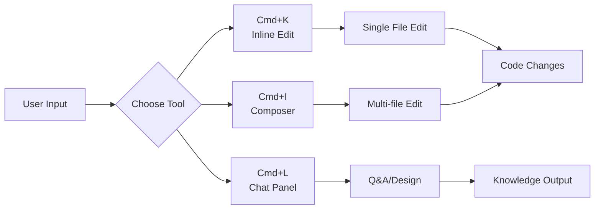
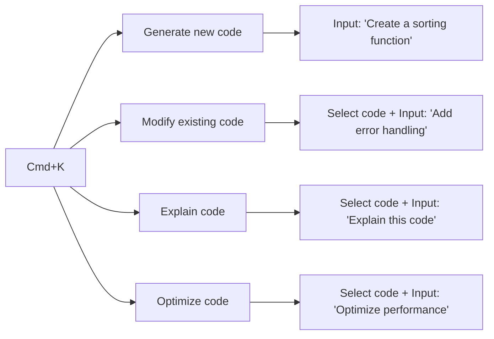
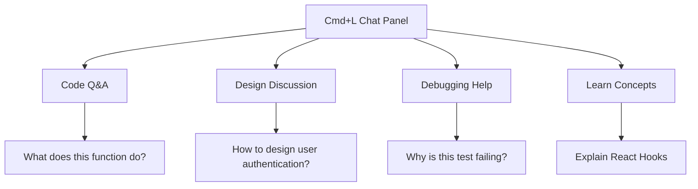
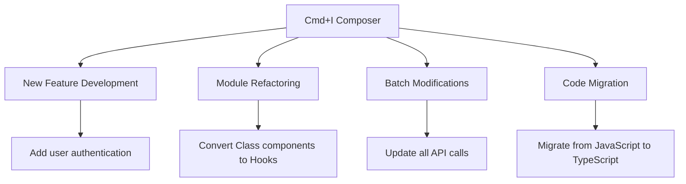
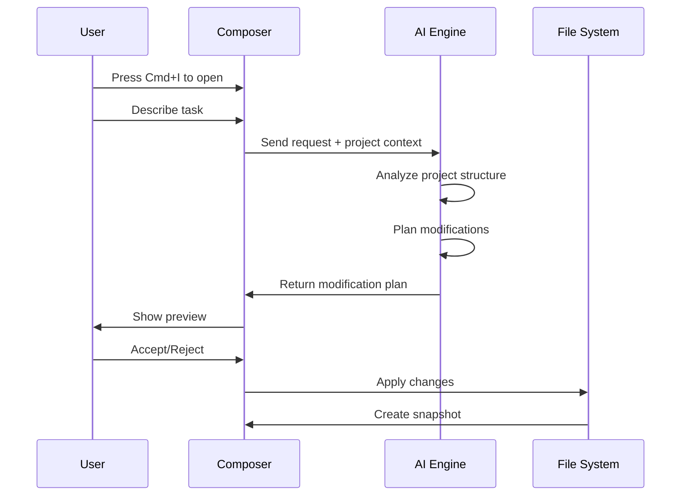
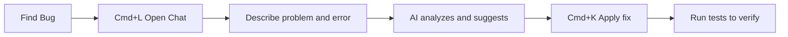
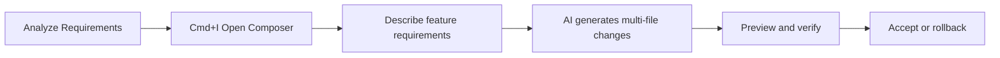
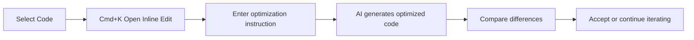

# 01. Shortcuts

> **Level:** Beginner | **Time:** 30 minutes | **Prerequisites:** Cursor installed

---

## Table of Contents

- [Overview](#overview)
- [Core Shortcuts](#core-shortcuts)
- [How They Work](#how-they-work)
- [Inline Edit (Cmd+K)](#inline-edit-cmdk)
- [Chat Panel (Cmd+L)](#chat-panel-cmdl)
- [Composer (Cmd+I)](#composer-cmdi)
- [Other Important Shortcuts](#other-important-shortcuts)
- [Practical Examples](#practical-examples)
- [Best Practices](#best-practices)
- [Troubleshooting](#troubleshooting)

---

## Overview

Cursor shortcuts are your primary entry point for AI interaction. Master these three core shortcuts and you've unlocked 80% of Cursor's capabilities:



---

## Core Shortcuts

| Shortcut | Mac | Windows | Function | Use Case |
|----------|-----|---------|----------|----------|
| **Inline Edit** | `Cmd+K` | `Ctrl+K` | Inline code generation/modification | Single file quick edits |
| **Chat Panel** | `Cmd+L` | `Ctrl+L` | AI Q&A dialogue | Design discussions, debugging |
| **Composer** | `Cmd+I` | `Ctrl+I` | Multi-file editing mode | Feature development, refactoring |
| **Command Palette** | `Cmd+Shift+P` | `Ctrl+Shift+P` | Quick command access | Execute various commands |
| **Settings** | `Cmd+,` | `Ctrl+,` | Open settings | Configure Cursor |

---

## How They Work

### Inline Edit vs Chat vs Composer

```mermaid
flowchart TB
    subgraph Inline["Inline Edit (Cmd+K)"]
        I1[Select code region] --> I2[Enter instruction]
        I2 --> I3[AI generates modification]
        I3 --> I4[Accept/Reject]
    end
    
    subgraph Chat["Chat Panel (Cmd+L)"]
        C1[Open chat panel] --> C2[Enter question]
        C2 --> C3[AI responds]
        C3 --> C4[Optional: Apply suggestion]
    end
    
    subgraph Composer["Composer (Cmd+I)"]
        CO1[Open Composer] --> CO2[Describe task]
        CO2 --> CO3[AI analyzes project]
        CO3 --> CO4[Generate multi-file changes]
        CO4 --> CO5[Preview/Accept/Rollback]
    end
    
    Inline --> Result1[Single file changes]
    Chat --> Result2[Knowledge/Suggestions]
    Composer --> Result3[Multi-file changes]
```



| Feature | Inline Edit | Chat | Composer |
|---------|-------------|------|----------|
| **File Scope** | Current file | Can reference multiple files | Auto-identifies multiple files |
| **Modification Ability** | Direct modification | Doesn't modify (unless applied) | Direct multi-file modification |
| **Context Understanding** | Limited | Strong | Strongest |
| **Use Case** | Quick fixes, optimization | Design discussions, debugging | Feature development, refactoring |
| **Rollback** | Git | N/A | Built-in snapshots |

---

## Inline Edit (Cmd+K)

### Basic Usage

1. **Select code** (optional) or position cursor
2. Press `Cmd+K` (Mac) or `Ctrl+K` (Windows)
3. Enter your instruction
4. Preview generated code
5. Press `Tab` to accept or `Esc` to reject

### Use Cases



### Practical Examples

#### Example 1: Generate New Function

```typescript
// Cursor position, press Cmd+K
// Input: "Create an email validation function"

// Generated code:
function validateEmail(email: string): boolean {
  const emailRegex = /^[^\s@]+@[^\s@]+\.[^\s@]+$/;
  return emailRegex.test(email);
}
```

#### Example 2: Modify Existing Code

```typescript
// Select this code, press Cmd+K
// Input: "Add parameter validation and error handling"

async function fetchUser(id: string) {
  const response = await fetch(`/api/users/${id}`);
  return response.json();
}

// Generated code:
async function fetchUser(id: string): Promise<User> {
  if (!id || typeof id !== 'string') {
    throw new Error('Invalid user ID');
  }
  
  try {
    const response = await fetch(`/api/users/${id}`);
    if (!response.ok) {
      throw new Error(`HTTP error! status: ${response.status}`);
    }
    return response.json();
  } catch (error) {
    console.error('Failed to fetch user:', error);
    throw error;
  }
}
```

#### Example 3: Code Explanation

```typescript
// Select complex code, press Cmd+K
// Input: "Explain how this code works"

// AI will generate detailed explanation
```

### Inline Edit Tips

| Tip | Description | Example |
|-----|-------------|---------|
| **Be Clear** | Clearly describe what you want | "Add TypeScript types" not "modify this" |
| **Provide Context** | Explain purpose and constraints | "For React component, handle null values" |
| **Specify Style** | Reference project style | "Use project's error handling pattern" |
| **Iterate** | Continue conversation if unsatisfied | "Add logging" → "Also add performance monitoring" |

---

## Chat Panel (Cmd+L)

### Basic Usage

1. Press `Cmd+L` (Mac) or `Ctrl+L` (Windows)
2. Enter question in chat panel
3. AI will respond based on project context
4. Can reference files, code snippets

### Use Cases



### Referencing Files and Code

In chat, you can:

- **Reference files**: Type `@` then select file
- **Reference code**: Select code, chat panel auto-references
- **Reference symbols**: Type `#` then select function/class/variable

### Practical Examples

#### Example 1: Code Q&A

```
User: @src/utils/auth.ts What's wrong with the validateToken function in this file?

AI: After analyzing the validateToken function, I found these potential issues:

1. Doesn't handle null or undefined tokens
2. Expiration time check uses unsafe comparison
3. Missing type definitions

Suggested fixes:
[Provides specific code suggestions]
```

#### Example 2: Design Discussion

```
User: I need to add multi-language support to this project. How should I do it?

AI: Based on your project structure (Next.js + TypeScript), I suggest:

1. Use next-intl library
2. Create language resource files
3. Configure middleware for language switching

Detailed steps:
[Provides complete implementation]
```

#### Example 3: Debugging Help

```
User: @src/tests/user.test.ts This test is failing with "Expected true, received false"

AI: After analyzing the test code, the issue might be:

1. Mock data not set correctly
2. Async operation not awaited properly
3. Test environment variables not configured

Suggested fix:
[Provides fix code]
```

### Chat Tips

| Tip | Description |
|-----|-------------|
| **Provide Context** | Reference relevant files and code |
| **Be Specific** | Ask specific questions, not vague descriptions |
| **Follow Up** | Continue asking if unsatisfied |
| **Apply Suggestions** | Can ask AI to apply suggestions directly to code |

---

## Composer (Cmd+I)

### Basic Usage

1. Press `Cmd+I` (Mac) or `Ctrl+I` (Windows)
2. Describe the feature you want to implement
3. AI analyzes project and generates multi-file changes
4. Preview changes, accept or rollback

### Use Cases



### Composer Workflow



### Practical Examples

#### Example 1: Add New Feature

```
Input: "Add search and filter functionality to user management module"

Composer will:
1. Analyze existing user management code
2. Create search component
3. Add filter logic
4. Update related type definitions
5. Add test files
```

#### Example 2: Refactor Module

```
Input: "Refactor Class components in src/components to Hooks"

Composer will:
1. Scan all Class components
2. Convert to functional components
3. Replace lifecycle methods
4. Update import statements
```

### Composer Best Practices

| Practice | Description |
|----------|-------------|
| **Split Large Tasks** | Modify 2-4 files per session |
| **Be Specific** | Specify file paths and exact requirements |
| **Verify Before Accepting** | Run tests before accepting changes |
| **Use Snapshots** | Rollback immediately if errors occur |

---

## Other Important Shortcuts

### Navigation Shortcuts

| Shortcut | Mac | Windows | Function |
|----------|-----|---------|----------|
| Quick Open File | `Cmd+P` | `Ctrl+P` | Fuzzy search files |
| Go to Symbol | `Cmd+Shift+O` | `Ctrl+Shift+O` | Search functions/classes |
| Go to Definition | `F12` | `F12` | Jump to definition |
| Find References | `Shift+F12` | `Shift+F12` | Find all references |

### Editing Shortcuts

| Shortcut | Mac | Windows | Function |
|----------|-----|---------|----------|
| Multi-cursor | `Option+Click` | `Alt+Click` | Add multiple cursors |
| Select Next Occurrence | `Cmd+D` | `Ctrl+D` | Edit multiple locations |
| Format Code | `Shift+Option+F` | `Shift+Alt+F` | Format current file |
| Toggle Comment | `Cmd+/` | `Ctrl+/` | Toggle comment |

### AI-Related Shortcuts

| Shortcut | Mac | Windows | Function |
|----------|-----|---------|----------|
| Accept Suggestion | `Tab` | `Tab` | Accept AI suggestion |
| Reject Suggestion | `Esc` | `Esc` | Reject AI suggestion |
| Next Suggestion | `Option+]` | `Alt+]` | View next suggestion |
| Previous Suggestion | `Option+[` | `Alt+[` | View previous suggestion |
| Explain Code | `Cmd+K` → "explain" | `Ctrl+K` → "explain" | Explain selected code |

---

## Practical Examples

### Scenario 1: Quick Bug Fix



### Scenario 2: Add New Feature



### Scenario 3: Code Optimization



---

## Best Practices

### ✅ Do's

1. **Be Clear About Goals** - "Add error handling" is better than "modify this"
2. **Provide Context** - Reference relevant files and code
3. **Iterate** - Continue conversation if unsatisfied
4. **Verify Before Accepting** - Run tests before accepting changes
5. **Use Snapshots** - Composer snapshots are your safety net

### ❌ Don'ts

1. **Vague Descriptions** - "Change this" doesn't help
2. **One Giant Task** - Split into smaller tasks for reliability
3. **Skip Verification** - Always run tests
4. **Skip Preview** - Always check AI-generated code

---

## Troubleshooting

### Shortcuts Not Responding

1. Check for conflicts with other applications
2. Rebind shortcuts in settings
3. Restart Cursor

### Poor AI Generation Quality

1. Provide more context
2. Reference relevant files
3. Use more specific descriptions
4. Check if project Rules conflict

### Composer Modifying Wrong Files

1. Specify file paths explicitly in description
2. Check if project structure is clear
3. Use more precise task description

---

## Next Steps

- [02. Rules System](../02-rules/) - Learn how to configure project rules
- [03. Codebase Indexing](../03-codebase-indexing/) - Understand codebase indexing
- [04. Chat](../04-chat/) - Deep dive into chat functionality

---

<p align="center">
  <a href="../README.md">Back to Home</a> | <a href="shortcuts-cheatsheet.md">Shortcuts Cheatsheet</a>
</p>
