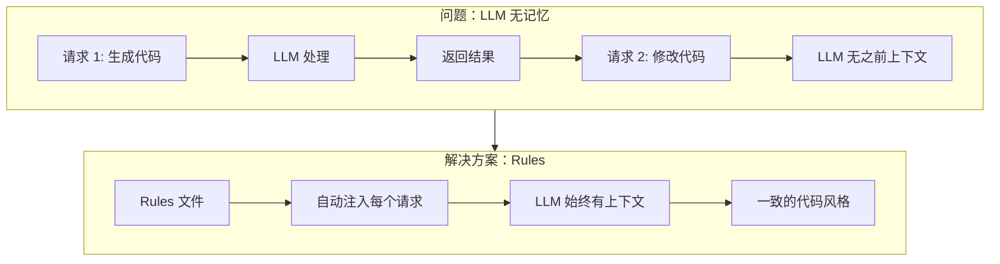
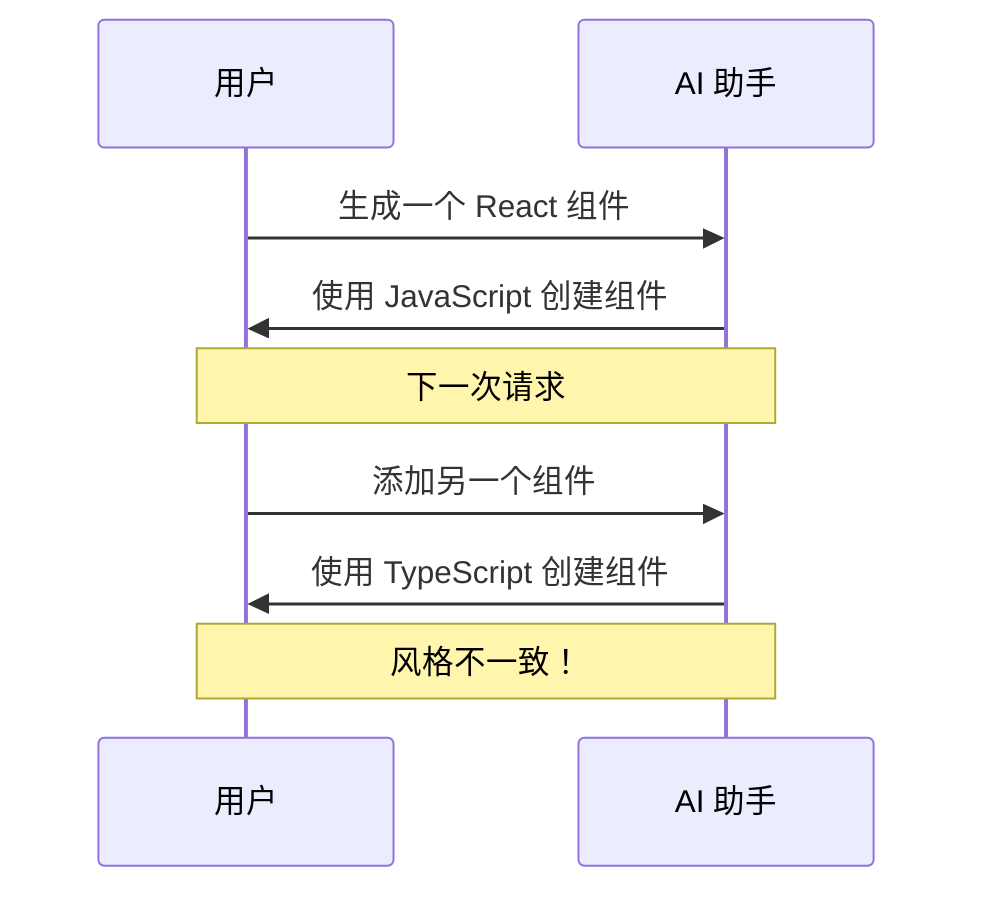
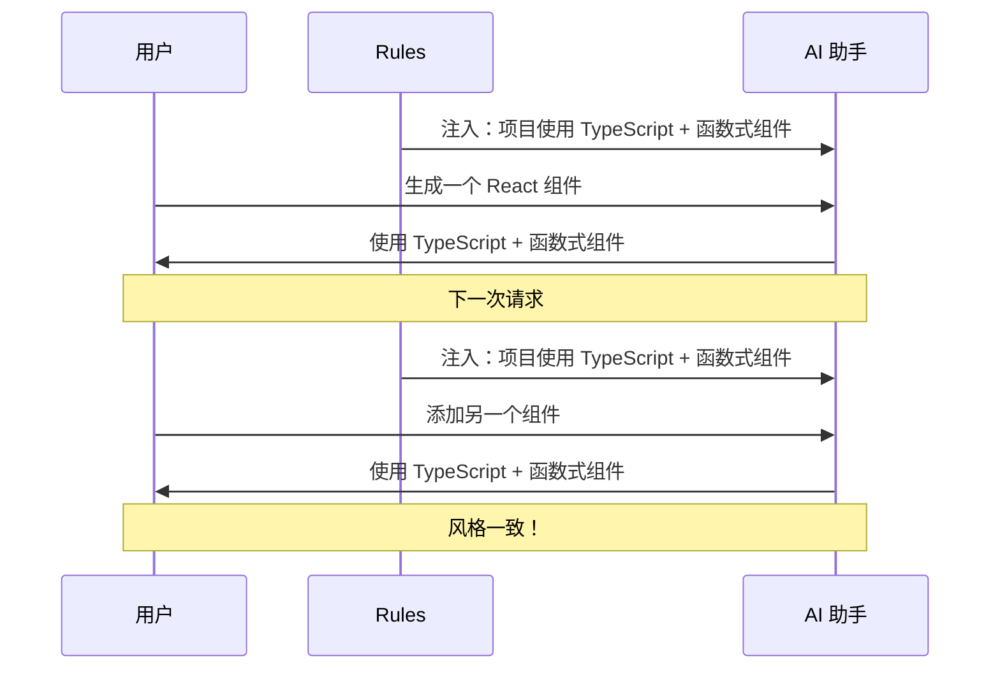
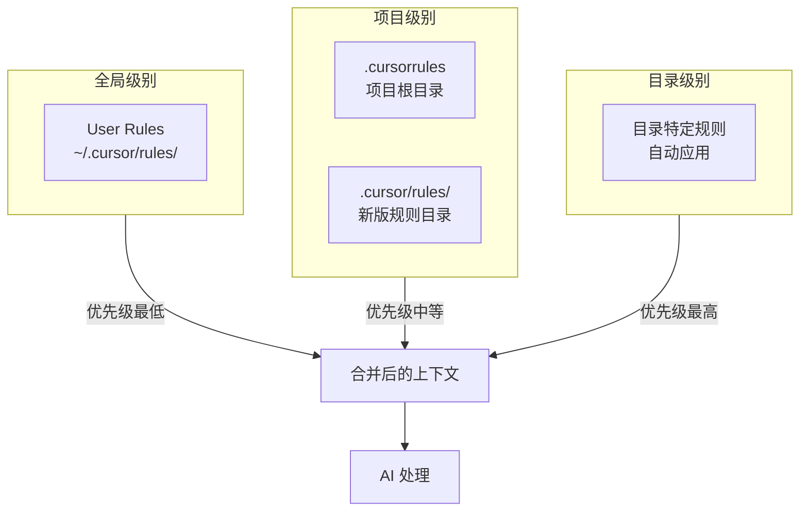
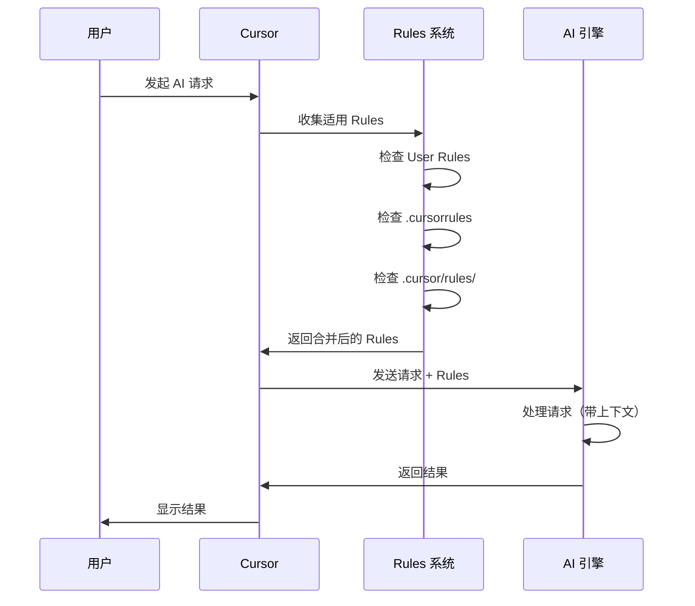
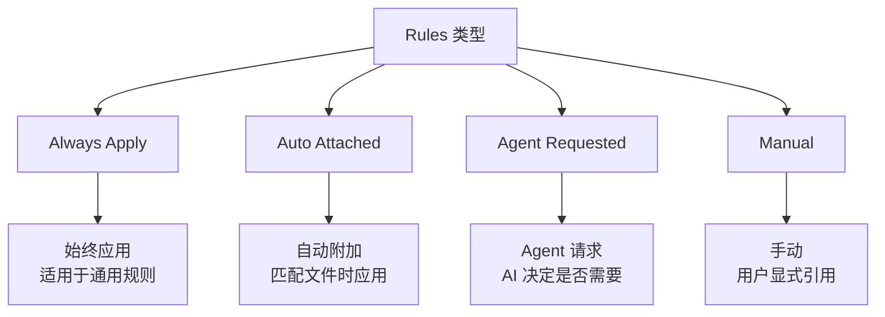

# 02. 规则系统 (Rules)

> **级别：** 初学者+ | **时间：** 45 分钟 | **前置条件：** 已安装 Cursor

---

## 目录

- [概述](#概述)
- [为什么需要 Rules](#为什么需要-rules)
- [Rules 层级结构](#rules-层级结构)
- [工作机制](#工作机制)
- [User Rules](#user-rules)
- [Project Rules](#project-rules)
- [.cursorrules 文件](#cursorrules-文件)
- [实战模板](#实战模板)
- [最佳实践](#最佳实践)
- [故障排查](#故障排查)

---

## 概述

Rules 是 Cursor 的**持久化上下文系统**。大语言模型在不同补全之间不会保留记忆，Rules 在提示级别提供持久、可重用的上下文。



---

## 为什么需要 Rules

### 没有 Rules 的问题



### 使用 Rules 的效果



---

## Rules 层级结构

Cursor 有三种层级的 Rules：



### 优先级顺序

| 优先级 | Rule 类型 | 位置 | 作用范围 |
|--------|-----------|------|----------|
| 1（最高）| 目录规则 | `.cursor/rules/*.mdc` | 匹配的文件/目录 |
| 2 | 项目规则 | `.cursorrules` | 整个项目 |
| 3（最低）| 用户规则 | `~/.cursor/rules/` | 所有项目 |

---

## 工作机制

### Rules 注入流程



### Rules 文件格式

```markdown
---
description: 规则描述
globs: ["*.ts", "*.tsx"]
---

# 规则内容

这里是具体的规则内容，会被注入到 AI 的上下文中。

## 代码风格
- 使用 TypeScript
- 使用函数式组件
- 使用 Tailwind CSS
```

---

## User Rules

### 位置

- **Mac/Linux**: `~/.cursor/rules/`
- **Windows**: `%USERPROFILE%\.cursor\rules\`

### 用途

User Rules 适用于**所有项目**，用于定义个人偏好：

- 代码风格偏好
- 常用库使用习惯
- 注释语言偏好

### 示例

```markdown
---
description: 个人编码偏好
---

# 编码偏好

## 语言
- 所有注释和文档使用中文
- 变量名使用英文

## 风格
- 优先使用函数式编程
- 使用 const 而非 let
- 使用箭头函数

## 错误处理
- 始终添加错误处理
- 使用 try-catch 包裹异步操作
```

### 配置方法

1. 打开 Cursor 设置 (`Cmd+,` / `Ctrl+,`)
2. 搜索 "Rules"
3. 点击 "Edit User Rules"
4. 添加你的规则

---

## Project Rules

### 新版规则目录结构

```
项目根目录/
├── .cursor/
│   └── rules/
│       ├── general.mdc        # 通用规则
│       ├── frontend.mdc       # 前端规则
│       ├── backend.mdc        # 后端规则
│       ├── testing.mdc        # 测试规则
│       └── database.mdc       # 数据库规则
└── ...
```

### 规则文件格式

每个规则文件使用 `.mdc` 扩展名，包含 YAML frontmatter：

```markdown
---
description: 前端开发规则
globs: ["src/**/*.tsx", "src/**/*.css"]
---

# 前端开发规则

## 技术栈
- React 18+
- TypeScript
- Tailwind CSS
- React Query

## 组件规范
- 使用函数式组件
- 使用自定义 Hooks 管理状态
- 组件文件名使用 PascalCase

## 样式规范
- 使用 Tailwind CSS 类名
- 避免内联样式
- 响应式设计优先
```

### glob 模式匹配

| glob 模式 | 匹配的文件 |
|-----------|-----------|
| `*.ts` | 所有 TypeScript 文件 |
| `src/**/*.tsx` | src 目录下所有 TSX 文件 |
| `**/*.test.ts` | 所有测试文件 |
| `!**/*.d.ts` | 排除类型定义文件 |

### 规则类型



---

## .cursorrules 文件

### 位置

项目根目录下的 `.cursorrules` 文件。

### ⚠️ 重要提示

> **官方说明：** `.cursorrules` 文件后续大概率会被移除，建议使用新的 `.cursor/rules/` 目录。

### 示例

```
# 项目规则

## 技术栈
- Next.js 14 (App Router)
- TypeScript
- Prisma ORM
- PostgreSQL

## 代码风格
- 使用 Server Components 优先
- API 路由放在 app/api/ 目录
- 使用 Zod 进行数据验证

## 命名规范
- 组件：PascalCase
- 函数：camelCase
- 文件：kebab-case
- 常量：UPPER_SNAKE_CASE

## 禁止事项
- 不要使用 any 类型
- 不要在客户端组件中使用服务端代码
- 不要直接使用 console.log（使用 logger）
```

---

## 实战模板

### 前端项目模板

```markdown
---
description: 前端项目规则
globs: ["src/**/*"]
---

# 前端项目规则

## 技术栈
- React 18+
- TypeScript 5+
- Tailwind CSS
- React Router v6

## 组件规范
- 使用函数式组件 + Hooks
- 组件放在 src/components/ 目录
- 页面组件放在 src/pages/ 目录
- 每个组件一个文件夹，包含 index.tsx 和 styles.css

## 状态管理
- 简单状态：useState
- 复杂状态：Zustand
- 服务端状态：React Query

## 样式规范
- 使用 Tailwind CSS
- 遵循 mobile-first 原则
- 颜色使用 CSS 变量

## 测试规范
- 使用 Vitest + React Testing Library
- 测试文件放在 __tests__ 目录
- 测试覆盖核心业务逻辑
```

### 后端项目模板

```markdown
---
description: 后端项目规则
globs: ["server/**/*", "api/**/*"]
---

# 后端项目规则

## 技术栈
- Node.js 20+
- TypeScript
- Express / Fastify
- Prisma ORM
- PostgreSQL

## API 规范
- RESTful API 设计
- 使用 Zod 验证请求
- 统一错误处理
- JWT 认证

## 代码结构
- 路由：src/routes/
- 控制器：src/controllers/
- 服务：src/services/
- 模型：src/models/
- 中间件：src/middleware/

## 安全规范
- 所有输入验证
- SQL 注入防护
- XSS 防护
- Rate limiting

## 日志规范
- 使用 winston 或 pino
- 结构化日志
- 错误日志包含堆栈信息
```

### 测试项目模板

```markdown
---
description: 测试规则
globs: ["**/*.test.ts", "**/*.spec.ts", "__tests__/**/*"]
---

# 测试规则

## 测试框架
- Vitest
- React Testing Library
- Playwright (E2E)

## 测试规范
- 描述性测试名称
- AAA 模式：Arrange, Act, Assert
- 每个测试独立
- Mock 外部依赖

## 覆盖率要求
- 语句覆盖率：> 80%
- 分支覆盖率：> 75%
- 函数覆盖率：> 80%

## 测试分类
- 单元测试：*.test.ts
- 集成测试：*.integration.test.ts
- E2E 测试：*.e2e.test.ts
```

---

## 最佳实践

### ✅ 应该做的

1. **分层管理** - 使用不同规则文件管理不同方面
2. **明确描述** - 每个规则文件有清晰的 description
3. **精确匹配** - 使用 glob 模式精确匹配目标文件
4. **版本控制** - 将项目规则纳入 Git 管理
5. **定期更新** - 随项目演进更新规则

### ❌ 不应该做的

1. **过度复杂** - 规则应该简洁明了
2. **冗余规则** - 避免重复和冲突
3. **忽略团队** - 规则应该与团队协商
4. **硬编码路径** - 使用相对路径和 glob 模式

### 规则组织建议

```
.cursor/rules/
├── 00-general.mdc        # 通用规则（优先加载）
├── 01-frontend.mdc       # 前端规则
├── 02-backend.mdc        # 后端规则
├── 03-database.mdc       # 数据库规则
├── 04-testing.mdc        # 测试规则
├── 05-security.mdc       # 安全规则
└── 06-documentation.mdc  # 文档规则
```

---

## 故障排查

### 规则未生效

1. **检查文件位置** - 确保在正确目录
2. **检查文件格式** - 确保 YAML frontmatter 正确
3. **检查 glob 模式** - 确保匹配目标文件
4. **重启 Cursor** - 有时需要重启生效

### 规则冲突

1. **检查优先级** - 高优先级规则会覆盖低优先级
2. **合并规则** - 避免多个规则定义相同内容
3. **使用描述性名称** - 帮助识别冲突来源

### 性能问题

1. **减少规则数量** - 合并相似规则
2. **优化 glob 模式** - 避免过于宽泛的匹配
3. **精简规则内容** - 只保留必要信息

---

## 下一步

- [03. 代码库索引](../03-codebase-indexing/) - 理解代码库索引机制
- [04. 聊天功能](../04-chat/) - 深入学习聊天功能
- [05. Composer](../05-composer/) - 学习多文件编辑

---

<p align="center">
  <a href="../README.md">返回首页</a> | <a href="project-.cursorrules">项目规则模板</a> | <a href="frontend-rules.mdc">前端规则模板</a>
</p>
