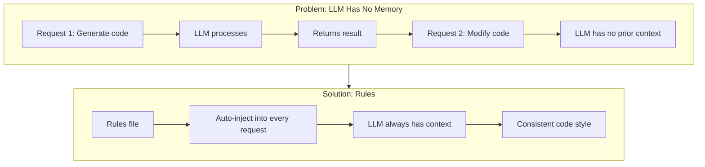
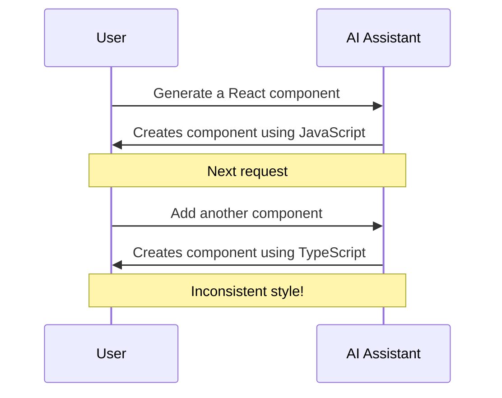
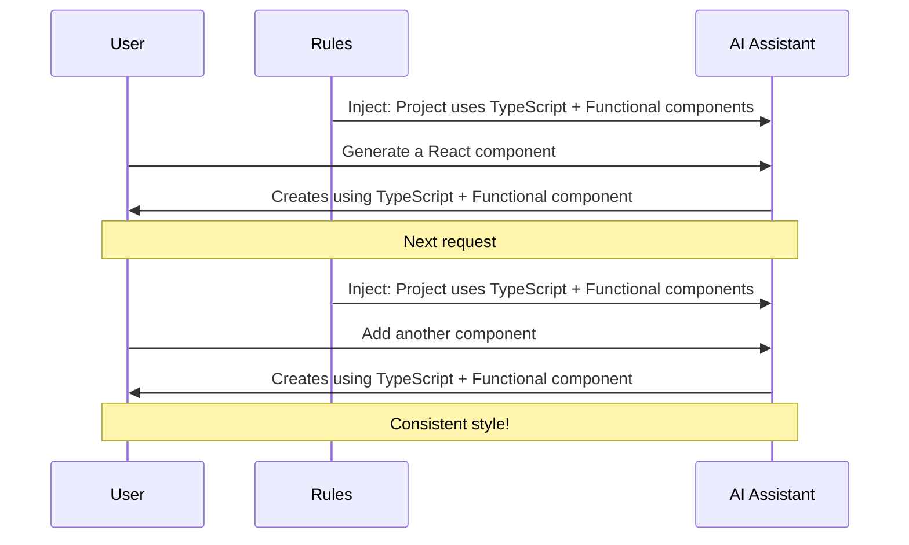
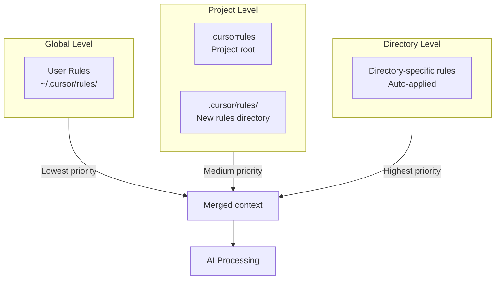
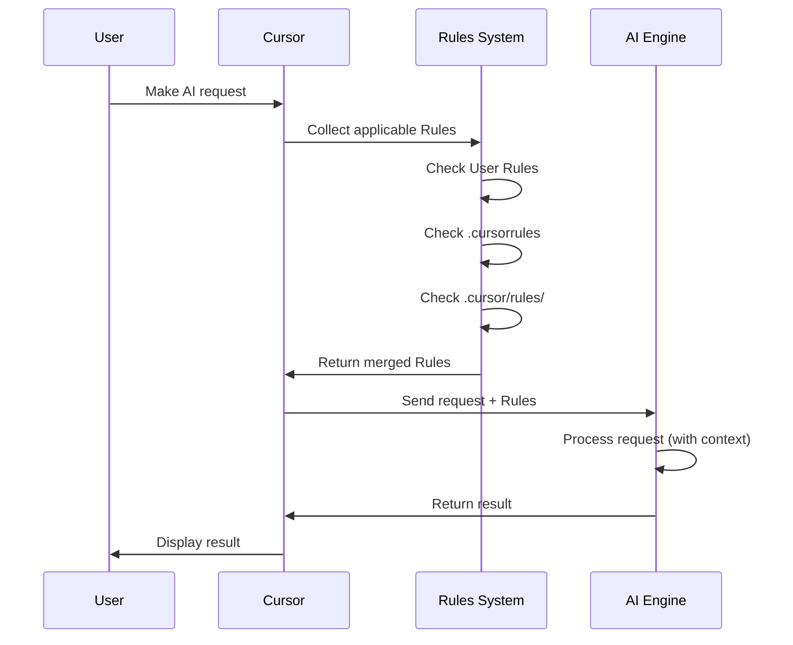
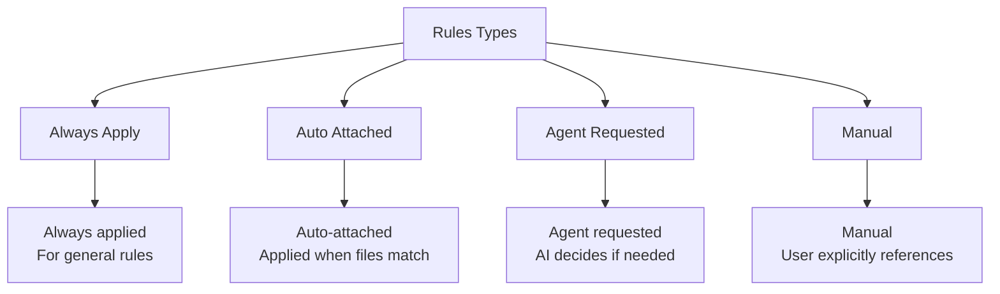

# 02. Rules System

> **Level:** Beginner+ | **Time:** 45 minutes | **Prerequisites:** Cursor installed

---

## Table of Contents

- [Overview](#overview)
- [Why Rules Are Needed](#why-rules-are-needed)
- [Rules Hierarchy](#rules-hierarchy)
- [How It Works](#how-it-works)
- [User Rules](#user-rules)
- [Project Rules](#project-rules)
- [.cursorrules File](#cursorrules-file)
- [Practical Templates](#practical-templates)
- [Best Practices](#best-practices)
- [Troubleshooting](#troubleshooting)

---

## Overview

Rules are Cursor's **persistent context system**. Large language models don't retain memory between completions, so Rules provide persistent, reusable context at the prompt level.



---

## Why Rules Are Needed

### Problem Without Rules



### Effect With Rules



---

## Rules Hierarchy

Cursor has three levels of Rules:



### Priority Order

| Priority | Rule Type | Location | Scope |
|----------|-----------|----------|-------|
| 1 (Highest) | Directory rules | `.cursor/rules/*.mdc` | Matched files/directories |
| 2 | Project rules | `.cursorrules` | Entire project |
| 3 (Lowest) | User rules | `~/.cursor/rules/` | All projects |

---

## How It Works

### Rules Injection Flow



### Rules File Format

```markdown
---
description: Rule description
globs: ["*.ts", "*.tsx"]
---

# Rule Content

Here is the specific rule content that will be injected into the AI's context.

## Code Style
- Use TypeScript
- Use functional components
- Use Tailwind CSS
```

---

## User Rules

### Location

- **Mac/Linux**: `~/.cursor/rules/`
- **Windows**: `%USERPROFILE%\.cursor\rules\`

### Purpose

User Rules apply to **all projects** and define personal preferences:

- Code style preferences
- Common library usage habits
- Comment language preferences

### Example

```markdown
---
description: Personal coding preferences
---

# Coding Preferences

## Language
- All comments and docs in English
- Variable names in English

## Style
- Prefer functional programming
- Use const over let
- Use arrow functions

## Error Handling
- Always add error handling
- Wrap async operations in try-catch
```

### Configuration

1. Open Cursor settings (`Cmd+,` / `Ctrl+,`)
2. Search for "Rules"
3. Click "Edit User Rules"
4. Add your rules

---

## Project Rules

### New Rules Directory Structure

```
project-root/
├── .cursor/
│   └── rules/
│       ├── general.mdc        # General rules
│       ├── frontend.mdc       # Frontend rules
│       ├── backend.mdc        # Backend rules
│       ├── testing.mdc        # Testing rules
│       └── database.mdc       # Database rules
└── ...
```

### Rules File Format

Each rule file uses `.mdc` extension with YAML frontmatter:

```markdown
---
description: Frontend development rules
globs: ["src/**/*.tsx", "src/**/*.css"]
---

# Frontend Development Rules

## Tech Stack
- React 18+
- TypeScript
- Tailwind CSS
- React Query

## Component Standards
- Use functional components
- Use custom Hooks for state management
- Component filenames use PascalCase

## Style Standards
- Use Tailwind CSS classes
- Avoid inline styles
- Mobile-first responsive design
```

### Glob Pattern Matching

| Glob Pattern | Matched Files |
|--------------|---------------|
| `*.ts` | All TypeScript files |
| `src/**/*.tsx` | All TSX files under src |
| `**/*.test.ts` | All test files |
| `!**/*.d.ts` | Exclude type definition files |

### Rule Types



---

## .cursorrules File

### Location

`.cursorrules` file in the project root directory.

### ⚠️ Important Note

> **Official Statement:** The `.cursorrules` file will likely be deprecated. Use the new `.cursor/rules/` directory instead.

### Example

```
# Project Rules

## Tech Stack
- Next.js 14 (App Router)
- TypeScript
- Prisma ORM
- PostgreSQL

## Code Style
- Use Server Components preferentially
- API routes in app/api/ directory
- Use Zod for data validation

## Naming Conventions
- Components: PascalCase
- Functions: camelCase
- Files: kebab-case
- Constants: UPPER_SNAKE_CASE

## Prohibited Items
- Do not use any type
- Do not use server code in client components
- Do not use console.log directly (use logger)
```

---

## Practical Templates

### Frontend Project Template

```markdown
---
description: Frontend project rules
globs: ["src/**/*"]
---

# Frontend Project Rules

## Tech Stack
- React 18+
- TypeScript 5+
- Tailwind CSS
- React Router v6

## Component Standards
- Use functional components + Hooks
- Components in src/components/ directory
- Page components in src/pages/ directory
- One component per folder with index.tsx and styles.css

## State Management
- Simple state: useState
- Complex state: Zustand
- Server state: React Query

## Style Standards
- Use Tailwind CSS
- Follow mobile-first principle
- Use CSS variables for colors

## Testing Standards
- Use Vitest + React Testing Library
- Test files in __tests__ directory
- Cover core business logic
```

### Backend Project Template

```markdown
---
description: Backend project rules
globs: ["server/**/*", "api/**/*"]
---

# Backend Project Rules

## Tech Stack
- Node.js 20+
- TypeScript
- Express / Fastify
- Prisma ORM
- PostgreSQL

## API Standards
- RESTful API design
- Use Zod for request validation
- Unified error handling
- JWT authentication

## Code Structure
- Routes: src/routes/
- Controllers: src/controllers/
- Services: src/services/
- Models: src/models/
- Middleware: src/middleware/

## Security Standards
- Validate all inputs
- SQL injection protection
- XSS protection
- Rate limiting

## Logging Standards
- Use winston or pino
- Structured logging
- Error logs include stack traces
```

### Testing Project Template

```markdown
---
description: Testing rules
globs: ["**/*.test.ts", "**/*.spec.ts", "__tests__/**/*"]
---

# Testing Rules

## Test Framework
- Vitest
- React Testing Library
- Playwright (E2E)

## Test Standards
- Descriptive test names
- AAA pattern: Arrange, Act, Assert
- Each test independent
- Mock external dependencies

## Coverage Requirements
- Statement coverage: > 80%
- Branch coverage: > 75%
- Function coverage: > 80%

## Test Categories
- Unit tests: *.test.ts
- Integration tests: *.integration.test.ts
- E2E tests: *.e2e.test.ts
```

---

## Best Practices

### ✅ Do's

1. **Layered Management** - Use different rule files for different aspects
2. **Clear Description** - Each rule file has a clear description
3. **Precise Matching** - Use glob patterns to precisely match target files
4. **Version Control** - Include project rules in Git
5. **Regular Updates** - Update rules as project evolves

### ❌ Don'ts

1. **Over-complicate** - Rules should be concise and clear
2. **Redundant Rules** - Avoid duplication and conflicts
3. **Ignore Team** - Rules should be agreed upon with team
4. **Hardcode Paths** - Use relative paths and glob patterns

### Rules Organization Suggestion

```
.cursor/rules/
├── 00-general.mdc        # General rules (loaded first)
├── 01-frontend.mdc       # Frontend rules
├── 02-backend.mdc        # Backend rules
├── 03-database.mdc       # Database rules
├── 04-testing.mdc        # Testing rules
├── 05-security.mdc       # Security rules
└── 06-documentation.mdc  # Documentation rules
```

---

## Troubleshooting

### Rules Not Taking Effect

1. **Check file location** - Ensure in correct directory
2. **Check file format** - Ensure YAML frontmatter is correct
3. **Check glob pattern** - Ensure matching target files
4. **Restart Cursor** - Sometimes requires restart

### Rules Conflicts

1. **Check priority** - Higher priority rules override lower ones
2. **Merge rules** - Avoid multiple rules defining same content
3. **Use descriptive names** - Help identify conflict sources

### Performance Issues

1. **Reduce rule count** - Merge similar rules
2. **Optimize glob patterns** - Avoid overly broad matching
3. **Simplify rule content** - Keep only necessary information

---

## Next Steps

- [03. Codebase Indexing](../03-codebase-indexing/) - Understand codebase indexing
- [04. Chat](../04-chat/) - Deep dive into chat functionality
- [05. Composer](../05-composer/) - Learn multi-file editing

---

<p align="center">
  <a href="../README.md">Back to Home</a> | <a href="project-.cursorrules">Project Rules Template</a> | <a href="frontend-rules.mdc">Frontend Rules Template</a>
</p>
