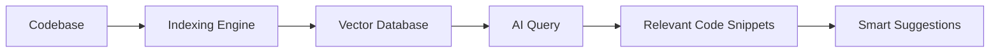
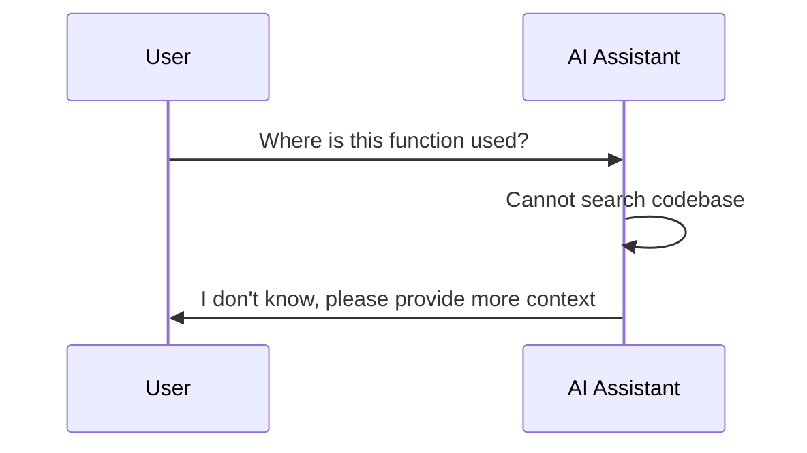
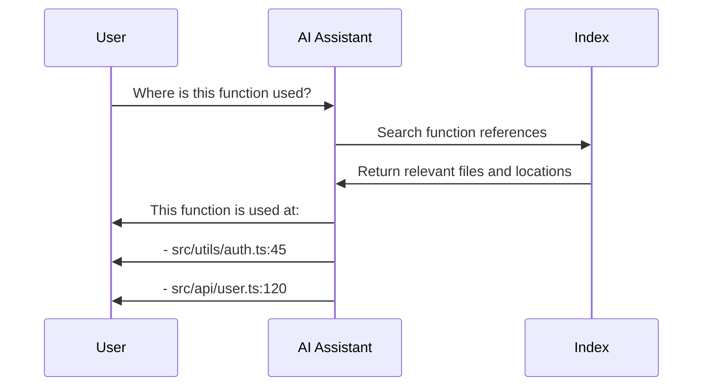
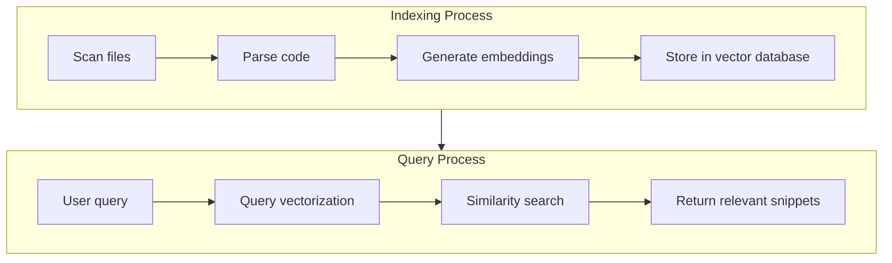
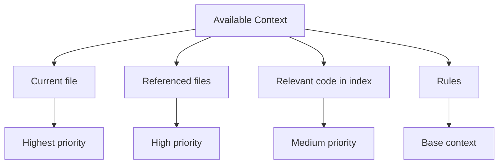

# 03. Codebase Indexing

> **Level:** Beginner+ | **Time:** 30 minutes | **Prerequisites:** Cursor installed

---

## Table of Contents

- [Overview](#overview)
- [Why Codebase Indexing Is Needed](#why-codebase-indexing-is-needed)
- [How It Works](#how-it-works)
- [Index Types](#index-types)
- [Configuring Indexing](#configuring-indexing)
- [Best Practices](#best-practices)
- [Troubleshooting](#troubleshooting)

---

## Overview

Codebase indexing is key to Cursor understanding your project. It converts the entire codebase into a searchable vector representation, enabling AI to:

- Understand project structure
- Find relevant code
- Provide context-aware suggestions



---

## Why Codebase Indexing Is Needed

### Problem Without Indexing



### Effect With Indexing



---

## How It Works

### Indexing Flow



### Context Priority



---

## Index Types

### 1. Automatic Indexing

Cursor automatically creates indexes for your project:

- Auto-index when opening project
- Update index when saving files
- Continuous background optimization

### 2. Manual Indexing

Trigger manually when needed:

```
Cmd+Shift+P → "Cursor: Reindex Codebase"
```

### 3. Selective Indexing

Configure which files to index:

```json
// .cursor/settings.json
{
  "cursor.codebaseIndexing": {
    "include": [
      "src/**/*",
      "lib/**/*"
    ],
    "exclude": [
      "node_modules/**",
      "dist/**",
      "*.min.js"
    ]
  }
}
```

---

## Configuring Indexing

### Index Settings

Open settings (`Cmd+,` / `Ctrl+,`) and search for "Indexing":

| Setting | Description | Default |
|---------|-------------|---------|
| `Enable Codebase Indexing` | Enable codebase indexing | `true` |
| `Index On Open` | Index when opening project | `true` |
| `Index On Save` | Update index when saving files | `true` |

### Excluding Files

Configure in `.cursorignore` file:

```gitignore
# Dependency directories
node_modules/
vendor/

# Build output
dist/
build/
.next/

# Test coverage
coverage/

# Log files
*.log

# Lock files
package-lock.json
yarn.lock

# Large files
*.min.js
*.min.css
```

### Index Status

View indexing status:

1. Open command palette (`Cmd+Shift+P`)
2. Type "Cursor: Show Indexing Status"

---

## Best Practices

### ✅ Do's

1. **Keep project structure clear** - Helps indexing understand
2. **Use meaningful names** - Variables, functions, filenames
3. **Add necessary comments** - Help AI understand code intent
4. **Regularly re-index** - After major refactoring
5. **Exclude unnecessary files** - Improve index quality

### ❌ Don'ts

1. **Index large dependencies** - Exclude node_modules
2. **Index build artifacts** - Exclude dist/build
3. **Ignore index status** - Ensure indexing completes
4. **Over-rely on indexing** - Complex queries still need context

### Optimizing Index Performance

```mermaid
flowchart LR
    A[Large Project] --> B{File Count}
    B -->|> 10000| C[Configure exclude rules]
    B -->|< 10000| D[Use default config]
    
    C --> E[Exclude node_modules]
    C --> F[Exclude build output]
    C --> G[Exclude test files (optional)]
    
    D --> H[Auto-index]
    E --> H
    F --> H
    G --> H
```

---

## Troubleshooting

### Index Not Complete

**Symptoms:** AI cannot find relevant code

**Solutions:**
1. Check index status
2. Manually trigger re-index
3. Check network connection (needs embedding service)

### Inaccurate Index Results

**Symptoms:** AI returns irrelevant code

**Solutions:**
1. Provide more specific queries
2. Reference relevant files
3. Use `@` symbol to specify files

### Index Using Too Many Resources

**Symptoms:** Cursor runs slowly

**Solutions:**
1. Configure `.cursorignore` to exclude files
2. Reduce index scope
3. Close unnecessary projects

---

## Next Steps

- [04. Chat](../04-chat/) - Deep dive into chat functionality
- [05. Composer](../05-composer/) - Learn multi-file editing
- [06. MCP Integration](../06-mcp/) - Connect external tools

---

<p align="center">
  <a href="../README.md">Back to Home</a> | <a href="indexing-config.md">Indexing Config Reference</a>
</p>
