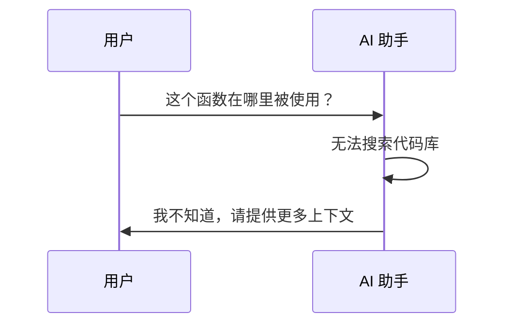
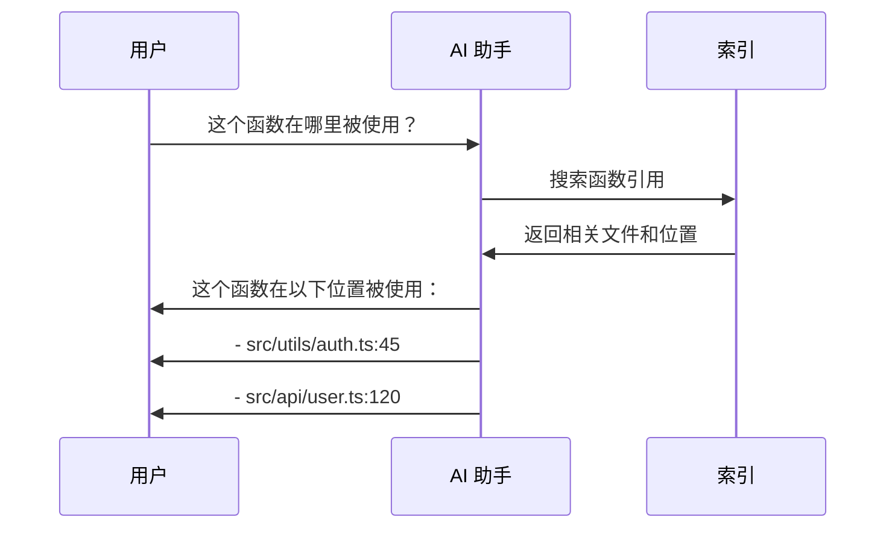
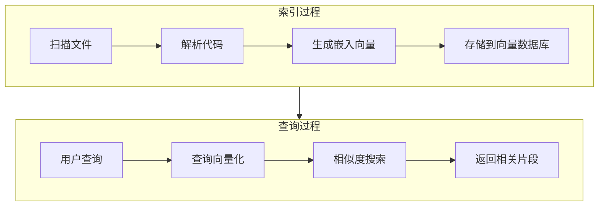
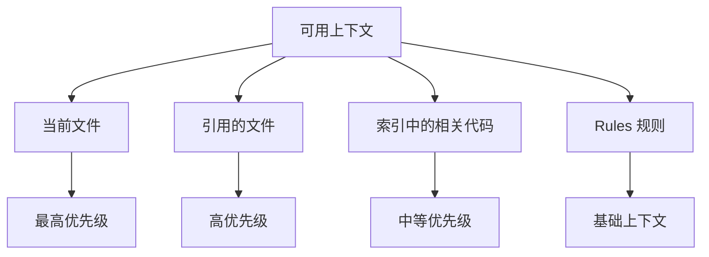
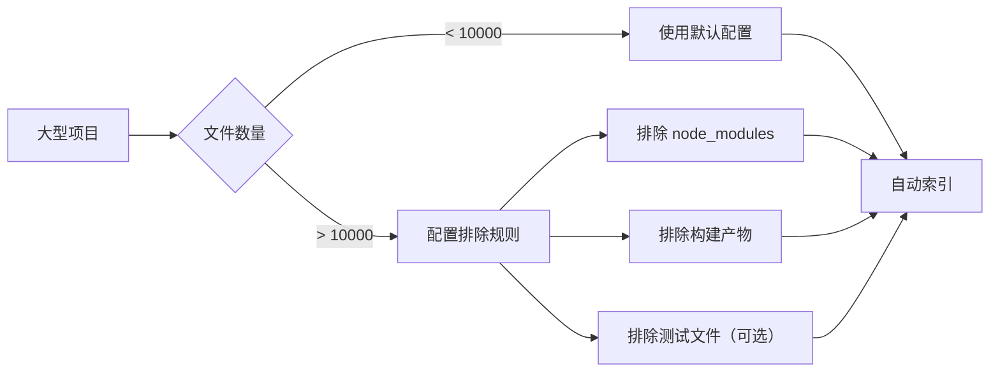

# 03. 代码库索引

> **级别：** 初学者+ | **时间：** 30 分钟 | **前置条件：** 已安装 Cursor

---

## 目录

- [概述](#概述)
- [为什么需要代码库索引](#为什么需要代码库索引)
- [工作机制](#工作机制)
- [索引类型](#索引类型)
- [配置索引](#配置索引)
- [最佳实践](#最佳实践)
- [故障排查](#故障排查)

---

## 概述

代码库索引是 Cursor 理解你项目的关键。它将整个代码库转换为可搜索的向量表示，让 AI 能够：

- 理解项目结构
- 找到相关代码
- 提供上下文感知的建议


---

## 为什么需要代码库索引

### 没有索引的问题



### 使用索引的效果



---

## 工作机制

### 索引流程



### 上下文优先级



---

## 索引类型

### 1. 自动索引

Cursor 自动为你的项目创建索引：

- 打开项目时自动索引
- 文件保存时更新索引
- 后台持续优化

### 2. 手动索引

在需要时手动触发：

```
Cmd+Shift+P → "Cursor: Reindex Codebase"
```

### 3. 选择性索引

配置哪些文件需要索引：

```json
// .cursor/settings.json
{
  "cursor.codebaseIndexing": {
    "include": [
      "src/**/*",
      "lib/**/*"
    ],
    "exclude": [
      "node_modules/**",
      "dist/**",
      "*.min.js"
    ]
  }
}
```

---

## 配置索引

### 索引设置

打开设置 (`Cmd+,` / `Ctrl+,`)，搜索 "Indexing"：

| 设置 | 描述 | 默认值 |
|------|------|--------|
| `Enable Codebase Indexing` | 启用代码库索引 | `true` |
| `Index On Open` | 打开项目时索引 | `true` |
| `Index On Save` | 保存文件时更新索引 | `true` |

### 排除文件

在 `.cursorignore` 文件中配置：

```gitignore
# 依赖目录
node_modules/
vendor/

# 构建输出
dist/
build/
.next/

# 测试覆盖率
coverage/

# 日志文件
*.log

# 锁文件
package-lock.json
yarn.lock

# 大文件
*.min.js
*.min.css
```

### 索引状态

查看索引状态：

1. 打开命令面板 (`Cmd+Shift+P`)
2. 输入 "Cursor: Show Indexing Status"

---

## 最佳实践

### ✅ 应该做的

1. **保持项目结构清晰** - 有助于索引理解
2. **使用有意义的命名** - 变量、函数、文件名
3. **添加必要的注释** - 帮助 AI 理解代码意图
4. **定期重新索引** - 大规模重构后
5. **排除不需要的文件** - 提高索引质量

### ❌ 不应该做的

1. **索引大型依赖** - 排除 node_modules
2. **索引构建产物** - 排除 dist/build
3. **忽略索引状态** - 确保索引完成
4. **过度依赖索引** - 复杂查询仍需提供上下文

### 优化索引性能



---

## 故障排查

### 索引未完成

**症状：** AI 无法找到相关代码

**解决方案：**
1. 检查索引状态
2. 手动触发重新索引
3. 检查网络连接（需要连接嵌入服务）

### 索引结果不准确

**症状：** AI 返回不相关的代码

**解决方案：**
1. 提供更具体的查询
2. 引用相关文件
3. 使用 `@` 符号指定文件

### 索引占用过多资源

**症状：** Cursor 运行缓慢

**解决方案：**
1. 配置 `.cursorignore` 排除文件
2. 减少索引范围
3. 关闭不需要的项目

---

## 下一步

- [04. 聊天功能](../04-chat/) - 深入学习聊天功能
- [05. Composer](../05-composer/) - 学习多文件编辑
- [06. MCP 集成](../06-mcp/) - 连接外部工具

---

<p align="center">
  <a href="../README.md">返回首页</a> | <a href="indexing-config.md">索引配置参考</a>
</p>
