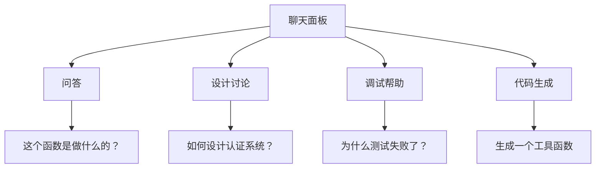
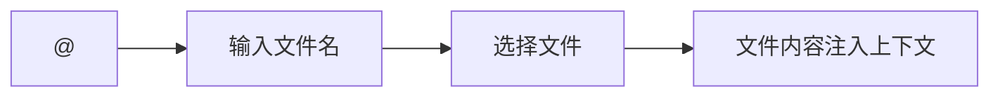
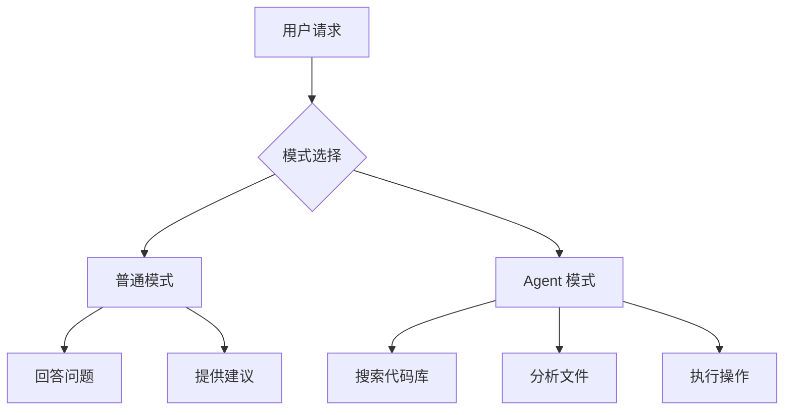
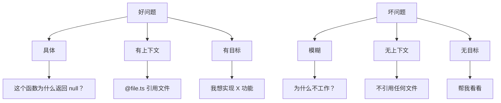

# 04. 聊天功能

> **级别：** 中级 | **时间：** 45 分钟 | **前置条件：** 已安装 Cursor

---

## 目录

- [概述](#概述)
- [打开聊天面板](#打开聊天面板)
- [基本用法](#基本用法)
- [引用上下文](#引用上下文)
- [聊天模式](#聊天模式)
- [实战示例](#实战示例)
- [最佳实践](#最佳实践)
- [故障排查](#故障排查)

---

## 概述

聊天面板是 Cursor 的核心交互界面之一。与内联编辑不同，聊天专注于：

- **问答** - 获取信息和解释
- **设计讨论** - 探讨架构和方案
- **调试帮助** - 分析问题和解决方案
- **学习概念** - 理解代码和技术



---

## 打开聊天面板

### 快捷键

| 平台 | 快捷键 |
|------|--------|
| Mac | `Cmd+L` |
| Windows | `Ctrl+L` |

### 其他方式

1. 点击左侧边栏的聊天图标
2. 命令面板 → "Cursor: Open Chat"

---

## 基本用法

### 发送消息

1. 打开聊天面板
2. 在输入框中输入问题
3. 按 `Enter` 发送

### 消息格式

```
普通问题：直接输入
引用文件：@filename
引用代码：选中代码后自动引用
引用符号：#symbolName
```

### 快捷操作

| 操作 | 快捷键 |
|------|--------|
| 发送消息 | `Enter` |
| 换行 | `Shift+Enter` |
| 清除对话 | 点击清除按钮 |
| 复制回复 | 点击复制按钮 |

---

## 引用上下文

### 引用文件

使用 `@` 符号引用文件：

```
@src/utils/auth.ts 这个文件中的 validateToken 函数有什么问题？
```



### 引用代码

选中代码后，聊天面板会自动引用：

1. 在编辑器中选中代码
2. 打开聊天面板
3. 选中的代码会自动显示在输入框下方

### 引用符号

使用 `#` 符号引用函数、类、变量：

```
#validateToken 这个函数在哪里被调用？
```

### 引用多个上下文

```
@src/utils/auth.ts @src/api/user.ts 
比较这两个文件中的认证逻辑有什么不同？
```

---

## 聊天模式

### 普通模式

标准的问答模式，AI 会：
- 回答问题
- 提供建议
- 解释代码

### Agent 模式

AI 会主动：
- 搜索代码库
- 分析文件
- 执行操作



### 切换模式

- 在聊天面板顶部切换
- 使用命令面板切换

---

## 实战示例

### 示例 1：代码问答

```
用户: @src/components/UserList.tsx 这个组件为什么渲染很慢？

AI: 分析 UserList.tsx 后，我发现以下性能问题：

1. **缺少 React.memo**
   组件在父组件重新渲染时也会重新渲染

2. **内联函数**
   onClick 处理函数在每次渲染时都会创建新引用

3. **未使用虚拟列表**
   渲染大量项目时性能下降

建议优化：
[提供具体代码]
```

### 示例 2：设计讨论

```
用户: 我需要为这个项目添加权限系统，应该怎么设计？

AI: 基于你的项目结构（Next.js + Prisma），我建议以下权限系统设计：

## 方案一：基于角色的访问控制 (RBAC)

### 数据模型
[提供 Prisma schema]

### API 设计
[提供 API 路由]

### 中间件实现
[提供中间件代码]

## 方案二：基于属性的访问控制 (ABAC)

[提供另一种方案]

推荐使用 RBAC，因为更简单且满足大多数需求。
```

### 示例 3：调试帮助

```
用户: @src/tests/auth.test.ts 这个测试失败了，错误是 "Expected true, received false"

AI: 分析测试代码后，问题可能出在：

1. **Mock 未正确设置**
   ```typescript
   // 当前代码
   jest.mock('../auth');
   
   // 应该是
   jest.mock('../auth', () => ({
     validateToken: jest.fn().mockReturnValue(true)
   }));
   ```

2. **异步操作未等待**
   ```typescript
   // 当前代码
   const result = validateToken(token);
   
   // 应该是
   const result = await validateToken(token);
   ```

建议修复：
[提供完整修复代码]
```

### 示例 4：代码生成

```
用户: 生成一个防抖 Hook

AI: 这是一个 TypeScript 实现的防抖 Hook：

```typescript
import { useCallback, useRef } from 'react';

export function useDebounce<T extends (...args: any[]) => any>(
  callback: T,
  delay: number
): (...args: Parameters<T>) => void {
  const timeoutRef = useRef<NodeJS.Timeout>();

  return useCallback(
    (...args: Parameters<T>) => {
      if (timeoutRef.current) {
        clearTimeout(timeoutRef.current);
      }

      timeoutRef.current = setTimeout(() => {
        callback(...args);
      }, delay);
    },
    [callback, delay]
  );
}
```

使用示例：
```typescript
const debouncedSearch = useDebounce((query: string) => {
  searchAPI(query);
}, 300);
```
```

---

## 最佳实践

### ✅ 应该做的

1. **提供上下文** - 引用相关文件和代码
2. **具体问题** - 问具体问题而非模糊描述
3. **追问** - 不满意就继续追问
4. **验证建议** - 不要盲目接受 AI 建议
5. **保存有用对话** - 复制重要的解决方案

### ❌ 不应该做的

1. **模糊问题** - "为什么不行？" 没有帮助
2. **忽略上下文** - 不引用相关文件
3. **过度依赖** - 始终验证 AI 建议
4. **忽略错误** - 如果 AI 说有问题，检查一下

### 提问技巧



---

## 故障排查

### AI 回答不相关

**解决方案：**
1. 提供更多上下文
2. 引用相关文件
3. 使用更具体的问题

### AI 不知道项目信息

**解决方案：**
1. 检查代码库索引状态
2. 手动触发重新索引
3. 明确引用文件

### 聊天面板卡住

**解决方案：**
1. 刷新 Cursor
2. 清除对话历史
3. 检查网络连接

---

## 下一步

- [05. Composer](../05-composer/) - 学习多文件编辑
- [06. MCP 集成](../06-mcp/) - 连接外部工具
- [07. 高级功能](../07-advanced-features/) - 探索高级功能

---

<p align="center">
  <a href="../README.md">返回首页</a> | <a href="chat-templates.md">聊天模板</a>
</p>
