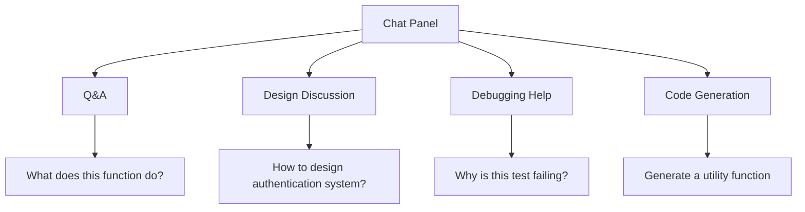
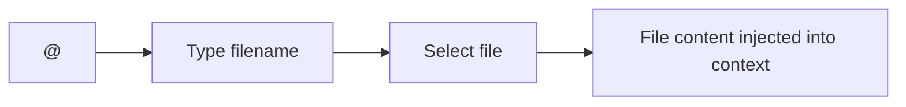
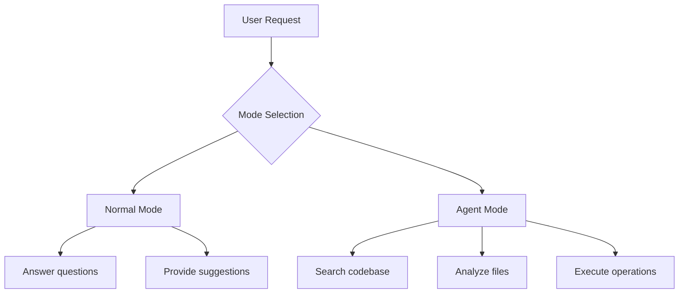
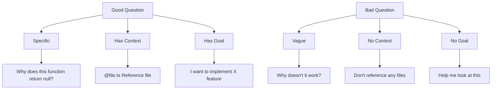

# 04. Chat

> **Level:** Intermediate | **Time:** 45 minutes | **Prerequisites:** Cursor installed

---

## Table of Contents

- [Overview](#overview)
- [Opening Chat Panel](#opening-chat-panel)
- [Basic Usage](#basic-usage)
- [Referencing Context](#referencing-context)
- [Chat Modes](#chat-modes)
- [Practical Examples](#practical-examples)
- [Best Practices](#best-practices)
- [Troubleshooting](#troubleshooting)

---

## Overview

The chat panel is one of Cursor's core interaction interfaces. Unlike inline editing, chat focuses on:

- **Q&A** - Getting information and explanations
- **Design Discussion** - Exploring architecture and solutions
- **Debugging Help** - Analyzing problems and solutions
- **Learning Concepts** - Understanding code and technology



---

## Opening Chat Panel

### Shortcuts

| Platform | Shortcut |
|----------|----------|
| Mac | `Cmd+L` |
| Windows | `Ctrl+L` |

### Other Methods

1. Click the chat icon in the left sidebar
2. Command Palette → "Cursor: Open Chat"

---

## Basic Usage

### Sending Messages

1. Open chat panel
2. Enter question in input box
3. Press `Enter` to send

### Message Format

```
Regular question: Just type
Reference file: @filename
Reference code: Auto-referenced when selected
Reference symbol: #symbolName
```

### Quick Actions

| Action | Shortcut |
|--------|----------|
| Send message | `Enter` |
| New line | `Shift+Enter` |
| Clear conversation | Click clear button |
| Copy reply | Click copy button |

---

## Referencing Context

### Referencing Files

Use `@` symbol to reference files:

```
@src/utils/auth.ts What's wrong with the validateToken function in this file?
```



### Referencing Code

After selecting code, chat panel auto-references:

1. Select code in editor
2. Open chat panel
3. Selected code automatically appears below input box

### Referencing Symbols

Use `#` symbol to reference functions, classes, variables:

```
#validateToken Where is this function called?
```

### Referencing Multiple Contexts

```
@src/utils/auth.ts @src/api/user.ts 
Compare the authentication logic in these two files?
```

---

## Chat Modes

### Normal Mode

Standard Q&A mode where AI will:
- Answer questions
- Provide suggestions
- Explain code

### Agent Mode

AI will proactively:
- Search codebase
- Analyze files
- Execute operations



### Switching Modes

- Switch at top of chat panel
- Use command palette to switch

---

## Practical Examples

### Example 1: Code Q&A

```
User: @src/components/UserList.tsx Why is this component rendering slowly?

AI: After analyzing UserList.tsx, I found these performance issues:

1. **Missing React.memo**
   Component re-renders when parent re-renders

2. **Inline Functions**
   onClick handler creates new reference on each render

3. **No Virtual List**
   Performance degrades with many items

Suggested optimizations:
[Provides specific code]
```

### Example 2: Design Discussion

```
User: I need to add a permission system to this project. How should I design it?

AI: Based on your project structure (Next.js + Prisma), I suggest this permission system design:

## Option 1: Role-Based Access Control (RBAC)

### Data Model
[Provides Prisma schema]

### API Design
[Provides API routes]

### Middleware Implementation
[Provides middleware code]

## Option 2: Attribute-Based Access Control (ABAC)

[Provides alternative]

I recommend RBAC as it's simpler and meets most needs.
```

### Example 3: Debugging Help

```
User: @src/tests/auth.test.ts This test is failing with "Expected true, received false"

AI: After analyzing the test code, the issue might be:

1. **Mock not set correctly**
   ```typescript
   // Current code
   jest.mock('../auth');
   
   // Should be
   jest.mock('../auth', () => ({
     validateToken: jest.fn().mockReturnValue(true)
   }));
   ```

2. **Async operation not awaited**
   ```typescript
   // Current code
   const result = validateToken(token);
   
   // Should be
   const result = await validateToken(token);
   ```

Suggested fix:
[Provides complete fix code]
```

### Example 4: Code Generation

```
User: Generate a debounce Hook

AI: Here's a TypeScript debounce Hook implementation:

```typescript
import { useCallback, useRef } from 'react';

export function useDebounce<T extends (...args: any[]) => any>(
  callback: T,
  delay: number
): (...args: Parameters<T>) => void {
  const timeoutRef = useRef<NodeJS.Timeout>();

  return useCallback(
    (...args: Parameters<T>) => {
      if (timeoutRef.current) {
        clearTimeout(timeoutRef.current);
      }

      timeoutRef.current = setTimeout(() => {
        callback(...args);
      }, delay);
    },
    [callback, delay]
  );
}
```

Usage example:
```typescript
const debouncedSearch = useDebounce((query: string) => {
  searchAPI(query);
}, 300);
```
```

---

## Best Practices

### ✅ Do's

1. **Provide context** - Reference relevant files and code
2. **Be specific** - Ask specific questions, not vague descriptions
3. **Follow up** - Continue asking if unsatisfied
4. **Verify suggestions** - Don't blindly accept AI suggestions
5. **Save useful conversations** - Copy important solutions

### ❌ Don'ts

1. **Vague questions** - "Why doesn't it work?" isn't helpful
2. **Ignore context** - Don't reference relevant files
3. **Over-rely** - Always verify AI suggestions
4. **Ignore errors** - If AI says there's an issue, check it

### Question Tips



---

## Troubleshooting

### AI Response Not Relevant

**Solutions:**
1. Provide more context
2. Reference relevant files
3. Use more specific questions

### AI Doesn't Know Project Info

**Solutions:**
1. Check codebase index status
2. Manually trigger re-index
3. Explicitly reference files

### Chat Panel Stuck

**Solutions:**
1. Refresh Cursor
2. Clear conversation history
3. Check network connection

---

## Next Steps

- [05. Composer](../05-composer/) - Learn multi-file editing
- [06. MCP Integration](../06-mcp/) - Connect external tools
- [07. Advanced Features](../07-advanced-features/) - Explore advanced features

---

<p align="center">
  <a href="../README.md">Back to Home</a> | <a href="chat-templates.md">Chat Templates</a>
</p>
