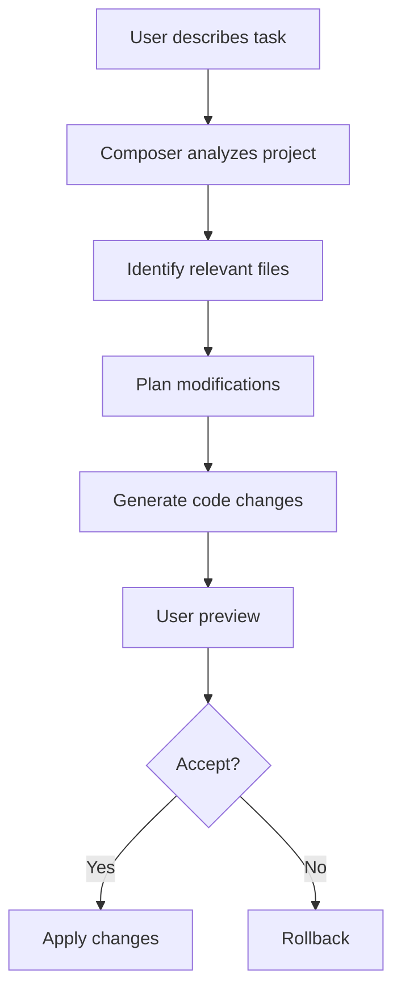
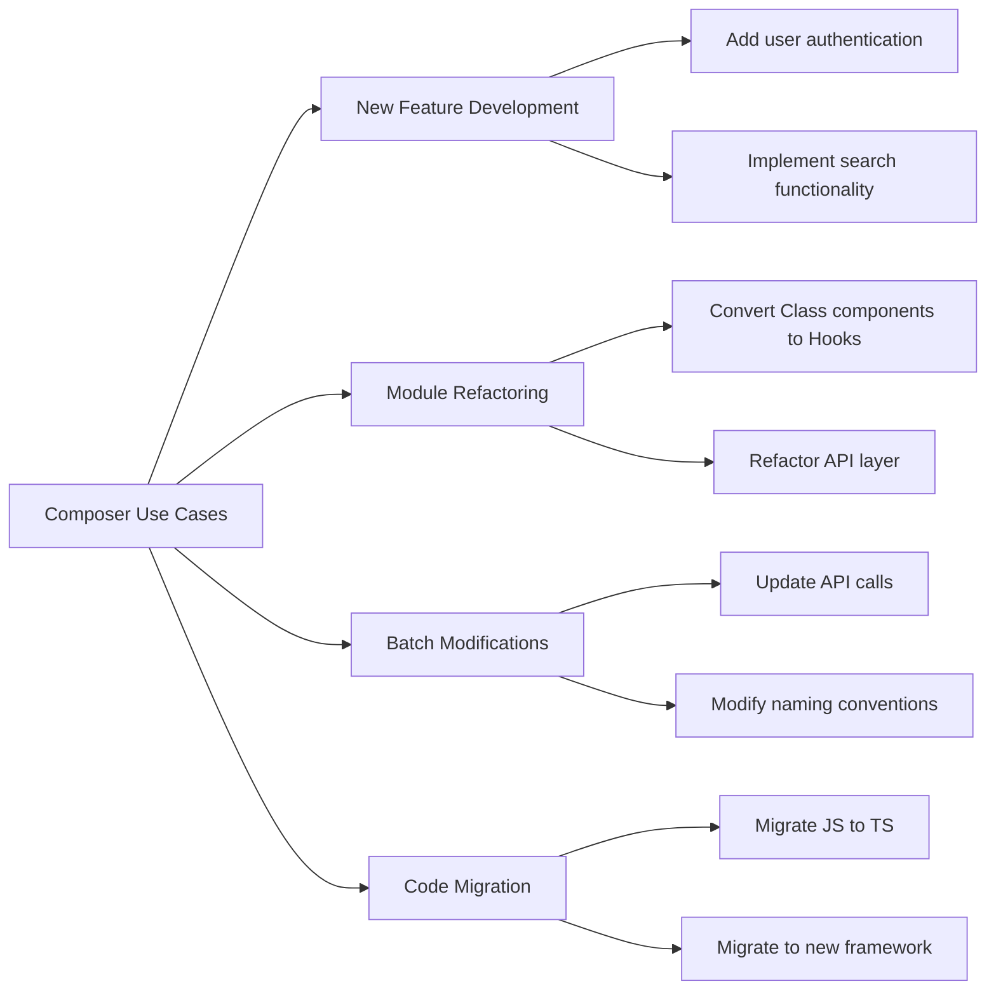
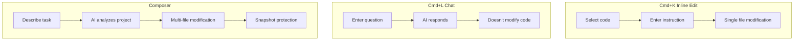
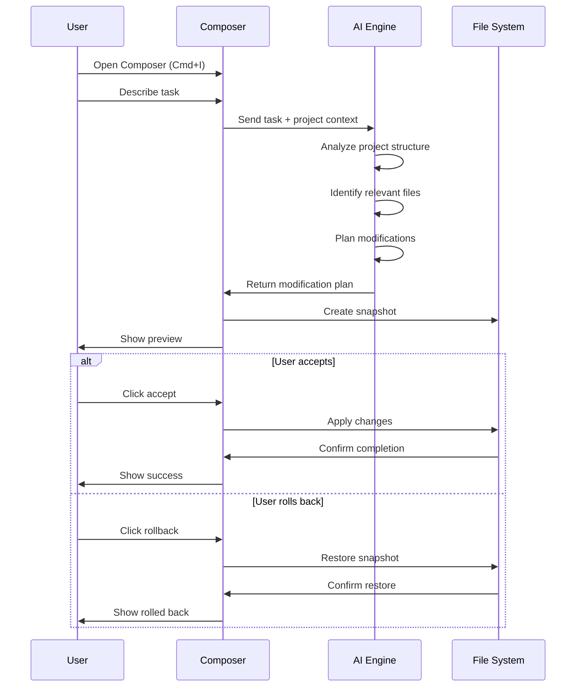
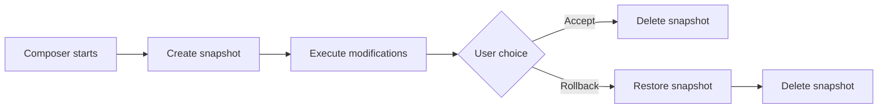
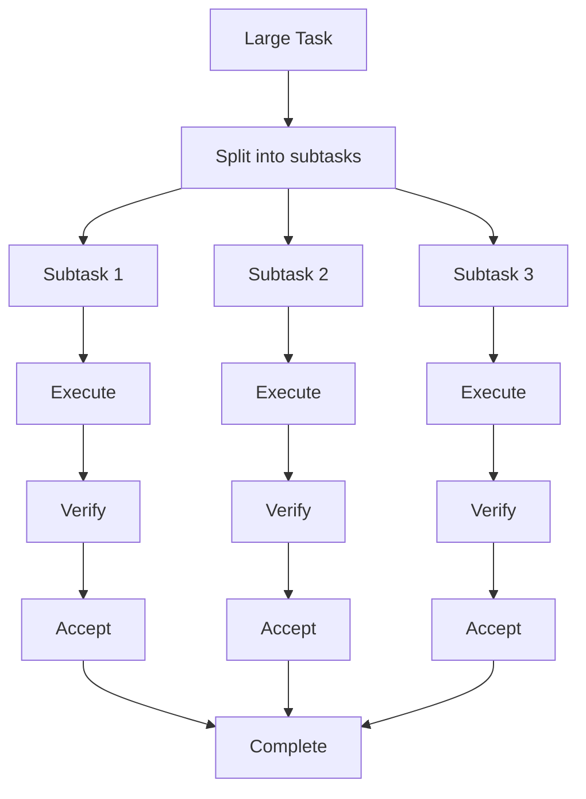

# 05. Composer

> **Level:** Intermediate | **Time:** 1 hour | **Prerequisites:** Cursor installed

---

## Table of Contents

- [Overview](#overview)
- [What is Composer](#what-is-composer)
- [Difference from Other Features](#difference-from-other-features)
- [Opening Composer](#opening-composer)
- [Basic Usage](#basic-usage)
- [Workflow](#workflow)
- [Snapshots and Rollback](#snapshots-and-rollback)
- [Practical Examples](#practical-examples)
- [Best Practices](#best-practices)
- [Troubleshooting](#troubleshooting)

---

## Overview

Composer is Cursor's **project-level task executor**. It's not simple code completion, but a tool that can:

- Understand entire project structure
- Automatically identify files to modify
- Execute cross-file edits
- Provide rollback-capable modifications



---

## What is Composer

### Core Positioning

> "An AI assistant that helps you complete new feature development in your project."

### Use Cases



---

## Difference from Other Features

| Feature | Use Case | File Scope | Modification Ability | Rollback |
|---------|----------|------------|---------------------|----------|
| **Cmd+K** | Single file editing | Current file | Direct modification | Git |
| **Cmd+L** | Q&A/Design | Can reference multiple files | Doesn't modify | N/A |
| **Composer** | Feature development/Refactoring | Auto-identifies multiple files | Direct modification | Built-in snapshots |



---

## Opening Composer

### Shortcuts

| Platform | Shortcut |
|----------|----------|
| Mac | `Cmd+I` |
| Windows | `Ctrl+I` |

### Other Methods

1. Command Palette → "Cursor: Open Composer"
2. Click the Composer icon in the left sidebar

---

## Basic Usage

### Steps

1. **Open Composer** - Press `Cmd+I` / `Ctrl+I`
2. **Describe Task** - Clearly describe the feature you want to implement
3. **Wait for Analysis** - AI analyzes project and plans modifications
4. **Preview Changes** - View all file modifications
5. **Accept or Rollback** - Decide whether to apply changes

### Task Description Tips

```
❌ Bad description:
"Add multi-language"

✅ Good description:
"Add Chinese and English support using next-intl, need to:
1. Install next-intl dependency
2. Create i18n config file
3. Add language switcher component
4. Integrate in layout.tsx"
```

---

## Workflow

### Complete Workflow



### File Changes View

Composer shows all changes:

```
Changes:
├── src/
│   ├── components/
│   │   └── LanguageSwitch.tsx    [+45 lines]
│   └── i18n/
│       ├── config.ts             [+30 lines]
│       └── messages/
│           ├── en.json           [+50 lines]
│           └── zh.json           [+50 lines]
└── package.json                  [+2 lines]
```

---

## Snapshots and Rollback

### Snapshot Mechanism



### Rollback Operation

1. Click "Restore" button in Composer panel
2. Code immediately rolls back to pre-modification state
3. Can adjust task description and try again

### Best Practices

```
✅ Verify after each subtask completes
✅ Rollback immediately on error, don't manually fix
✅ Use Git as double protection
```

---

## Practical Examples

### Example 1: Add New Feature

```
Task: Add search and filter functionality to user management module

Composer executes:
1. Analyze src/pages/users/ directory
2. Create SearchBar.tsx component
3. Create FilterPanel.tsx component
4. Modify UsersPage.tsx to integrate components
5. Add types/user.ts type definitions
6. Update API call logic
```

### Example 2: Refactor Module

```
Task: Refactor Class components in src/components to Hooks

Composer executes:
1. Scan all Class components
2. Convert to functional components
3. Replace lifecycle methods:
   - componentDidMount → useEffect
   - componentDidUpdate → useEffect
   - componentWillUnmount → useEffect cleanup
4. Update import statements
5. Remove this references
```

### Example 3: Add Internationalization

```
Task: Add Chinese and English support using next-intl

Step 1: Install dependencies
"Install next-intl and create basic config"

Step 2: Create language files
"Create messages/en.json and messages/zh.json"

Step 3: Integrate into app
"Integrate next-intl in layout.tsx"

Step 4: Add switcher component
"Create language switcher component LanguageSwitch.tsx"
```

---

## Best Practices

### ✅ Do's

1. **Split large tasks** - Modify 2-4 files per session
2. **Be specific** - Specify file paths and exact requirements
3. **Verify before accepting** - Run tests before accepting changes
4. **Use snapshots** - Rollback immediately on errors
5. **Use with Git** - Commit clean state before starting

### ❌ Don'ts

1. **One giant task** - Modifying 10+ files is error-prone
2. **Vague descriptions** - "Add a feature" doesn't help
3. **Skip verification** - Always run tests
4. **Skip preview** - Check all changes
5. **Manually fix errors** - Should rollback and retry

### Task Splitting Strategy



---

## Troubleshooting

### Composer Modifying Wrong Files

**Solutions:**
1. Specify file paths explicitly in description
2. Use more precise task description
3. Rollback and retry

### Modifications Not Meeting Expectations

**Solutions:**
1. Provide more detailed description
2. Reference relevant files as examples
3. Split into smaller tasks

### Performance Issues

**Solutions:**
1. Reduce task complexity
2. Split into multiple smaller tasks
3. Check project index status

---

## Next Steps

- [06. MCP Integration](../06-mcp/) - Connect external tools
- [07. Advanced Features](../07-advanced-features/) - Explore advanced features
- [08. Best Practices](../08-best-practices/) - Learn workflows

---

<p align="center">
  <a href="../README.md">Back to Home</a> | <a href="composer-workflows.md">Composer Workflows</a>
</p>
