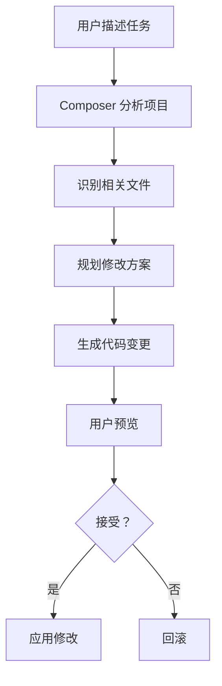
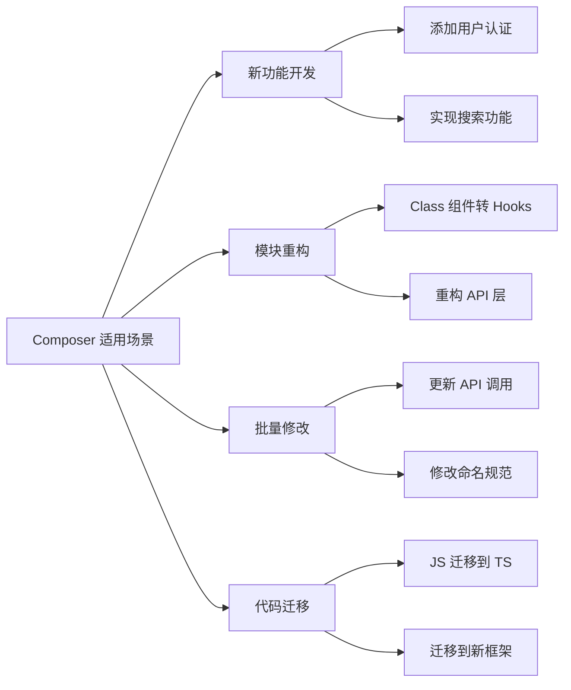
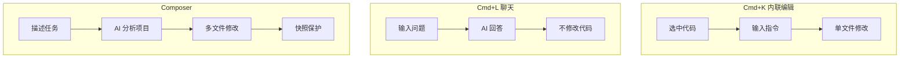
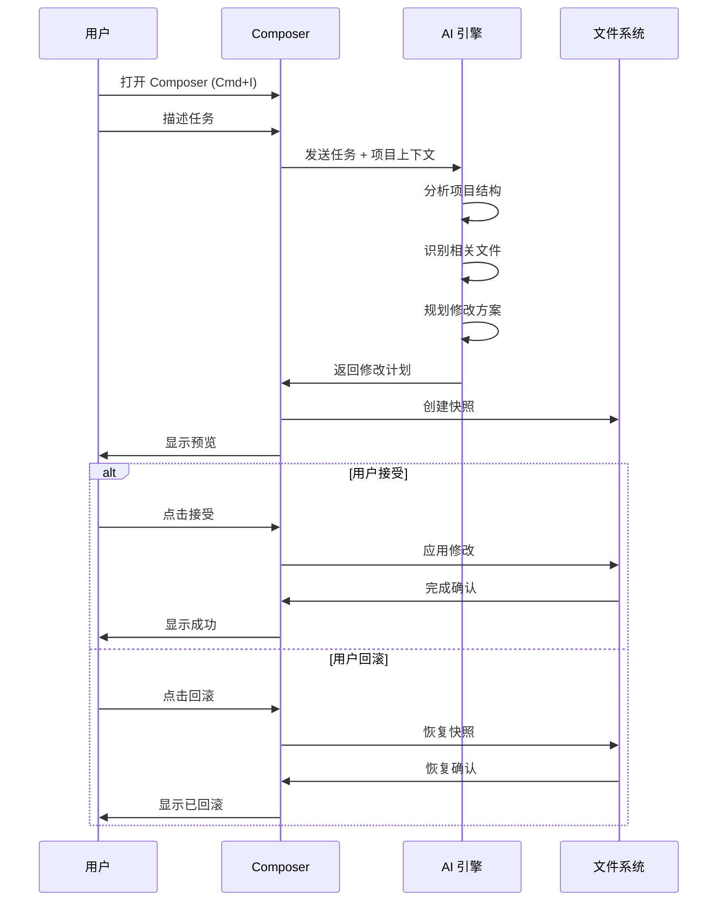
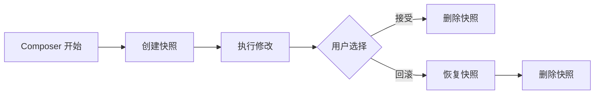
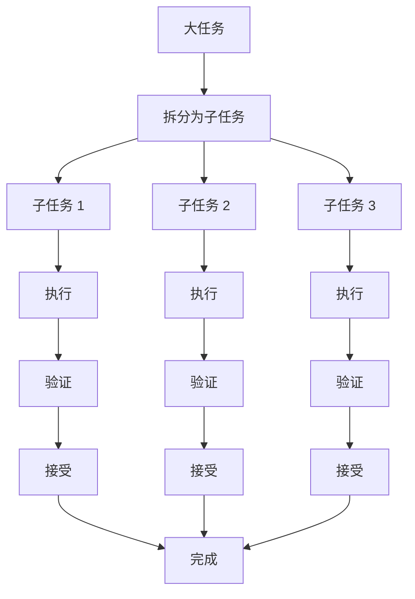

# 05. Composer

> **级别：** 中级 | **时间：** 1 小时 | **前置条件：** 已安装 Cursor

---

## 目录

- [概述](#概述)
- [什么是 Composer](#什么是-composer)
- [与其他功能的区别](#与其他功能的区别)
- [打开 Composer](#打开-composer)
- [基本用法](#基本用法)
- [工作流程](#工作流程)
- [快照与回滚](#快照与回滚)
- [实战示例](#实战示例)
- [最佳实践](#最佳实践)
- [故障排查](#故障排查)

---

## 概述

Composer 是 Cursor 的**项目级任务执行器**。它不是简单的代码补全，而是一个能够：

- 理解整个项目结构
- 自动识别需要修改的文件
- 执行跨文件编辑
- 提供可回滚的修改



---

## 什么是 Composer

### 核心定位

> "帮助你在项目中完成新功能开发的 AI 助理。"

### 适用场景



---

## 与其他功能的区别

| 功能 | 适用场景 | 文件范围 | 修改能力 | 可回滚 |
|------|----------|----------|----------|--------|
| **Cmd+K** | 单文件编辑 | 当前文件 | 直接修改 | Git |
| **Cmd+L** | 问答/设计 | 可引用多文件 | 不修改 | N/A |
| **Composer** | 功能开发/重构 | 自动识别多文件 | 直接修改 | 内置快照 |



---

## 打开 Composer

### 快捷键

| 平台 | 快捷键 |
|------|--------|
| Mac | `Cmd+I` |
| Windows | `Ctrl+I` |

### 其他方式

1. 命令面板 → "Cursor: Open Composer"
2. 点击左侧边栏的 Composer 图标

---

## 基本用法

### 步骤

1. **打开 Composer** - 按 `Cmd+I` / `Ctrl+I`
2. **描述任务** - 清晰描述你想要实现的功能
3. **等待分析** - AI 分析项目并规划修改
4. **预览变更** - 查看所有文件的修改
5. **接受或回滚** - 决定是否应用修改

### 任务描述技巧

```
❌ 差的描述：
"加个多语言"

✅ 好的描述：
"使用 next-intl 为项目添加中英文支持，需要：
1. 安装 next-intl 依赖
2. 创建 i18n 配置文件
3. 添加语言切换组件
4. 在 layout.tsx 中集成"
```

---

## 工作流程

### 完整工作流程



### 文件变更视图

Composer 会显示所有变更：

```
Changes:
├── src/
│   ├── components/
│   │   └── LanguageSwitch.tsx    [+45 lines]
│   └── i18n/
│       ├── config.ts             [+30 lines]
│       └── messages/
│           ├── en.json           [+50 lines]
│           └── zh.json           [+50 lines]
└── package.json                  [+2 lines]
```

---

## 快照与回滚

### 快照机制



### 回滚操作

1. 在 Composer 面板中点击 "Restore" 按钮
2. 代码会立即回滚到修改前的状态
3. 可以重新调整任务描述后再次尝试

### 最佳实践

```
✅ 每个子任务完成后验证
✅ 出错立即回滚，不要手动修复
✅ 使用 Git 作为双重保障
```

---

## 实战示例

### 示例 1：添加新功能

```
任务：为用户管理模块添加搜索和过滤功能

Composer 执行：
1. 分析 src/pages/users/ 目录
2. 创建 SearchBar.tsx 组件
3. 创建 FilterPanel.tsx 组件
4. 修改 UsersPage.tsx 集成组件
5. 添加 types/user.ts 类型定义
6. 更新 API 调用逻辑
```

### 示例 2：重构模块

```
任务：将 src/components 下的 Class 组件重构为 Hooks

Composer 执行：
1. 扫描所有 Class 组件
2. 转换为函数组件
3. 替换生命周期方法：
   - componentDidMount → useEffect
   - componentDidUpdate → useEffect
   - componentWillUnmount → useEffect cleanup
4. 更新导入语句
5. 移除 this 引用
```

### 示例 3：添加国际化

```
任务：使用 next-intl 添加中英文支持

步骤 1：安装依赖
"安装 next-intl 并创建基础配置"

步骤 2：创建语言文件
"创建 messages/en.json 和 messages/zh.json"

步骤 3：集成到应用
"在 layout.tsx 中集成 next-intl"

步骤 4：添加切换组件
"创建语言切换组件 LanguageSwitch.tsx"
```

---

## 最佳实践

### ✅ 应该做的

1. **拆分大任务** - 每次修改 2-4 个文件
2. **明确描述** - 指定文件路径和具体需求
3. **验证后接受** - 运行测试后再接受修改
4. **使用快照** - 出错时立即回滚
5. **配合 Git** - 开始前先 commit 干净状态

### ❌ 不应该做的

1. **一次性大任务** - 修改 10+ 文件容易出错
2. **模糊描述** - "加个功能" 没有帮助
3. **跳过验证** - 始终运行测试
4. **忽略预览** - 检查所有变更
5. **手动修复错误** - 应该回滚后重新尝试

### 任务拆分策略



---

## 故障排查

### Composer 修改错误文件

**解决方案：**
1. 在描述中明确指定文件路径
2. 使用更精确的任务描述
3. 回滚后重新尝试

### 修改不符合预期

**解决方案：**
1. 提供更详细的描述
2. 引用相关文件作为示例
3. 拆分为更小的任务

### 性能问题

**解决方案：**
1. 减少任务复杂度
2. 拆分为多个小任务
3. 检查项目索引状态

---

## 下一步

- [06. MCP 集成](../06-mcp/) - 连接外部工具
- [07. 高级功能](../07-advanced-features/) - 探索高级功能
- [08. 最佳实践](../08-best-practices/) - 学习工作流

---

<p align="center">
  <a href="../README.md">返回首页</a> | <a href="composer-workflows.md">Composer 工作流</a>
</p>
