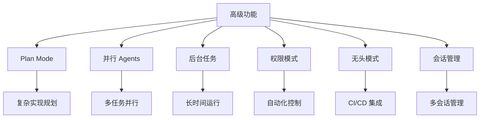
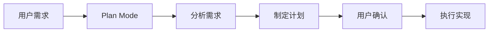
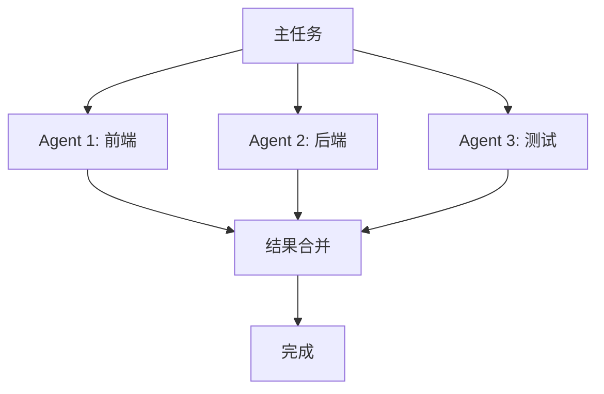
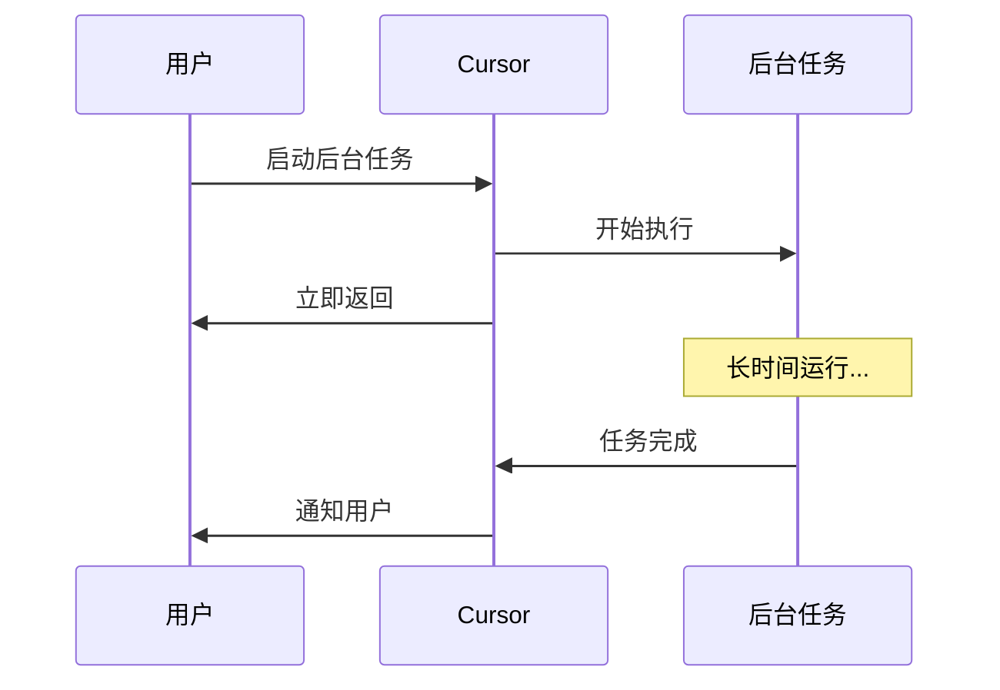
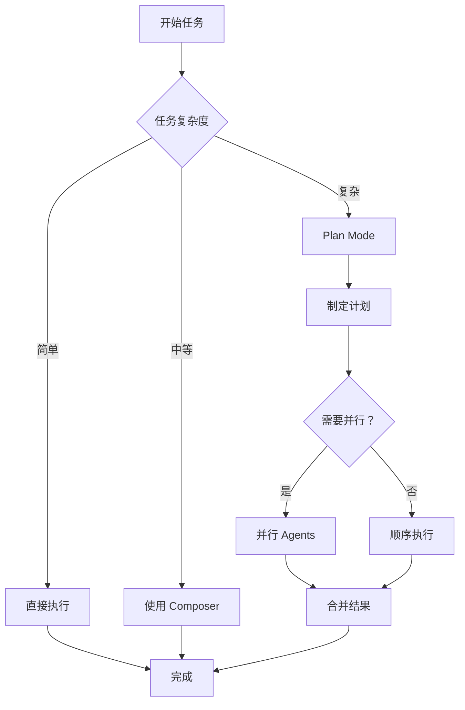

# 07. 高级功能

> **级别：** 高级 | **时间：** 1.5 小时 | **前置条件：** 熟悉 Cursor 基础功能

---

## 目录

- [概述](#概述)
- [Plan Mode](#plan-mode)
- [并行 Agents](#parallel-agents)
- [后台任务](#后台任务)
- [权限模式](#权限模式)
- [无头模式](#无头模式)
- [会话管理](#会话管理)
- [最佳实践](#最佳实践)

---

## 概述

Cursor 的高级功能让你能够：

- 规划复杂实现
- 并行执行多个任务
- 自动化 CI/CD 流程
- 管理多个会话



---

## Plan Mode

### 什么是 Plan Mode

Plan Mode 让 AI 在编写代码前先制定详细计划：



### 启用 Plan Mode

1. 在聊天面板中点击 "Plan" 按钮
2. 或使用命令面板 → "Cursor: Toggle Plan Mode"

### 使用场景

```
✅ 复杂功能开发
✅ 大规模重构
✅ 架构变更
✅ 多模块修改
```

### Plan Mode 示例

```
用户: 为项目添加用户认证系统

AI (Plan Mode):
## 实现计划

### 1. 数据库设计
- 创建 users 表
- 创建 sessions 表
- 添加索引

### 2. 后端 API
- POST /auth/register
- POST /auth/login
- POST /auth/logout
- GET /auth/me

### 3. 前端集成
- 创建登录页面
- 创建注册页面
- 添加认证状态管理

### 4. 安全措施
- 密码加密
- JWT Token
- CSRF 防护

是否按此计划执行？
```

---

## 并行 Agents

### 什么是并行 Agents

并行 Agents 让多个 AI Agent 同时工作：



### 使用场景

```
✅ 前后端同时开发
✅ 多模块并行修改
✅ 代码生成 + 测试编写
```

### 配置并行 Agents

在设置中启用：

```json
{
  "cursor.experimental.parallelAgents": true
}
```

### 使用示例

```
用户: 同时实现用户管理的前端和后端

AI (并行执行):
启动 2 个 Agent...

Agent 1 (前端):
- 创建 UserList.tsx
- 创建 UserForm.tsx
- 添加路由配置

Agent 2 (后端):
- 创建 user.controller.ts
- 创建 user.service.ts
- 添加 API 路由

合并结果...
完成！
```

---

## 后台任务

### 什么是后台任务

后台任务让 AI 在后台执行长时间操作：



### 使用场景

```
✅ 大规模代码生成
✅ 批量文件处理
✅ 长时间测试运行
```

### 启动后台任务

```
用户: 在后台生成所有 API 的类型定义

AI: 已启动后台任务
任务 ID: task-123

你可以在任务运行时继续其他工作。
完成后我会通知你。
```

### 查看任务状态

```
用户: 查看后台任务状态

AI: 后台任务状态：

task-123: 进行中 (45%)
- 已处理: 23/51 文件
- 预计剩余: 2 分钟
```

---

## 权限模式

### 权限模式类型

| 模式 | 描述 | 适用场景 |
|------|------|----------|
| **default** | 每次操作都询问 | 谨慎开发 |
| **acceptEdits** | 自动接受编辑 | 快速迭代 |
| **plan** | 先规划后执行 | 复杂任务 |
| **dontAsk** | 不询问直接执行 | 自动化流程 |
| **bypassPermissions** | 绕过所有权限检查 | CI/CD |

### 配置权限模式

```json
// .cursor/settings.json
{
  "cursor.permissionMode": "acceptEdits"
}
```

### 切换权限模式

```
命令面板 → "Cursor: Set Permission Mode"
```

---

## 无头模式

### 什么是无头模式

无头模式让 Cursor 在命令行中运行，适合 CI/CD：

```bash
# 基本用法
cursor -p "解释这个项目"

# 处理文件内容
cat error.log | cursor -p "解释这个错误"

# JSON 输出
cursor -p --output-format json "列出所有函数"

# 恢复会话
cursor -r "feature-auth" "继续实现"
```

### CI/CD 集成示例

```yaml
# .github/workflows/ai-review.yml
name: AI Code Review

on:
  pull_request:
    types: [opened, synchronize]

jobs:
  review:
    runs-on: ubuntu-latest
    steps:
      - uses: actions/checkout@v4
      
      - name: AI Review
        run: |
          cursor -p "审查这个 PR 的代码变更" \
            --output-format json > review.json
          
      - name: Post Review
        uses: actions/github-script@v7
        with:
          script: |
            const review = require('./review.json');
            github.rest.issues.createComment({
              issue_number: context.issue.number,
              owner: context.repo.owner,
              repo: context.repo.repo,
              body: review.comment
            });
```

---

## 会话管理

### 会话操作

| 操作 | 命令 | 描述 |
|------|------|------|
| **新建会话** | `cursor -c` | 创建新会话 |
| **恢复会话** | `cursor -r <name>` | 恢复之前的会话 |
| **列出会话** | `cursor --list-sessions` | 列出所有会话 |
| **删除会话** | `cursor --delete-session <name>` | 删除会话 |

### 会话命名

```
用户: /rename feature-auth

AI: 会话已重命名为 "feature-auth"
你可以使用 cursor -r feature-auth 恢复此会话
```

### 会话分支

```
用户: /fork

AI: 已创建会话分支
新会话 ID: session-456
原会话: session-123

你可以在新会话中尝试不同的方案。
```

---

## 最佳实践

### ✅ 应该做的

1. **复杂任务用 Plan Mode** - 先规划后执行
2. **独立任务并行执行** - 提高效率
3. **长时间任务放后台** - 不阻塞工作
4. **CI/CD 用无头模式** - 自动化流程
5. **命名会话** - 方便恢复和管理

### ❌ 不应该做的

1. **简单任务用 Plan Mode** - 浪费时间
2. **依赖任务并行执行** - 可能出错
3. **忽略后台任务状态** - 可能错过错误
4. **生产环境用 bypassPermissions** - 安全风险

### 工作流建议



---

## 下一步

- [08. 最佳实践](../08-best-practices/) - 学习完整工作流
- [09. Skills](../09-skills/) - 创建自定义技能
- [10. Subagents](../10-subagents/) - 配置专用 Agent

---

<p align="center">
  <a href="../README.md">返回首页</a> | <a href="plan-mode-examples.md">Plan Mode 示例</a> | <a href="config-examples.json">配置示例</a>
</p>
