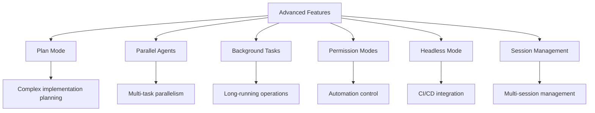
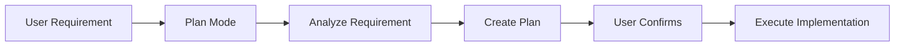
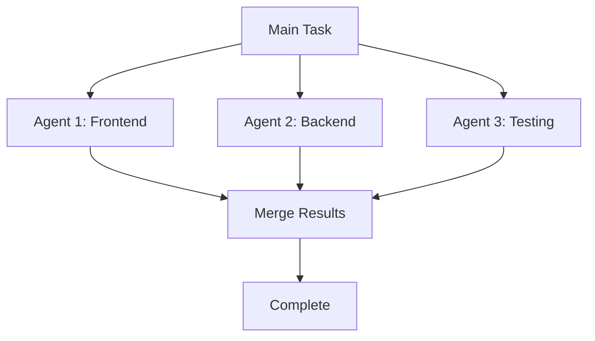
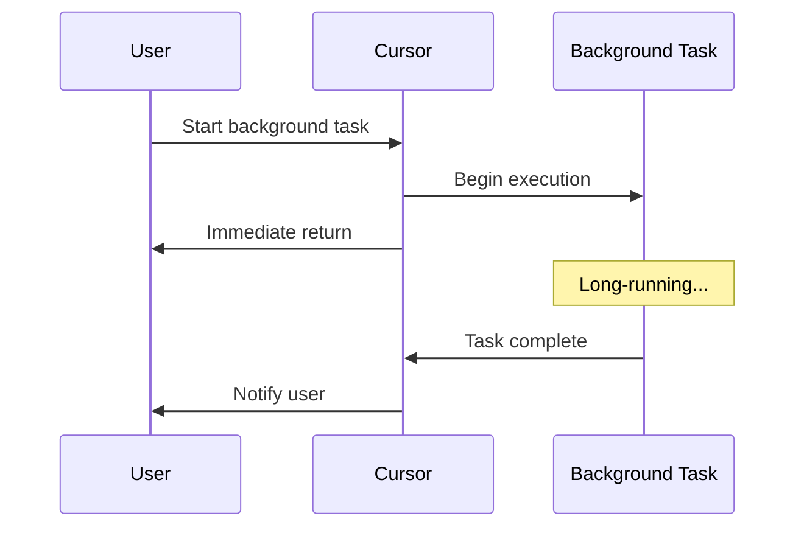
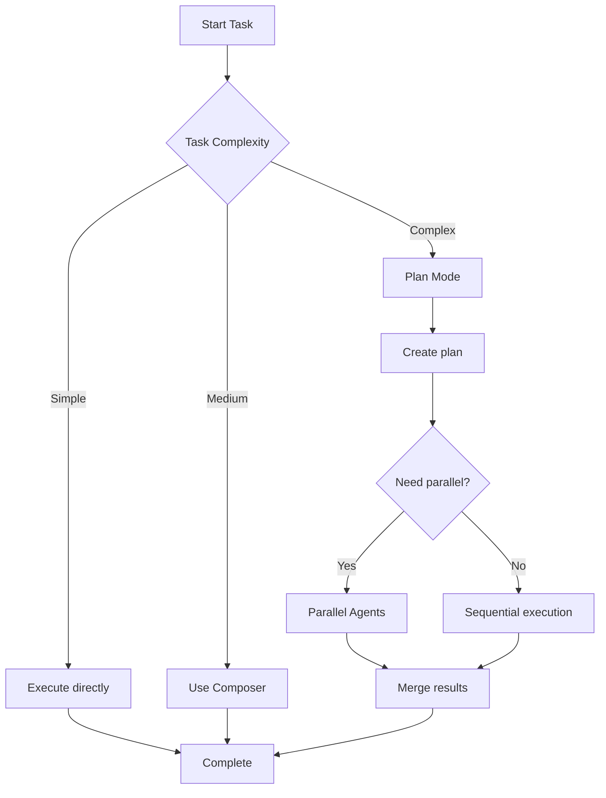

# 07. Advanced Features

> **Level:** Advanced | **Time:** 1.5 hours | **Prerequisites:** Familiar with Cursor basics

---

## Table of Contents

- [Overview](#overview)
- [Plan Mode](#plan-mode)
- [Parallel Agents](#parallel-agents)
- [Background Tasks](#background-tasks)
- [Permission Modes](#permission-modes)
- [Headless Mode](#headless-mode)
- [Session Management](#session-management)
- [Best Practices](#best-practices)

---

## Overview

Cursor's advanced features enable you to:

- Plan complex implementations
- Execute multiple tasks in parallel
- Automate CI/CD processes
- Manage multiple sessions



---

## Plan Mode

### What is Plan Mode

Plan Mode lets AI create a detailed plan before writing code:



### Enabling Plan Mode

1. Click "Plan" button in chat panel
2. Or use Command Palette → "Cursor: Toggle Plan Mode"

### Use Cases

```
✅ Complex feature development
✅ Large-scale refactoring
✅ Architecture changes
✅ Multi-module modifications
```

### Plan Mode Example

```
User: Add user authentication system to project

AI (Plan Mode):
## Implementation Plan

### 1. Database Design
- Create users table
- Create sessions table
- Add indexes

### 2. Backend API
- POST /auth/register
- POST /auth/login
- POST /auth/logout
- GET /auth/me

### 3. Frontend Integration
- Create login page
- Create registration page
- Add authentication state management

### 4. Security Measures
- Password encryption
- JWT Token
- CSRF protection

Should I proceed with this plan?
```

---

## Parallel Agents

### What are Parallel Agents

Parallel Agents let multiple AI Agents work simultaneously:



### Use Cases

```
✅ Frontend and backend development simultaneously
✅ Multi-module parallel modifications
✅ Code generation + Test writing
```

### Configuring Parallel Agents

Enable in settings:

```json
{
  "cursor.experimental.parallelAgents": true
}
```

### Usage Example

```
User: Implement user management frontend and backend simultaneously

AI (Parallel execution):
Starting 2 Agents...

Agent 1 (Frontend):
- Create UserList.tsx
- Create UserForm.tsx
- Add route configuration

Agent 2 (Backend):
- Create user.controller.ts
- Create user.service.ts
- Add API routes

Merging results...
Complete!
```

---

## Background Tasks

### What are Background Tasks

Background Tasks let AI execute long-running operations in the background:



### Use Cases

```
✅ Large-scale code generation
✅ Batch file processing
✅ Long test runs
```

### Starting Background Tasks

```
User: Generate type definitions for all APIs in background

AI: Background task started
Task ID: task-123

You can continue other work while the task runs.
I'll notify you when complete.
```

### Viewing Task Status

```
User: Show background task status

AI: Background task status:

task-123: In progress (45%)
- Processed: 23/51 files
- Estimated remaining: 2 minutes
```

---

## Permission Modes

### Permission Mode Types

| Mode | Description | Use Case |
|------|-------------|----------|
| **default** | Ask for each operation | Cautious development |
| **acceptEdits** | Auto-accept edits | Rapid iteration |
| **plan** | Plan before execute | Complex tasks |
| **dontAsk** | Execute without asking | Automated processes |
| **bypassPermissions** | Bypass all permission checks | CI/CD |

### Configuring Permission Mode

```json
// .cursor/settings.json
{
  "cursor.permissionMode": "acceptEdits"
}
```

### Switching Permission Mode

```
Command Palette → "Cursor: Set Permission Mode"
```

---

## Headless Mode

### What is Headless Mode

Headless Mode lets Cursor run in the command line, suitable for CI/CD:

```bash
# Basic usage
cursor -p "Explain this project"

# Process file content
cat error.log | cursor -p "Explain this error"

# JSON output
cursor -p --output-format json "List all functions"

# Resume session
cursor -r "feature-auth" "Continue implementation"
```

### CI/CD Integration Example

```yaml
# .github/workflows/ai-review.yml
name: AI Code Review

on:
  pull_request:
    types: [opened, synchronize]

jobs:
  review:
    runs-on: ubuntu-latest
    steps:
      - uses: actions/checkout@v4
      
      - name: AI Review
        run: |
          cursor -p "Review this PR's code changes" \
            --output-format json > review.json
          
      - name: Post Review
        uses: actions/github-script@v7
        with:
          script: |
            const review = require('./review.json');
            github.rest.issues.createComment({
              issue_number: context.issue.number,
              owner: context.repo.owner,
              repo: context.repo.repo,
              body: review.comment
            });
```

---

## Session Management

### Session Operations

| Operation | Command | Description |
|-----------|---------|-------------|
| **New Session** | `cursor -c` | Create new session |
| **Resume Session** | `cursor -r <name>` | Resume previous session |
| **List Sessions** | `cursor --list-sessions` | List all sessions |
| **Delete Session** | `cursor --delete-session <name>` | Delete session |

### Session Naming

```
User: /rename feature-auth

AI: Session renamed to "feature-auth"
You can resume this session with cursor -r feature-auth
```

### Session Branching

```
User: /fork

AI: Session branch created
New session ID: session-456
Original session: session-123

You can try different approaches in the new session.
```

---

## Best Practices

### ✅ Do's

1. **Use Plan Mode for complex tasks** - Plan before execute
2. **Execute independent tasks in parallel** - Improve efficiency
3. **Run long tasks in background** - Don't block work
4. **Use headless mode for CI/CD** - Automation
5. **Name sessions** - Easy to resume and manage

### ❌ Don'ts

1. **Use Plan Mode for simple tasks** - Wastes time
2. **Execute dependent tasks in parallel** - May cause errors
3. **Ignore background task status** - May miss errors
4. **Use bypassPermissions in production** - Security risk

### Workflow Suggestions



---

## Next Steps

- [08. Best Practices](../08-best-practices/) - Learn complete workflows
- [09. Skills](../09-skills/) - Create custom skills
- [10. Subagents](../10-subagents/) - Configure specialized Agents

---

<p align="center">
  <a href="../README.md">Back to Home</a> | <a href="plan-mode-examples.md">Plan Mode Examples</a> | <a href="config-examples.json">Config Examples</a>
</p>
