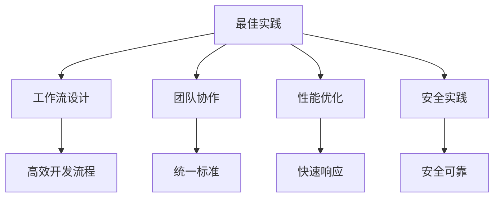
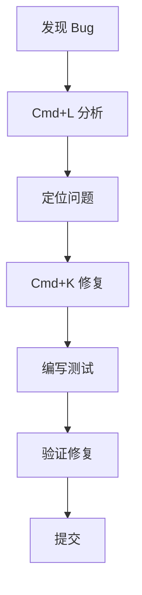
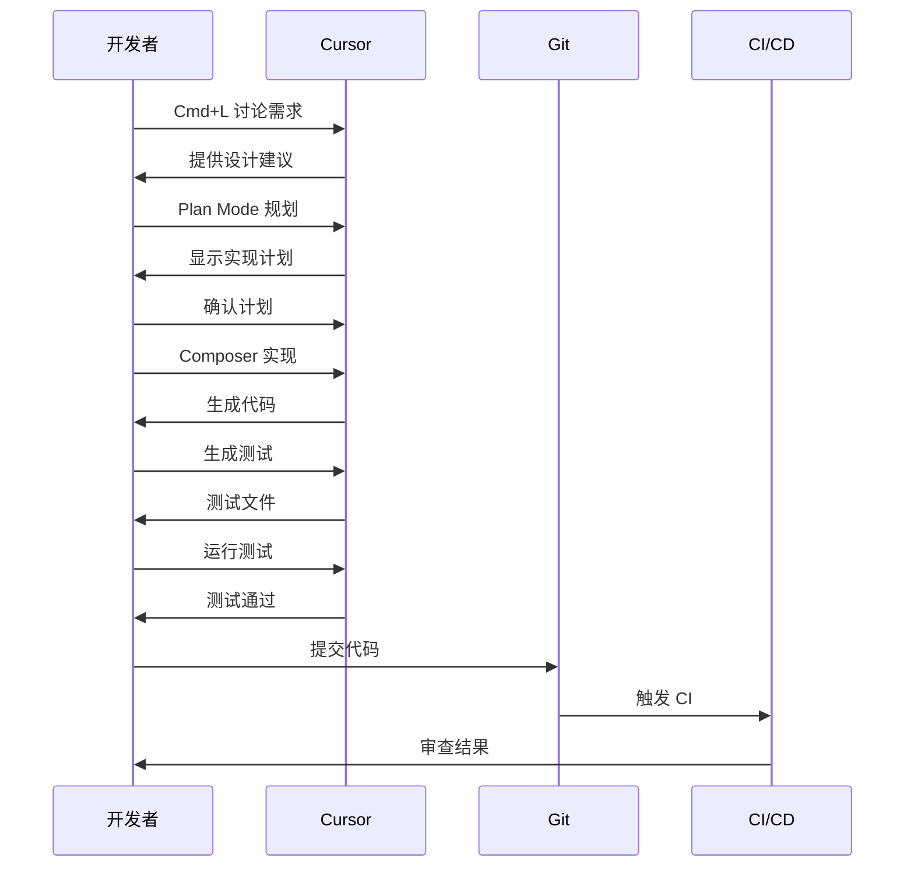

# 08. 最佳实践

> **级别：** 高级 | **时间：** 1 小时 | **前置条件：** 熟悉 Cursor 所有功能

---

## 目录

- [概述](#概述)
- [工作流设计](#工作流设计)
- [团队协作](#团队协作)
- [性能优化](#性能优化)
- [安全最佳实践](#安全最佳实践)
- [常见工作流示例](#常见工作流示例)
- [故障排查指南](#故障排查指南)

---

## 概述

最佳实践是确保你从 Cursor 获得最大价值的关键。本章将介绍：

- 如何设计高效工作流
- 团队如何协作使用 Cursor
- 如何优化性能
- 如何确保安全



---

## 工作流设计

### 基础工作流


### 功能开发工作流

```
1. 需求分析
   └── 使用 Cmd+L 讨论

2. 规划实现
   └── 使用 Plan Mode

3. 编写代码
   └── 使用 Composer + Cmd+K

4. 编写测试
   └── 使用 Skills 自动生成

5. 代码审查
   └── 使用 MCP + Subagents

6. 提交代码
   └── 使用 Hooks 自动检查
```

### Bug 修复工作流



---

## 团队协作

### 统一 Rules

```
项目根目录/
├── .cursor/
│   └── rules/
│       ├── general.mdc      # 通用规则
│       ├── frontend.mdc     # 前端规则
│       ├── backend.mdc      # 后端规则
│       └── testing.mdc      # 测试规则
└── .cursorrules             # 项目规则
```

### 共享 Skills

```
项目根目录/
└── .cursor/
    └── skills/
        ├── code-review/     # 代码审查
        ├── test-gen/        # 测试生成
        └── doc-gen/         # 文档生成
```

### 团队配置模板

```json
// .cursor/settings.json
{
  "cursor.rules.enabled": true,
  "cursor.codebaseIndexing.enabled": true,
  "cursor.permissionMode": "default",
  "editor.formatOnSave": true,
  "editor.codeActionsOnSave": {
    "source.fixAll": true
  }
}
```

### Git 工作流集成

```yaml
# .github/workflows/cursor-review.yml
name: Cursor AI Review

on:
  pull_request:
    types: [opened, synchronize]

jobs:
  review:
    runs-on: ubuntu-latest
    steps:
      - uses: actions/checkout@v4
      
      - name: Setup Cursor
        run: npm install -g cursor-cli
        
      - name: AI Review
        env:
          CURSOR_API_KEY: ${{ secrets.CURSOR_API_KEY }}
        run: |
          cursor -p "审查这个 PR" \
            --output-format json > review.json
            
      - name: Post Review
        uses: actions/github-script@v7
        with:
          script: |
            const fs = require('fs');
            const review = JSON.parse(fs.readFileSync('review.json'));
            github.rest.issues.createComment({
              issue_number: context.issue.number,
              owner: context.repo.owner,
              repo: context.repo.repo,
              body: review.summary
            });
```

---

## 性能优化

### 索引优化

```gitignore
# .cursorignore
node_modules/
dist/
build/
.next/
coverage/
*.min.js
*.min.css
package-lock.json
yarn.lock
```

### Rules 优化

```markdown
---
description: 简洁的规则描述
globs: ["src/**/*.tsx"]
---

# 规则内容

保持简洁，只包含必要信息。
避免重复和冗余。
```

### MCP 优化

```json
{
  "mcpServers": {
    "github": {
      "command": "npx",
      "args": ["-y", "@modelcontextprotocol/server-github"],
      "env": {
        "GITHUB_TOKEN": "${GITHUB_TOKEN}"
      }
    }
  }
}
```

### 性能检查清单

```
□ 索引排除不必要的文件
□ Rules 简洁明了
□ MCP 服务器数量合理
□ 后台任务及时清理
□ 会话数量合理
```

---

## 安全最佳实践

### 敏感信息处理

```json
// ❌ 错误：硬编码 Token
{
  "mcpServers": {
    "github": {
      "env": {
        "GITHUB_TOKEN": "ghp_xxxx"
      }
    }
  }
}

// ✅ 正确：使用环境变量
{
  "mcpServers": {
    "github": {
      "env": {
        "GITHUB_TOKEN": "${GITHUB_TOKEN}"
      }
    }
  }
}
```

### .gitignore 配置

```gitignore
# Cursor 相关
.cursor/mcp.json
.cursor/settings.json
.env
.env.local
*.pem
*.key
```

### Rules 安全

```markdown
# 安全规则

## 禁止事项
- 不要在代码中硬编码密钥
- 不要在日志中记录敏感信息
- 不要跳过输入验证

## 必须事项
- 使用环境变量存储敏感信息
- 所有 API 输入必须验证
- 使用参数化查询防止 SQL 注入
```

### 权限控制

```json
// 生产环境权限设置
{
  "cursor.permissionMode": "default",
  "cursor.security.restrictFileAccess": true,
  "cursor.security.allowedPaths": ["src/", "lib/"]
}
```

---

## 常见工作流示例

### 完整功能开发



### 代码审查流程

```
1. PR 创建
   └── 触发 Hooks

2. 自动检查
   ├── 代码风格检查
   ├── 类型检查
   ├── 测试运行
   └── 安全扫描

3. AI 审查
   └── 使用 MCP + Subagents

4. 生成报告
   └── 发布到 PR 评论

5. 人工审查
   └── 开发者确认
```

### 文档生成流程

```
1. 代码完成
   └── 功能实现

2. 触发 Skill
   └── doc-gen Skill

3. 分析代码
   └── 提取 API 信息

4. 生成文档
   ├── API 文档
   ├── 使用示例
   └── 类型定义

5. 更新 README
   └── 自动更新
```

---

## 故障排查指南

### 常见问题

#### AI 响应慢

```
检查项：
□ 网络连接
□ 索引状态
□ MCP 服务器状态
□ 后台任务数量
```

#### 代码质量差

```
检查项：
□ Rules 是否配置
□ 上下文是否充分
□ 任务描述是否清晰
□ 项目结构是否清晰
```

#### 功能不工作

```
检查项：
□ Cursor 版本
□ 配置是否正确
□ 权限是否设置
□ 日志错误信息
```

### 日志查看

```
# 查看 Cursor 日志
命令面板 → "Cursor: Open Logs"

# 查看特定日志
命令面板 → "Cursor: Show MCP Logs"
```

### 重置配置

```
# 重置用户设置
命令面板 → "Cursor: Reset User Settings"

# 重新索引
命令面板 → "Cursor: Reindex Codebase"
```

---

## 检查清单

### 新项目设置

```
□ 创建 .cursorrules 或 .cursor/rules/
□ 配置 .cursorignore
□ 设置项目 Rules
□ 配置 MCP 服务器
□ 安装必要的 Skills
□ 配置 Hooks
□ 设置 CI/CD 集成
```

### 日常开发

```
□ 使用正确的工具（Cmd+K/L/I）
□ 提供充分的上下文
□ 验证 AI 生成的代码
□ 运行测试
□ 遵循团队规范
```

### 代码提交前

```
□ 运行所有测试
□ 检查代码风格
□ 更新文档
□ 审查 AI 生成的代码
□ 确保无敏感信息
```

---

## 下一步

- [09. Skills](../09-skills/) - 创建自定义技能
- [10. Subagents](../10-subagents/) - 配置专用 Agent
- [11. Hooks](../11-hooks/) - 设置自动化钩子

---

<p align="center">
  <a href="../README.md">返回首页</a> | <a href="workflow-examples.md">更多工作流示例</a>
</p>
