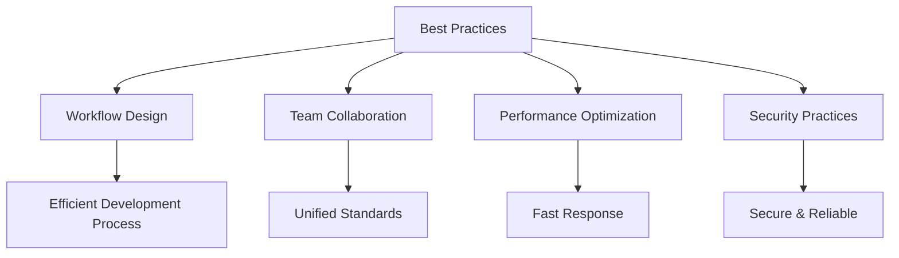
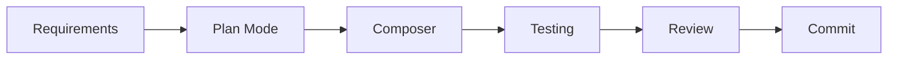
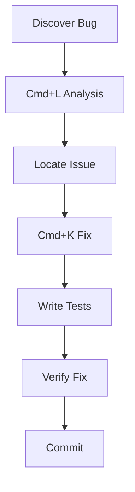
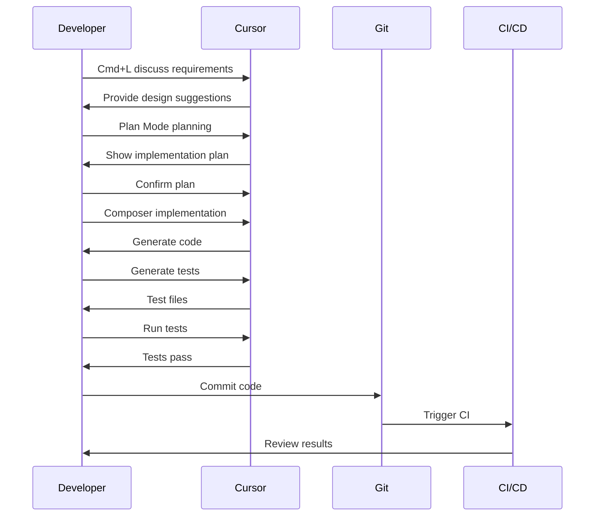

# 08. Best Practices

> **Level:** Advanced | **Time:** 1 hour | **Prerequisites:** Familiarity with all Cursor features

---

## Table of Contents

- [Overview](#overview)
- [Workflow Design](#workflow-design)
- [Team Collaboration](#team-collaboration)
- [Performance Optimization](#performance-optimization)
- [Security Best Practices](#security-best-practices)
- [Common Workflow Examples](#common-workflow-examples)
- [Troubleshooting Guide](#troubleshooting-guide)

---

## Overview

Best practices are key to getting maximum value from Cursor. This chapter covers:

- How to design efficient workflows
- How teams can collaborate using Cursor
- How to optimize performance
- How to ensure security



---

## Workflow Design

### Basic Workflow



### Feature Development Workflow

```
1. Requirements Analysis
   └── Use Cmd+L for discussion

2. Plan Implementation
   └── Use Plan Mode

3. Write Code
   └── Use Composer + Cmd+K

4. Write Tests
   └── Use Skills for auto-generation

5. Code Review
   └── Use MCP + Subagents

6. Commit Code
   └── Use Hooks for auto-checks
```

### Bug Fix Workflow



---

## Team Collaboration

### Unified Rules

```
Project Root/
├── .cursor/
│   └── rules/
│       ├── general.mdc      # General rules
│       ├── frontend.mdc     # Frontend rules
│       ├── backend.mdc      # Backend rules
│       └── testing.mdc      # Testing rules
└── .cursorrules             # Project rules
```

### Shared Skills

```
Project Root/
└── .cursor/
    └── skills/
        ├── code-review/     # Code review
        ├── test-gen/        # Test generation
        └── doc-gen/         # Documentation generation
```

### Team Configuration Template

```json
// .cursor/settings.json
{
  "cursor.rules.enabled": true,
  "cursor.codebaseIndexing.enabled": true,
  "cursor.permissionMode": "default",
  "editor.formatOnSave": true,
  "editor.codeActionsOnSave": {
    "source.fixAll": true
  }
}
```

### Git Workflow Integration

```yaml
# .github/workflows/cursor-review.yml
name: Cursor AI Review

on:
  pull_request:
    types: [opened, synchronize]

jobs:
  review:
    runs-on: ubuntu-latest
    steps:
      - uses: actions/checkout@v4
      
      - name: Setup Cursor
        run: npm install -g cursor-cli
        
      - name: AI Review
        env:
          CURSOR_API_KEY: ${{ secrets.CURSOR_API_KEY }}
        run: |
          cursor -p "Review this PR" \
            --output-format json > review.json
            
      - name: Post Review
        uses: actions/github-script@v7
        with:
          script: |
            const fs = require('fs');
            const review = JSON.parse(fs.readFileSync('review.json'));
            github.rest.issues.createComment({
              issue_number: context.issue.number,
              owner: context.repo.owner,
              repo: context.repo.repo,
              body: review.summary
            });
```

---

## Performance Optimization

### Indexing Optimization

```gitignore
# .cursorignore
node_modules/
dist/
build/
.next/
coverage/
*.min.js
*.min.css
package-lock.json
yarn.lock
```

### Rules Optimization

```markdown
---
description: Concise rule description
globs: ["src/**/*.tsx"]
---

# Rule Content

Keep it concise, only include necessary information.
Avoid repetition and redundancy.
```

### MCP Optimization

```json
{
  "mcpServers": {
    "github": {
      "command": "npx",
      "args": ["-y", "@modelcontextprotocol/server-github"],
      "env": {
        "GITHUB_TOKEN": "${GITHUB_TOKEN}"
      }
    }
  }
}
```

### Performance Checklist

```
□ Exclude unnecessary files from indexing
□ Keep Rules concise and clear
□ Reasonable number of MCP servers
□ Clean up background tasks promptly
□ Reasonable number of sessions
```

---

## Security Best Practices

### Sensitive Information Handling

```json
// ❌ Wrong: Hardcoded Token
{
  "mcpServers": {
    "github": {
      "env": {
        "GITHUB_TOKEN": "ghp_xxxx"
      }
    }
  }
}

// ✅ Correct: Use environment variables
{
  "mcpServers": {
    "github": {
      "env": {
        "GITHUB_TOKEN": "${GITHUB_TOKEN}"
      }
    }
  }
}
```

### .gitignore Configuration

```gitignore
# Cursor related
.cursor/mcp.json
.cursor/settings.json
.env
.env.local
*.pem
*.key
```

### Rules Security

```markdown
# Security Rules

## Prohibited
- Do not hardcode keys in code
- Do not log sensitive information
- Do not skip input validation

## Required
- Use environment variables for sensitive information
- All API inputs must be validated
- Use parameterized queries to prevent SQL injection
```

### Permission Control

```json
// Production environment permission settings
{
  "cursor.permissionMode": "default",
  "cursor.security.restrictFileAccess": true,
  "cursor.security.allowedPaths": ["src/", "lib/"]
}
```

---

## Common Workflow Examples

### Complete Feature Development



### Code Review Process

```
1. PR Created
   └── Triggers Hooks

2. Automatic Checks
   ├── Code style check
   ├── Type check
   ├── Test run
   └── Security scan

3. AI Review
   └── Use MCP + Subagents

4. Generate Report
   └── Post to PR comments

5. Manual Review
   └── Developer confirmation
```

### Documentation Generation Process

```
1. Code Complete
   └── Feature implementation

2. Trigger Skill
   └── doc-gen Skill

3. Analyze Code
   └── Extract API information

4. Generate Documentation
   ├── API documentation
   ├── Usage examples
   └── Type definitions

5. Update README
   └── Auto update
```

---

## Troubleshooting Guide

### Common Issues

#### Slow AI Response

```
Check items:
□ Network connection
□ Indexing status
□ MCP server status
□ Number of background tasks
```

#### Poor Code Quality

```
Check items:
□ Are Rules configured
□ Is context sufficient
□ Is task description clear
□ Is project structure clear
```

#### Features Not Working

```
Check items:
□ Cursor version
□ Is configuration correct
□ Are permissions set
□ Log error messages
```

### Viewing Logs

```
# View Cursor logs
Command Palette → "Cursor: Open Logs"

# View specific logs
Command Palette → "Cursor: Show MCP Logs"
```

### Reset Configuration

```
# Reset user settings
Command Palette → "Cursor: Reset User Settings"

# Reindex codebase
Command Palette → "Cursor: Reindex Codebase"
```

---

## Checklist

### New Project Setup

```
□ Create .cursorrules or .cursor/rules/
□ Configure .cursorignore
□ Set project Rules
□ Configure MCP servers
□ Install necessary Skills
□ Configure Hooks
□ Setup CI/CD integration
```

### Daily Development

```
□ Use correct tools (Cmd+K/L/I)
□ Provide sufficient context
□ Verify AI-generated code
□ Run tests
□ Follow team standards
```

### Before Code Commit

```
□ Run all tests
□ Check code style
□ Update documentation
□ Review AI-generated code
□ Ensure no sensitive information
```

---

## Next Steps

- [09. Skills](../09-skills/) - Create custom skills
- [10. Subagents](../10-subagents/) - Configure specialized agents
- [11. Hooks](../11-hooks/) - Setup automation hooks

---

<p align="center">
  <a href="../README.md">Back to Home</a> | <a href="workflow-examples.md">More Workflow Examples</a>
</p>
