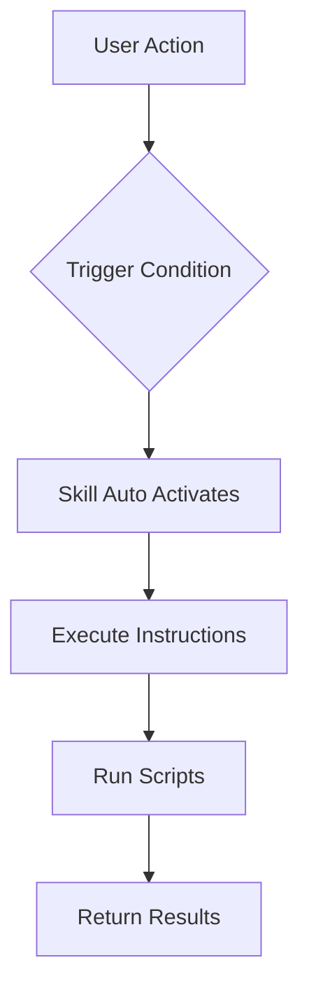

# 09. Skills

> **Level:** Advanced | **Time:** 1 hour | **Prerequisites:** Familiarity with Cursor basic features

---

## Table of Contents

- [Overview](#overview)
- [What are Skills](#what-are-skills)
- [Skill Structure](#skill-structure)
- [Creating Custom Skills](#creating-custom-skills)
- [Built-in Skills Examples](#built-in-skills-examples)
- [Best Practices](#best-practices)

---

## Overview

Skills are Cursor's **reusable capability modules**. They are:

- Automatically triggered
- Shareable across projects
- Contain instructions and scripts



---

## What are Skills

### Difference from Rules

| Feature | Rules | Skills |
|---------|-------|--------|
| **Trigger Method** | Auto-inject context | Conditional trigger execution |
| **Content** | Text rules | Instructions + Scripts |
| **Capability** | Provide context | Execute operations |
| **Reusability** | Project-level | Cross-project |

### What Skills Can Do

```
✅ Code review
✅ Test generation
✅ Documentation generation
✅ Code formatting
✅ Security scanning
✅ Performance analysis
```

---

## Skill Structure

### Directory Structure

```
.cursor/skills/
└── skill-name/
    ├── SKILL.md          # Skill definition (required)
    ├── scripts/          # Helper scripts
    │   ├── analyze.sh
    │   └── format.py
    └── templates/        # Template files
        └── report.md
```

### SKILL.md Format

```markdown
---
name: Code Review
description: Automatic code review
triggers:
  - type: file_save
    glob: "*.ts"
  - type: command
    command: "/review"
---

# Code Review Skill

## Function
Automatically review code and provide improvement suggestions.

## Execution Steps
1. Analyze code structure
2. Check code style
3. Check for potential issues
4. Generate review report

## Output Format
[Review Report Template]
```

---

## Creating Custom Skills

### Example: Code Review Skill

```markdown
---
name: Code Review
description: Automatic code review
triggers:
  - type: command
    command: "/review"
---

# Code Review Skill

## Review Items

### Code Quality
- Naming conventions
- Code structure
- Comment completeness

### Security Check
- SQL injection
- XSS vulnerabilities
- Sensitive information exposure

### Performance Check
- Loop optimization
- Memory leaks
- Async handling

## Output Template

```markdown
# Code Review Report

## Overview
- File: {filename}
- Review Time: {timestamp}

## Issue List
| Level | Location | Description | Suggestion |
|-------|----------|-------------|------------|
| {level} | {location} | {description} | {suggestion} |

## Statistics
- Total Issues: {total}
- High: {high}
- Medium: {medium}
- Low: {low}

## Recommendations
{recommendations}
```
```

### Example: Test Generator Skill

```markdown
---
name: Test Generator
description: Automatically generate test files
triggers:
  - type: file_create
    glob: "src/**/*.ts"
---

# Test Generator Skill

## Generation Rules

### Unit Tests
- Test file location: `__tests__/{filename}.test.ts`
- Test framework: Vitest
- Coverage target: 80%

### Test Template

```typescript
import { describe, it, expect } from 'vitest';
import { {functionName} } from '../{filename}';

describe('{functionName}', () => {
  it('should work correctly', () => {
    // Arrange
    const input = {input};
    
    // Act
    const result = {functionName}(input);
    
    // Assert
    expect(result).toBe({expected});
  });
});
```

## Execution Steps
1. Analyze source file
2. Extract function signatures
3. Generate test cases
4. Create test file
```

---

## Built-in Skills Examples

### code-review

```
Trigger: /review
Function: Comprehensive code review
Output: Review report
```

### test-gen

```
Trigger: File creation
Function: Auto-generate tests
Output: Test files
```

### doc-gen

```
Trigger: /docs
Function: Generate API documentation
Output: Markdown documentation
```

---

## Best Practices

### ✅ Do's

1. **Clear Trigger Conditions** - Avoid accidental triggers
2. **Provide Clear Output** - Use templates for formatting
3. **Handle Errors** - Provide friendly error messages
4. **Version Control** - Include Skills in Git

### ❌ Don'ts

1. **Over-triggering** - Avoid frequent execution
2. **Complex Logic** - Keep it simple
3. **Ignore Performance** - Consider execution time
4. **Hardcoded Paths** - Use relative paths

---

## Next Steps

- [10. Subagents](../10-subagents/) - Configure specialized agents
- [11. Hooks](../11-hooks/) - Setup automation hooks
- [12. Plugins](../12-plugins/) - Package complete features

---

<p align="center">
  <a href="../README.md">Back to Home</a>
</p>
