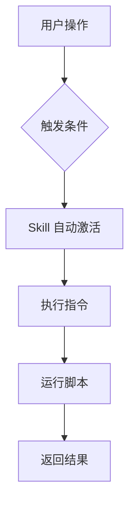

# 09. Skills

> **级别：** 高级 | **时间：** 1 小时 | **前置条件：** 熟悉 Cursor 基础功能

---

## 目录

- [概述](#概述)
- [什么是 Skills](#什么是-skills)
- [Skill 结构](#skill-结构)
- [创建自定义 Skill](#创建自定义-skill)
- [内置 Skills 示例](#内置-skills-示例)
- [最佳实践](#最佳实践)

---

## 概述

Skills 是 Cursor 的**可复用能力模块**。它们是：

- 自动触发的
- 可跨项目共享
- 包含指令和脚本



---

## 什么是 Skills

### 与 Rules 的区别

| 特性 | Rules | Skills |
|------|-------|--------|
| **触发方式** | 自动注入上下文 | 条件触发执行 |
| **内容** | 文本规则 | 指令 + 脚本 |
| **能力** | 提供上下文 | 执行操作 |
| **复用性** | 项目级 | 可跨项目 |

### Skills 能做什么

```
✅ 代码审查
✅ 测试生成
✅ 文档生成
✅ 代码格式化
✅ 安全扫描
✅ 性能分析
```

---

## Skill 结构

### 目录结构

```
.cursor/skills/
└── skill-name/
    ├── SKILL.md          # Skill 定义（必需）
    ├── scripts/          # 辅助脚本
    │   ├── analyze.sh
    │   └── format.py
    └── templates/        # 模板文件
        └── report.md
```

### SKILL.md 格式

```markdown
---
name: Code Review
description: 自动代码审查
triggers:
  - type: file_save
    glob: "*.ts"
  - type: command
    command: "/review"
---

# Code Review Skill

## 功能
自动审查代码并提供改进建议。

## 执行步骤
1. 分析代码结构
2. 检查代码风格
3. 检查潜在问题
4. 生成审查报告

## 输出格式
[审查报告模板]
```

---

## 创建自定义 Skill

### 示例：代码审查 Skill

```markdown
---
name: Code Review
description: 自动代码审查
triggers:
  - type: command
    command: "/review"
---

# Code Review Skill

## 审查项目

### 代码质量
- 命名规范
- 代码结构
- 注释完整性

### 安全检查
- SQL 注入
- XSS 漏洞
- 敏感信息暴露

### 性能检查
- 循环优化
- 内存泄漏
- 异步处理

## 输出模板

```markdown
# 代码审查报告

## 概述
- 文件: {filename}
- 审查时间: {timestamp}

## 问题列表
| 级别 | 位置 | 描述 | 建议 |
|------|------|------|------|
| {level} | {location} | {description} | {suggestion} |

## 统计
- 总问题: {total}
- 高危: {high}
- 中危: {medium}
- 低危: {low}

## 建议
{recommendations}
```
```

### 示例：测试生成 Skill

```markdown
---
name: Test Generator
description: 自动生成测试文件
triggers:
  - type: file_create
    glob: "src/**/*.ts"
---

# Test Generator Skill

## 生成规则

### 单元测试
- 测试文件位置: `__tests__/{filename}.test.ts`
- 测试框架: Vitest
- 覆盖率目标: 80%

### 测试模板

```typescript
import { describe, it, expect } from 'vitest';
import { {functionName} } from '../{filename}';

describe('{functionName}', () => {
  it('should work correctly', () => {
    // Arrange
    const input = {input};
    
    // Act
    const result = {functionName}(input);
    
    // Assert
    expect(result).toBe({expected});
  });
});
```

## 执行步骤
1. 分析源文件
2. 提取函数签名
3. 生成测试用例
4. 创建测试文件
```

---

## 内置 Skills 示例

### code-review

```
触发: /review
功能: 全面代码审查
输出: 审查报告
```

### test-gen

```
触发: 文件创建
功能: 自动生成测试
输出: 测试文件
```

### doc-gen

```
触发: /docs
功能: 生成 API 文档
输出: Markdown 文档
```

---

## 最佳实践

### ✅ 应该做的

1. **明确触发条件** - 避免意外触发
2. **提供清晰输出** - 使用模板格式化
3. **处理错误** - 提供友好的错误信息
4. **版本控制** - 将 Skills 纳入 Git

### ❌ 不应该做的

1. **过度触发** - 避免频繁执行
2. **复杂逻辑** - 保持简单
3. **忽略性能** - 考虑执行时间
4. **硬编码路径** - 使用相对路径

---

## 下一步

- [10. Subagents](../10-subagents/) - 配置专用 Agent
- [11. Hooks](../11-hooks/) - 设置自动化钩子
- [12. Plugins](../12-plugins/) - 打包完整功能

---

<p align="center">
  <a href="../README.md">返回首页</a>
</p>
