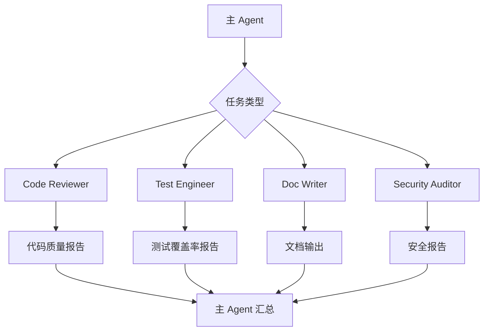
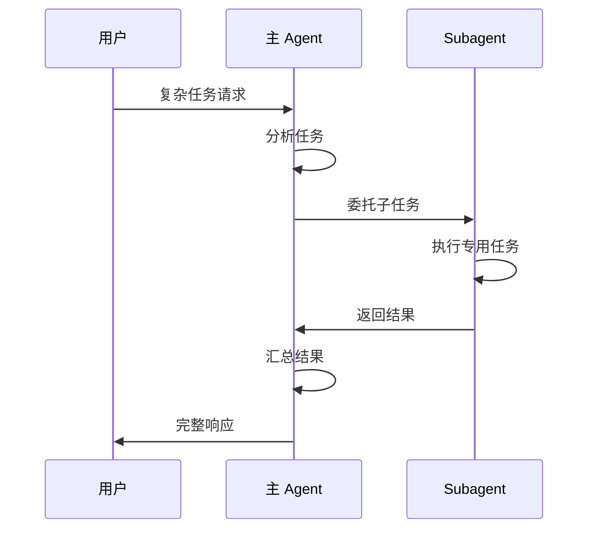

# 10. Subagents

> **级别：** 高级 | **时间：** 1 小时 | **前置条件：** 熟悉 Cursor 基础功能

---

## 目录

- [概述](#概述)
- [什么是 Subagents](#什么是-subagents)
- [Subagent 配置](#subagent-配置)
- [内置 Subagents](#内置-subagents)
- [创建自定义 Subagent](#创建自定义-subagent)
- [最佳实践](#最佳实践)

---

## 概述

Subagents 是 Cursor 的**专用 AI 助手**。它们：

- 拥有隔离的上下文
- 专注于特定任务
- 可以被主 Agent 委托



---

## 什么是 Subagents

### 与主 Agent 的关系



### Subagent 特点

| 特点 | 描述 |
|------|------|
| **隔离上下文** | 独立的对话历史 |
| **专用能力** | 针对特定任务优化 |
| **自动委托** | 主 Agent 自动判断 |
| **结果汇总** | 主 Agent 整合结果 |

---

## Subagent 配置

### 配置文件位置

```
项目根目录/
└── .cursor/
    └── agents/
        ├── code-reviewer.md
        ├── test-engineer.md
        └── doc-writer.md
```

### 配置格式

```markdown
---
name: Code Reviewer
description: 专注于代码质量和最佳实践审查
tools:
  - read_file
  - search
  - grep
model: claude-sonnet-4.6
---

# Code Reviewer Agent

## 专长
- 代码质量分析
- 设计模式识别
- 最佳实践建议

## 审查项目
1. 代码结构
2. 命名规范
3. 错误处理
4. 性能问题
5. 安全隐患

## 输出格式
[审查报告模板]
```

---

## 内置 Subagents

### Code Reviewer

```yaml
名称: Code Reviewer
专长: 代码质量审查
触发: 代码审查请求
输出: 审查报告
```

### Test Engineer

```yaml
名称: Test Engineer
专长: 测试策略和覆盖
触发: 测试相关请求
输出: 测试计划和用例
```

### Documentation Writer

```yaml
名称: Documentation Writer
专长: 技术文档编写
触发: 文档请求
输出: 格式化文档
```

### Security Auditor

```yaml
名称: Security Auditor
专长: 安全漏洞检测
触发: 安全审查请求
输出: 安全报告
```

---

## 创建自定义 Subagent

### 示例：性能优化 Agent

```markdown
---
name: Performance Optimizer
description: 专注于代码性能分析和优化
tools:
  - read_file
  - search
  - run_command
model: claude-sonnet-4.6
---

# Performance Optimizer Agent

## 专长
- 性能瓶颈识别
- 优化方案设计
- 性能测试建议

## 分析项目
1. 算法复杂度
2. 内存使用
3. I/O 操作
4. 异步处理
5. 缓存策略

## 输出格式

```markdown
# 性能分析报告

## 概述
- 分析文件: {files}
- 发现问题: {count}

## 问题列表
| 级别 | 位置 | 问题 | 影响 | 建议 |
|------|------|------|------|------|
| {level} | {location} | {issue} | {impact} | {suggestion} |

## 优化建议
1. {optimization_1}
2. {optimization_2}

## 预期收益
- 性能提升: {improvement}
- 资源节省: {saving}
```
```

### 示例：API 设计 Agent

```markdown
---
name: API Designer
description: 专注于 RESTful API 设计
tools:
  - read_file
  - write_file
  - search
model: claude-sonnet-4.6
---

# API Designer Agent

## 专长
- RESTful API 设计
- 接口规范制定
- 文档生成

## 设计原则
1. RESTful 规范
2. 版本控制
3. 错误处理
4. 认证授权
5. 限流策略

## 输出格式
- OpenAPI 规范
- 接口文档
- 示例代码
```

---

## 最佳实践

### ✅ 应该做的

1. **明确定义专长** - 让主 Agent 正确委托
2. **限制工具权限** - 只授予必要的工具
3. **提供输出模板** - 标准化输出格式
4. **测试独立运行** - 确保单独工作正常

### ❌ 不应该做的

1. **过度细分** - 避免创建太多 Subagent
2. **功能重叠** - 每个 Subagent 有明确职责
3. **忽略协作** - 考虑 Subagent 之间的配合
4. **硬编码配置** - 使用可配置的参数

---

## 下一步

- [11. Hooks](../11-hooks/) - 设置自动化钩子
- [12. Plugins](../12-plugins/) - 打包完整功能
- [CATALOG.md](../CATALOG.md) - 浏览功能目录

---

<p align="center">
  <a href="../README.md">返回首页</a>
</p>
