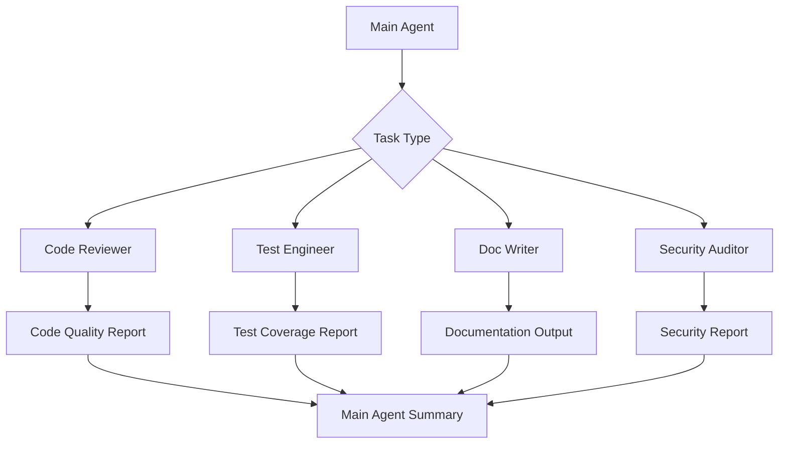
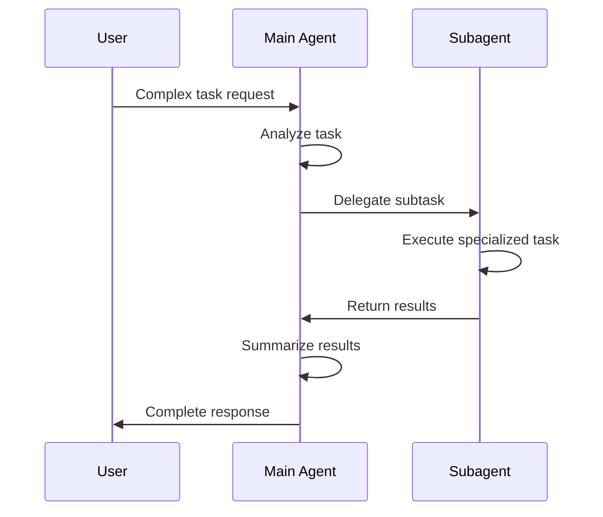

# 10. Subagents

> **Level:** Advanced | **Time:** 1 hour | **Prerequisites:** Familiarity with Cursor basic features

---

## Table of Contents

- [Overview](#overview)
- [What are Subagents](#what-are-subagents)
- [Subagent Configuration](#subagent-configuration)
- [Built-in Subagents](#built-in-subagents)
- [Creating Custom Subagents](#creating-custom-subagents)
- [Best Practices](#best-practices)

---

## Overview

Subagents are Cursor's **specialized AI assistants**. They:

- Have isolated context
- Focus on specific tasks
- Can be delegated by the main Agent



---

## What are Subagents

### Relationship with Main Agent



### Subagent Characteristics

| Characteristic | Description |
|----------------|-------------|
| **Isolated Context** | Independent conversation history |
| **Specialized Capability** | Optimized for specific tasks |
| **Auto Delegation** | Main Agent automatically decides |
| **Result Aggregation** | Main Agent consolidates results |

---

## Subagent Configuration

### Configuration File Location

```
Project Root/
└── .cursor/
    └── agents/
        ├── code-reviewer.md
        ├── test-engineer.md
        └── doc-writer.md
```

### Configuration Format

```markdown
---
name: Code Reviewer
description: Focus on code quality and best practices review
tools:
  - read_file
  - search
  - grep
model: claude-sonnet-4.6
---

# Code Reviewer Agent

## Expertise
- Code quality analysis
- Design pattern recognition
- Best practice recommendations

## Review Items
1. Code structure
2. Naming conventions
3. Error handling
4. Performance issues
5. Security vulnerabilities

## Output Format
[Review Report Template]
```

---

## Built-in Subagents

### Code Reviewer

```yaml
Name: Code Reviewer
Expertise: Code quality review
Trigger: Code review request
Output: Review report
```

### Test Engineer

```yaml
Name: Test Engineer
Expertise: Test strategy and coverage
Trigger: Test-related request
Output: Test plan and cases
```

### Documentation Writer

```yaml
Name: Documentation Writer
Expertise: Technical documentation writing
Trigger: Documentation request
Output: Formatted documentation
```

### Security Auditor

```yaml
Name: Security Auditor
Expertise: Security vulnerability detection
Trigger: Security review request
Output: Security report
```

---

## Creating Custom Subagents

### Example: Performance Optimizer Agent

```markdown
---
name: Performance Optimizer
description: Focus on code performance analysis and optimization
tools:
  - read_file
  - search
  - run_command
model: claude-sonnet-4.6
---

# Performance Optimizer Agent

## Expertise
- Performance bottleneck identification
- Optimization solution design
- Performance testing recommendations

## Analysis Items
1. Algorithm complexity
2. Memory usage
3. I/O operations
4. Async handling
5. Caching strategies

## Output Format

```markdown
# Performance Analysis Report

## Overview
- Analyzed files: {files}
- Issues found: {count}

## Issue List
| Level | Location | Issue | Impact | Suggestion |
|-------|----------|-------|--------|------------|
| {level} | {location} | {issue} | {impact} | {suggestion} |

## Optimization Recommendations
1. {optimization_1}
2. {optimization_2}

## Expected Benefits
- Performance improvement: {improvement}
- Resource savings: {saving}
```
```

### Example: API Designer Agent

```markdown
---
name: API Designer
description: Focus on RESTful API design
tools:
  - read_file
  - write_file
  - search
model: claude-sonnet-4.6
---

# API Designer Agent

## Expertise
- RESTful API design
- Interface specification development
- Documentation generation

## Design Principles
1. RESTful standards
2. Versioning
3. Error handling
4. Authentication & Authorization
5. Rate limiting strategies

## Output Format
- OpenAPI specification
- Interface documentation
- Example code
```

---

## Best Practices

### ✅ Do's

1. **Clearly Define Expertise** - Let Main Agent delegate correctly
2. **Limit Tool Permissions** - Only grant necessary tools
3. **Provide Output Templates** - Standardize output format
4. **Test Independently** - Ensure standalone operation works

### ❌ Don'ts

1. **Over-segmentation** - Avoid creating too many Subagents
2. **Overlapping Functions** - Each Subagent has clear responsibilities
3. **Ignore Collaboration** - Consider cooperation between Subagents
4. **Hardcoded Configuration** - Use configurable parameters

---

## Next Steps

- [11. Hooks](../11-hooks/) - Setup automation hooks
- [12. Plugins](../12-plugins/) - Package complete features
- [CATALOG.md](../CATALOG.md) - Browse feature catalog

---

<p align="center">
  <a href="../README.md">Back to Home</a>
</p>
