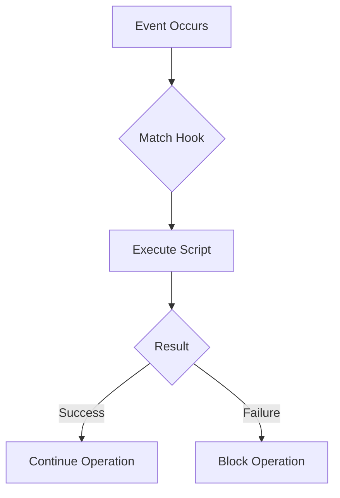
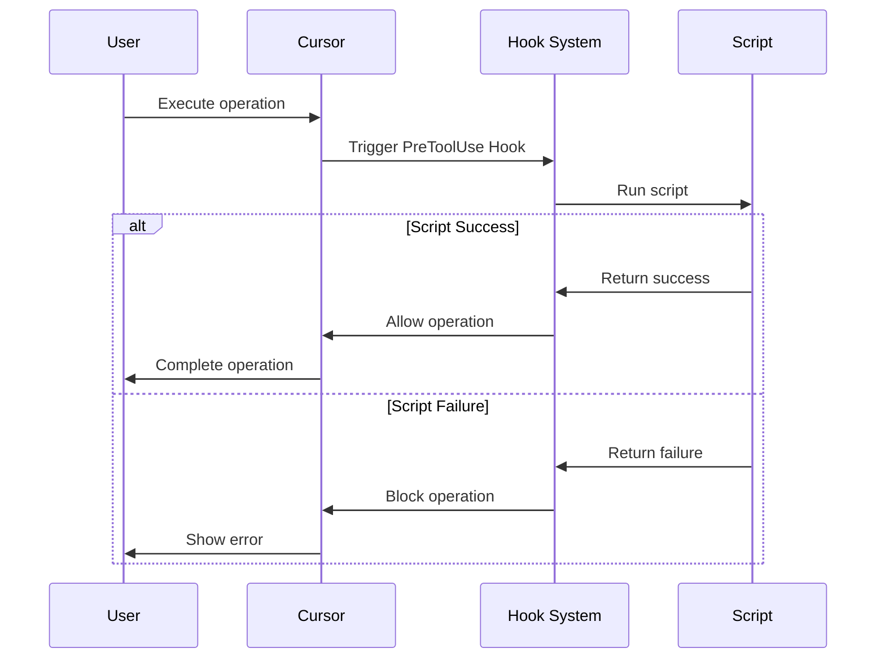

# 11. Hooks

> **Level:** Advanced | **Time:** 45 minutes | **Prerequisites:** Familiarity with Cursor basic features

---

## Table of Contents

- [Overview](#overview)
- [What are Hooks](#what-are-hooks)
- [Hook Types](#hook-types)
- [Configuring Hooks](#configuring-hooks)
- [Common Hook Examples](#common-hook-examples)
- [Best Practices](#best-practices)

---

## Overview

Hooks are Cursor's **event-driven automation system**. They:

- Trigger on specific events
- Execute custom scripts
- Can validate, modify, or notify



---

## What are Hooks

### How They Work



### What Hooks Can Do

```
✅ Code formatting
✅ Test running
✅ Security scanning
✅ Logging
✅ Notification sending
✅ Permission validation
```

---

## Hook Types

### Tool Hooks

| Hook | When Triggered | Purpose |
|------|----------------|---------|
| `PreToolUse` | Before tool use | Validate, modify input |
| `PostToolUse` | After tool use | Process output, notify |
| `PostToolUseFailure` | After tool failure | Error handling |
| `PermissionRequest` | On permission request | Custom permissions |

### Session Hooks

| Hook | When Triggered | Purpose |
|------|----------------|---------|
| `SessionStart` | Session start | Initialization |
| `SessionEnd` | Session end | Cleanup, reporting |
| `Stop` | On stop | Save state |
| `SubagentStart` | Subagent start | Logging |
| `SubagentStop` | Subagent stop | Result processing |

### Task Hooks

| Hook | When Triggered | Purpose |
|------|----------------|---------|
| `UserPromptSubmit` | User submits prompt | Validate, modify |
| `TaskCompleted` | Task complete | Notify, report |
| `TaskCreated` | Task created | Logging |

### Lifecycle Hooks

| Hook | When Triggered | Purpose |
|------|----------------|---------|
| `ConfigChange` | Configuration change | Validate |
| `CwdChanged` | Directory change | Update state |
| `FileChanged` | File change | Auto process |
| `PreCompact` | Before compression | Backup |
| `PostCompact` | After compression | Validate |

---

## Configuring Hooks

### Configuration File Location

```
User Directory/
└── .cursor/
    ├── hooks/
    │   ├── format-code.sh
    │   └── security-scan.sh
    └── settings.json
```

### settings.json Configuration

```json
{
  "hooks": {
    "PreToolUse": [
      {
        "matcher": "Write",
        "hooks": ["~/.cursor/hooks/format-code.sh"]
      }
    ],
    "PostToolUse": [
      {
        "matcher": "Write",
        "hooks": ["~/.cursor/hooks/security-scan.sh"]
      }
    ]
  }
}
```

### Matcher Rules

```json
{
  "matcher": "Write",           // Match Write tool
  "matcher": "Write|Edit",      // Match Write or Edit
  "matcher": ".*",              // Match all
  "matcher": {
    "tool": "Write",
    "path": "src/**/*.ts"       // Match specific path
  }
}
```

---

## Common Hook Examples

### Code Formatting Hook

```bash
#!/bin/bash
# ~/.cursor/hooks/format-code.sh

# Read file path
FILE_PATH="$1"

# Check file type
if [[ "$FILE_PATH" == *.ts || "$FILE_PATH" == *.tsx ]]; then
    # Run Prettier
    npx prettier --write "$FILE_PATH"
    echo "Formatted: $FILE_PATH"
fi

exit 0
```

### Pre-commit Check Hook

```bash
#!/bin/bash
# ~/.cursor/hooks/pre-commit.sh

# Run tests
npm test

if [ $? -ne 0 ]; then
    echo "Tests failed. Commit blocked."
    exit 1
fi

# Run lint
npm run lint

if [ $? -ne 0 ]; then
    echo "Lint failed. Commit blocked."
    exit 1
fi

echo "All checks passed."
exit 0
```

### Security Scan Hook

```bash
#!/bin/bash
# ~/.cursor/hooks/security-scan.sh

FILE_PATH="$1"

# Check for sensitive information
if grep -E "(password|secret|api_key|token)\s*=\s*['\"]" "$FILE_PATH"; then
    echo "Warning: Potential sensitive data found in $FILE_PATH"
    # Don't block, just warn
fi

# Run security scanning tool
if command -v bandit &> /dev/null && [[ "$FILE_PATH" == *.py ]]; then
    bandit "$FILE_PATH"
fi

exit 0
```

### Logging Hook

```bash
#!/bin/bash
# ~/.cursor/hooks/log-bash.sh

LOG_FILE="$HOME/.cursor/logs/bash.log"
TIMESTAMP=$(date "+%Y-%m-%d %H:%M:%S")

echo "[$TIMESTAMP] $1" >> "$LOG_FILE"
```

### Notification Hook

```bash
#!/bin/bash
# ~/.cursor/hooks/notify-team.sh

# Send Slack notification
curl -X POST "$SLACK_WEBHOOK_URL" \
    -H 'Content-Type: application/json' \
    -d '{
        "text": "Task completed by Cursor",
        "attachments": [{
            "text": "'"Task: $1\nStatus: Completed"'"
        }]
    }'
```

---

## Best Practices

### ✅ Do's

1. **Fast Execution** - Hooks should complete quickly
2. **Provide Feedback** - Output useful information
3. **Handle Errors** - Gracefully handle failures
4. **Log** - Facilitate debugging
5. **Version Control** - Include scripts in Git

### ❌ Don'ts

1. **Long-running** - Avoid blocking operations
2. **Ignore Errors** - Handle failures properly
3. **Overuse** - Only use when necessary
4. **Hardcoded Paths** - Use environment variables

### Hook Script Template

```bash
#!/bin/bash
set -e

# Configuration
SCRIPT_NAME="my-hook"
LOG_FILE="$HOME/.cursor/logs/${SCRIPT_NAME}.log"

# Logging function
log() {
    echo "[$(date '+%Y-%m-%d %H:%M:%S')] $1" >> "$LOG_FILE"
}

# Main logic
main() {
    local input="$1"
    
    log "Starting $SCRIPT_NAME"
    log "Input: $input"
    
    # Execute operations
    # ...
    
    log "Completed successfully"
    exit 0
}

# Error handling
trap 'log "Error occurred"; exit 1' ERR

# Run
main "$@"
```

---

## Next Steps

- [12. Plugins](../12-plugins/) - Package complete features
- [CATALOG.md](../CATALOG.md) - Browse feature catalog
- [CONTRIBUTING.md](../CONTRIBUTING.md) - Contribution guide

---

<p align="center">
  <a href="../README.md">Back to Home</a>
</p>
