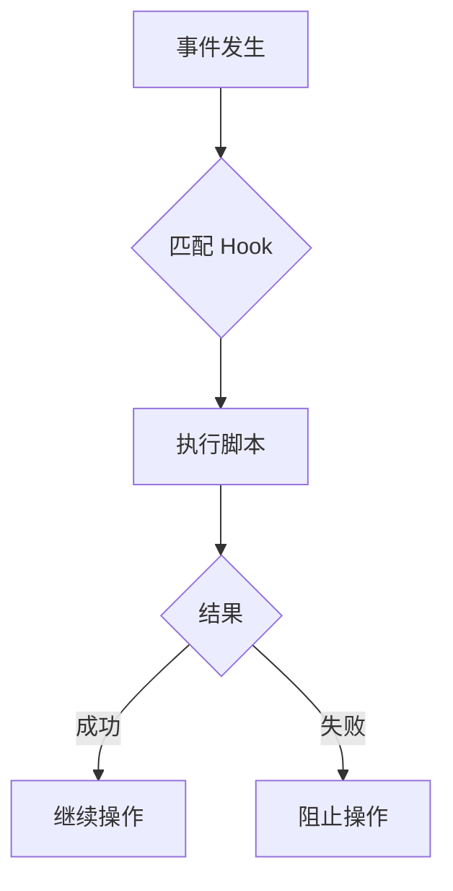
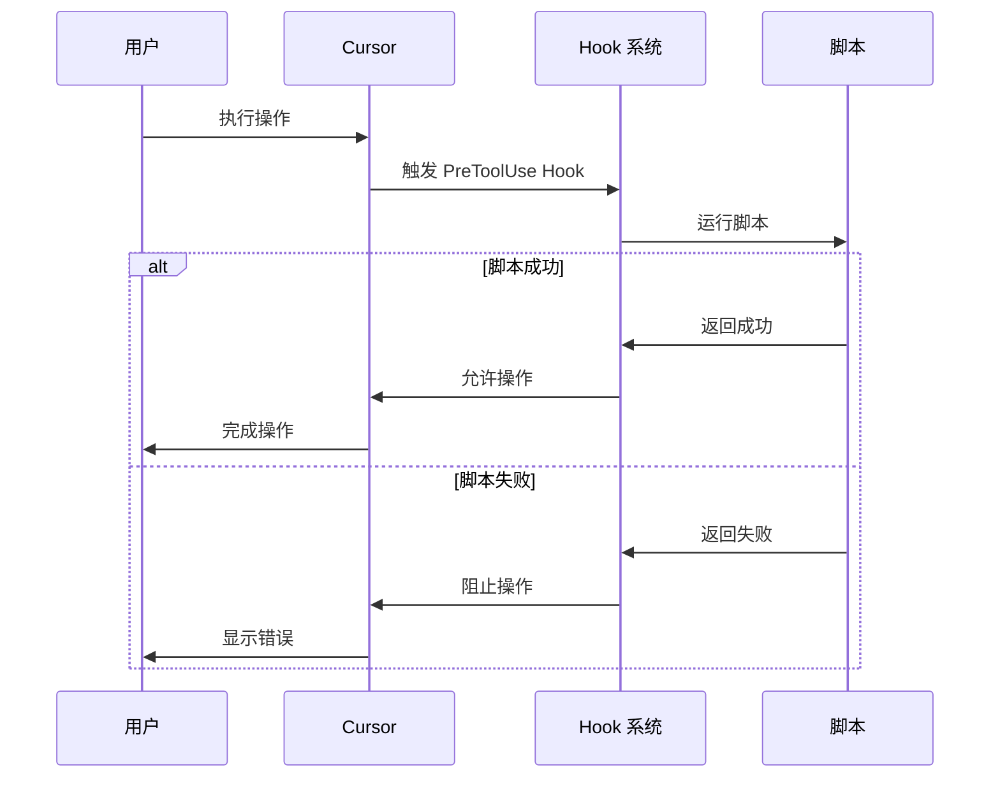

# 11. Hooks

> **级别：** 高级 | **时间：** 45 分钟 | **前置条件：** 熟悉 Cursor 基础功能

---

## 目录

- [概述](#概述)
- [什么是 Hooks](#什么是-hooks)
- [Hook 类型](#hook-类型)
- [配置 Hooks](#配置-hooks)
- [常用 Hook 示例](#常用-hook-示例)
- [最佳实践](#最佳实践)

---

## 概述

Hooks 是 Cursor 的**事件驱动自动化系统**。它们：

- 在特定事件时触发
- 执行自定义脚本
- 可以验证、修改或通知



---

## 什么是 Hooks

### 工作原理



### Hooks 能做什么

```
✅ 代码格式化
✅ 测试运行
✅ 安全扫描
✅ 日志记录
✅ 通知发送
✅ 权限验证
```

---

## Hook 类型

### Tool Hooks

| Hook | 触发时机 | 用途 |
|------|----------|------|
| `PreToolUse` | 工具使用前 | 验证、修改输入 |
| `PostToolUse` | 工具使用后 | 处理输出、通知 |
| `PostToolUseFailure` | 工具失败后 | 错误处理 |
| `PermissionRequest` | 权限请求时 | 自定义权限 |

### Session Hooks

| Hook | 触发时机 | 用途 |
|------|----------|------|
| `SessionStart` | 会话开始 | 初始化 |
| `SessionEnd` | 会话结束 | 清理、报告 |
| `Stop` | 停止时 | 保存状态 |
| `SubagentStart` | Subagent 启动 | 日志 |
| `SubagentStop` | Subagent 停止 | 结果处理 |

### Task Hooks

| Hook | 触发时机 | 用途 |
|------|----------|------|
| `UserPromptSubmit` | 用户提交提示 | 验证、修改 |
| `TaskCompleted` | 任务完成 | 通知、报告 |
| `TaskCreated` | 任务创建 | 日志 |

### Lifecycle Hooks

| Hook | 触发时机 | 用途 |
|------|----------|------|
| `ConfigChange` | 配置变更 | 验证 |
| `CwdChanged` | 目录变更 | 更新状态 |
| `FileChanged` | 文件变更 | 自动处理 |
| `PreCompact` | 压缩前 | 备份 |
| `PostCompact` | 压缩后 | 验证 |

---

## 配置 Hooks

### 配置文件位置

```
用户目录/
└── .cursor/
    ├── hooks/
    │   ├── format-code.sh
    │   └── security-scan.sh
    └── settings.json
```

### settings.json 配置

```json
{
  "hooks": {
    "PreToolUse": [
      {
        "matcher": "Write",
        "hooks": ["~/.cursor/hooks/format-code.sh"]
      }
    ],
    "PostToolUse": [
      {
        "matcher": "Write",
        "hooks": ["~/.cursor/hooks/security-scan.sh"]
      }
    ]
  }
}
```

### Matcher 规则

```json
{
  "matcher": "Write",           // 匹配 Write 工具
  "matcher": "Write|Edit",      // 匹配 Write 或 Edit
  "matcher": ".*",              // 匹配所有
  "matcher": {
    "tool": "Write",
    "path": "src/**/*.ts"       // 匹配特定路径
  }
}
```

---

## 常用 Hook 示例

### 代码格式化 Hook

```bash
#!/bin/bash
# ~/.cursor/hooks/format-code.sh

# 读取文件路径
FILE_PATH="$1"

# 检查文件类型
if [[ "$FILE_PATH" == *.ts || "$FILE_PATH" == *.tsx ]]; then
    # 运行 Prettier
    npx prettier --write "$FILE_PATH"
    echo "Formatted: $FILE_PATH"
fi

exit 0
```

### Pre-commit 检查 Hook

```bash
#!/bin/bash
# ~/.cursor/hooks/pre-commit.sh

# 运行测试
npm test

if [ $? -ne 0 ]; then
    echo "Tests failed. Commit blocked."
    exit 1
fi

# 运行 lint
npm run lint

if [ $? -ne 0 ]; then
    echo "Lint failed. Commit blocked."
    exit 1
fi

echo "All checks passed."
exit 0
```

### 安全扫描 Hook

```bash
#!/bin/bash
# ~/.cursor/hooks/security-scan.sh

FILE_PATH="$1"

# 检查敏感信息
if grep -E "(password|secret|api_key|token)\s*=\s*['\"]" "$FILE_PATH"; then
    echo "Warning: Potential sensitive data found in $FILE_PATH"
    # 不阻止，只是警告
fi

# 运行安全扫描工具
if command -v bandit &> /dev/null && [[ "$FILE_PATH" == *.py ]]; then
    bandit "$FILE_PATH"
fi

exit 0
```

### 日志记录 Hook

```bash
#!/bin/bash
# ~/.cursor/hooks/log-bash.sh

LOG_FILE="$HOME/.cursor/logs/bash.log"
TIMESTAMP=$(date "+%Y-%m-%d %H:%M:%S")

echo "[$TIMESTAMP] $1" >> "$LOG_FILE"
```

### 通知 Hook

```bash
#!/bin/bash
# ~/.cursor/hooks/notify-team.sh

# 发送 Slack 通知
curl -X POST "$SLACK_WEBHOOK_URL" \
    -H 'Content-Type: application/json' \
    -d '{
        "text": "Task completed by Cursor",
        "attachments": [{
            "text": "'"Task: $1\nStatus: Completed"'"
        }]
    }'
```

---

## 最佳实践

### ✅ 应该做的

1. **快速执行** - Hook 应该快速完成
2. **提供反馈** - 输出有用的信息
3. **处理错误** - 优雅地处理失败
4. **记录日志** - 便于调试
5. **版本控制** - 将脚本纳入 Git

### ❌ 不应该做的

1. **长时间运行** - 避免阻塞操作
2. **忽略错误** - 正确处理失败
3. **过度使用** - 只在必要时使用
4. **硬编码路径** - 使用环境变量

### Hook 脚本模板

```bash
#!/bin/bash
set -e

# 配置
SCRIPT_NAME="my-hook"
LOG_FILE="$HOME/.cursor/logs/${SCRIPT_NAME}.log"

# 日志函数
log() {
    echo "[$(date '+%Y-%m-%d %H:%M:%S')] $1" >> "$LOG_FILE"
}

# 主逻辑
main() {
    local input="$1"
    
    log "Starting $SCRIPT_NAME"
    log "Input: $input"
    
    # 执行操作
    # ...
    
    log "Completed successfully"
    exit 0
}

# 错误处理
trap 'log "Error occurred"; exit 1' ERR

# 运行
main "$@"
```

---

## 下一步

- [12. Plugins](../12-plugins/) - 打包完整功能
- [CATALOG.md](../CATALOG.md) - 浏览功能目录
- [CONTRIBUTING.md](../CONTRIBUTING.md) - 贡献指南

---

<p align="center">
  <a href="../README.md">返回首页</a>
</p>
