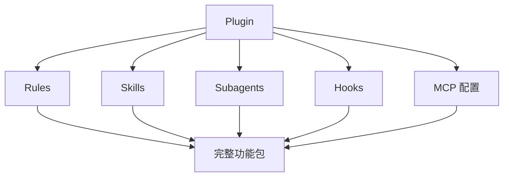

# 12. Plugins

> **级别：** 高级 | **时间：** 45 分钟 | **前置条件：** 熟悉 Cursor 所有功能

---

## 目录

- [概述](#概述)
- [什么是 Plugins](#什么是-plugins)
- [Plugin 结构](#plugin-结构)
- [安装 Plugins](#安装-plugins)
- [创建自定义 Plugin](#创建自定义-plugin)
- [内置 Plugins 示例](#内置-plugins-示例)
- [最佳实践](#最佳实践)

---

## 概述

Plugins 是 Cursor 的**功能打包系统**。它们将：

- Rules
- Skills
- Subagents
- Hooks
- MCP 配置

打包成一个可一键安装的完整解决方案。



---

## 什么是 Plugins

### 与单独功能的区别

| 特性 | 单独功能 | Plugin |
|------|----------|--------|
| **安装** | 逐个配置 | 一键安装 |
| **依赖** | 手动管理 | 自动处理 |
| **更新** | 分别更新 | 统一更新 |
| **分享** | 多个文件 | 单个包 |

### Plugin 能做什么

```
✅ 完整开发环境
✅ 代码审查流水线
✅ 文档生成系统
✅ DevOps 自动化
✅ 安全审计套件
```

---

## Plugin 结构

### 目录结构

```
my-plugin/
├── plugin.json          # Plugin 配置（必需）
├── README.md            # 说明文档
├── rules/               # Rules 文件
│   ├── general.mdc
│   └── frontend.mdc
├── skills/              # Skills 文件
│   └── code-review/
│       └── SKILL.md
├── agents/              # Subagents 文件
│   └── reviewer.md
├── hooks/               # Hooks 脚本
│   └── pre-commit.sh
└── mcp/                 # MCP 配置
    └── github.json
```

### plugin.json 格式

```json
{
  "name": "code-review-plugin",
  "version": "1.0.0",
  "description": "完整的代码审查解决方案",
  "author": "Your Name",
  "repository": "https://github.com/user/code-review-plugin",
  "cursorVersion": ">=0.48.0",
  "dependencies": {
    "prettier": "^3.0.0",
    "eslint": "^8.0.0"
  },
  "features": {
    "rules": true,
    "skills": true,
    "agents": true,
    "hooks": true,
    "mcp": true
  }
}
```

---

## 安装 Plugins

### 从市场安装

```
命令面板 → "Cursor: Install Plugin"
搜索并选择 Plugin
```

### 从本地安装

```bash
# 复制 Plugin 到项目
cp -r /path/to/plugin ~/.cursor/plugins/

# 或在项目中
cp -r /path/to/plugin .cursor/plugins/
```

### 从 Git 安装

```bash
# 克隆到 plugins 目录
git clone https://github.com/user/plugin.git ~/.cursor/plugins/plugin-name
```

---

## 创建自定义 Plugin

### 示例：代码审查 Plugin

#### plugin.json

```json
{
  "name": "pr-review",
  "version": "1.0.0",
  "description": "PR 代码审查完整解决方案",
  "author": "Your Name",
  "cursorVersion": ">=0.48.0",
  "features": {
    "rules": true,
    "skills": true,
    "agents": true,
    "hooks": true,
    "mcp": true
  }
}
```

#### rules/review.mdc

```markdown
---
description: PR 审查规则
globs: ["**/*"]
---

# PR 审查规则

## 审查项目
- 代码质量
- 测试覆盖
- 文档完整
- 安全检查
```

#### skills/review/SKILL.md

```markdown
---
name: PR Review
description: 自动 PR 审查
triggers:
  - type: command
    command: "/pr-review"
---

# PR Review Skill

## 功能
自动审查 PR 并生成报告。
```

#### agents/reviewer.md

```markdown
---
name: Code Reviewer
description: 代码审查 Agent
---

# Code Reviewer Agent

## 专长
- 代码质量分析
- 最佳实践建议
```

#### hooks/pre-commit.sh

```bash
#!/bin/bash
npm test && npm run lint
```

#### mcp/github.json

```json
{
  "mcpServers": {
    "github": {
      "command": "npx",
      "args": ["-y", "@modelcontextprotocol/server-github"],
      "env": {
        "GITHUB_TOKEN": "${GITHUB_TOKEN}"
      }
    }
  }
}
```

---

## 内置 Plugins 示例

### pr-review

```
功能: PR 代码审查
包含: Rules + Skills + Agents + MCP
用途: 自动化 PR 审查流程
```

### devops-automation

```
功能: DevOps 自动化
包含: Skills + Hooks + MCP
用途: 部署、监控自动化
```

### documentation

```
功能: 文档生成
包含: Skills + Agents
用途: 自动生成 API 文档
```

---

## 最佳实践

### ✅ 应该做的

1. **明确功能范围** - 每个 Plugin 有清晰定位
2. **版本管理** - 使用语义化版本
3. **文档完善** - 提供详细使用说明
4. **依赖声明** - 明确列出依赖
5. **测试覆盖** - 确保 Plugin 可靠

### ❌ 不应该做的

1. **功能重叠** - 避免多个 Plugin 做同样的事
2. **过度依赖** - 减少外部依赖
3. **忽略兼容性** - 标明支持的 Cursor 版本
4. **缺少文档** - 提供完整的使用说明

### Plugin 发布流程


---

## 下一步

- [CATALOG.md](../CATALOG.md) - 浏览功能目录
- [CONTRIBUTING.md](../CONTRIBUTING.md) - 贡献指南
- [README.md](../README.md) - 返回首页

---

<p align="center">
  <a href="../README.md">返回首页</a>
</p>
