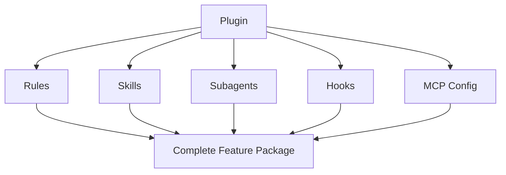
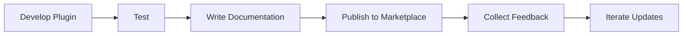

# 12. Plugins

> **Level:** Advanced | **Time:** 45 minutes | **Prerequisites:** Familiarity with all Cursor features

---

## Table of Contents

- [Overview](#overview)
- [What are Plugins](#what-are-plugins)
- [Plugin Structure](#plugin-structure)
- [Installing Plugins](#installing-plugins)
- [Creating Custom Plugins](#creating-custom-plugins)
- [Built-in Plugins Examples](#built-in-plugins-examples)
- [Best Practices](#best-practices)

---

## Overview

Plugins are Cursor's **feature packaging system**. They bundle:

- Rules
- Skills
- Subagents
- Hooks
- MCP Configuration

Into a complete solution that can be installed with one click.



---

## What are Plugins

### Difference from Individual Features

| Feature | Individual Features | Plugin |
|---------|---------------------|--------|
| **Installation** | Configure one by one | One-click install |
| **Dependencies** | Manual management | Auto handling |
| **Updates** | Update separately | Unified update |
| **Sharing** | Multiple files | Single package |

### What Plugins Can Do

```
✅ Complete development environment
✅ Code review pipeline
✅ Documentation generation system
✅ DevOps automation
✅ Security audit suite
```

---

## Plugin Structure

### Directory Structure

```
my-plugin/
├── plugin.json          # Plugin configuration (required)
├── README.md            # Documentation
├── rules/               # Rules files
│   ├── general.mdc
│   └── frontend.mdc
├── skills/              # Skills files
│   └── code-review/
│       └── SKILL.md
├── agents/              # Subagents files
│   └── reviewer.md
├── hooks/               # Hooks scripts
│   └── pre-commit.sh
└── mcp/                 # MCP configuration
    └── github.json
```

### plugin.json Format

```json
{
  "name": "code-review-plugin",
  "version": "1.0.0",
  "description": "Complete code review solution",
  "author": "Your Name",
  "repository": "https://github.com/user/code-review-plugin",
  "cursorVersion": ">=0.48.0",
  "dependencies": {
    "prettier": "^3.0.0",
    "eslint": "^8.0.0"
  },
  "features": {
    "rules": true,
    "skills": true,
    "agents": true,
    "hooks": true,
    "mcp": true
  }
}
```

---

## Installing Plugins

### From Marketplace

```
Command Palette → "Cursor: Install Plugin"
Search and select Plugin
```

### From Local

```bash
# Copy Plugin to project
cp -r /path/to/plugin ~/.cursor/plugins/

# Or in project
cp -r /path/to/plugin .cursor/plugins/
```

### From Git

```bash
# Clone to plugins directory
git clone https://github.com/user/plugin.git ~/.cursor/plugins/plugin-name
```

---

## Creating Custom Plugins

### Example: Code Review Plugin

#### plugin.json

```json
{
  "name": "pr-review",
  "version": "1.0.0",
  "description": "Complete PR code review solution",
  "author": "Your Name",
  "cursorVersion": ">=0.48.0",
  "features": {
    "rules": true,
    "skills": true,
    "agents": true,
    "hooks": true,
    "mcp": true
  }
}
```

#### rules/review.mdc

```markdown
---
description: PR review rules
globs: ["**/*"]
---

# PR Review Rules

## Review Items
- Code quality
- Test coverage
- Documentation completeness
- Security check
```

#### skills/review/SKILL.md

```markdown
---
name: PR Review
description: Automatic PR review
triggers:
  - type: command
    command: "/pr-review"
---

# PR Review Skill

## Function
Automatically review PR and generate report.
```

#### agents/reviewer.md

```markdown
---
name: Code Reviewer
description: Code review Agent
---

# Code Reviewer Agent

## Expertise
- Code quality analysis
- Best practice recommendations
```

#### hooks/pre-commit.sh

```bash
#!/bin/bash
npm test && npm run lint
```

#### mcp/github.json

```json
{
  "mcpServers": {
    "github": {
      "command": "npx",
      "args": ["-y", "@modelcontextprotocol/server-github"],
      "env": {
        "GITHUB_TOKEN": "${GITHUB_TOKEN}"
      }
    }
  }
}
```

---

## Built-in Plugins Examples

### pr-review

```
Function: PR code review
Contains: Rules + Skills + Agents + MCP
Usage: Automate PR review process
```

### devops-automation

```
Function: DevOps automation
Contains: Skills + Hooks + MCP
Usage: Deployment, monitoring automation
```

### documentation

```
Function: Documentation generation
Contains: Skills + Agents
Usage: Auto-generate API documentation
```

---

## Best Practices

### ✅ Do's

1. **Clear Feature Scope** - Each Plugin has a clear purpose
2. **Version Management** - Use semantic versioning
3. **Complete Documentation** - Provide detailed usage instructions
4. **Declare Dependencies** - Clearly list dependencies
5. **Test Coverage** - Ensure Plugin reliability

### ❌ Don'ts

1. **Feature Overlap** - Avoid multiple Plugins doing the same thing
2. **Excessive Dependencies** - Minimize external dependencies
3. **Ignore Compatibility** - Specify supported Cursor versions
4. **Missing Documentation** - Provide complete usage instructions

### Plugin Publishing Process



---

## Next Steps

- [CATALOG.md](../CATALOG.md) - Browse feature catalog
- [CONTRIBUTING.md](../CONTRIBUTING.md) - Contribution guide
- [README.md](../README.md) - Back to home

---

<p align="center">
  <a href="../README.md">Back to Home</a>
</p>
