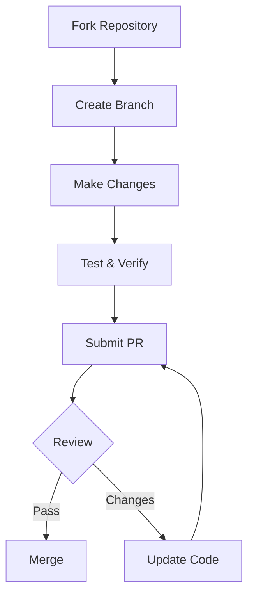
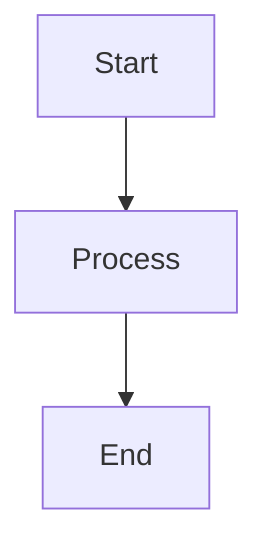
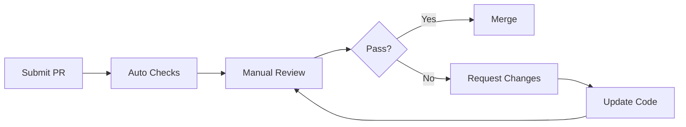

# Contributing Guide

Thank you for considering contributing to the Cursor Usage Guide!

---

## Table of Contents

- [Code of Conduct](#code-of-conduct)
- [How to Contribute](#how-to-contribute)
- [Development Setup](#development-setup)
- [Directory Structure](#directory-structure)
- [Writing Guidelines](#writing-guidelines)
- [Commit Conventions](#commit-conventions)
- [Pull Request Process](#pull-request-process)

---

## Code of Conduct

### Our Pledge

To foster an open and friendly environment, we pledge to:

- Use inclusive language
- Respect different viewpoints and experiences
- Gracefully accept constructive criticism
- Focus on what's best for the community
- Show empathy towards other community members

### Unacceptable Behavior

- Using sexualized language or imagery
- Trolling, insulting/derogatory comments, and personal attacks
- Public or private harassment
- Publishing others' private information without permission
- Other conduct that could reasonably be considered inappropriate in a professional setting

---

## How to Contribute

### Types of Contributions

We welcome the following types of contributions:

| Type | Description | Example |
|------|-------------|---------|
| **Examples** | New usage examples | New workflow examples |
| **Documentation** | Documentation improvements | Fix typos, improve explanations |
| **Features** | New feature suggestions | New Skill templates |
| **Bugs** | Bug fixes | Fix errors in documentation |
| **Feedback** | Usage feedback | Suggest improvements |

### Contribution Process



---

## Development Setup

### Requirements

- Git
- Text editor (Cursor recommended)
- Basic Markdown knowledge

### Clone Repository

```bash
# Clone after forking
git clone https://github.com/YOUR_USERNAME/cursor-howto.git
cd cursor-howto

# Add upstream repository
git remote add upstream https://github.com/original/cursor-howto.git
```

### Keep Synced

```bash
git fetch upstream
git checkout main
git merge upstream/main
```

---

## Directory Structure

```
cursor-howto/
├── 01-shortcuts/           # Shortcuts module
│   ├── README.md           # Module documentation
│   └── *.md                # Related files
├── 02-rules/               # Rules module
├── 03-codebase-indexing/   # Codebase indexing module
├── 04-chat/                # Chat module
├── 05-composer/            # Composer module
├── 06-mcp/                 # MCP module
├── 07-advanced-features/   # Advanced features module
├── 08-best-practices/      # Best practices module
├── 09-skills/              # Skills module
├── 10-subagents/           # Subagents module
├── 11-hooks/               # Hooks module
├── 12-plugins/             # Plugins module
├── CATALOG.md              # Feature catalog
├── CONTRIBUTING.md         # This file
└── README.md               # Main documentation
```

### Adding New Content

1. **New Module Examples** - Add to corresponding module directory
2. **New Templates** - Add to corresponding module directory
3. **Documentation Improvements** - Directly edit related files

---

## Writing Guidelines

### Markdown Standards

```markdown
# Level 1 Heading (one per file)

## Level 2 Heading (main sections)

### Level 3 Heading (subsections)

#### Level 4 Heading (details)

**Bold** for emphasizing important content
*Italic* for terminology
`Code` for commands and code snippets

> Blockquotes for important notes

- Unordered lists
- For listing items

1. Ordered lists
2. For steps
```

### Document Structure Template

```markdown
# Module Title

> **Level:** Beginner/Intermediate/Advanced | **Time:** XX minutes | **Prerequisites:** XXX

---

## Table of Contents

- [Overview](#overview)
- [Core Content](#core-content)
- [Practical Examples](#practical-examples)
- [Best Practices](#best-practices)
- [Troubleshooting](#troubleshooting)

---

## Overview

[Brief description of module content and goals]

---

## Core Content

[Detailed content]

---

## Practical Examples

[Specific examples]

---

## Best Practices

### ✅ Do's

### ❌ Don'ts

---

## Troubleshooting

[Common issues and solutions]

---

## Next Steps

- [Next Module](../next-module/)

---

<p align="center">
  <a href="../README.md">Back to Home</a>
</p>
```

### Writing Principles

1. **Clear and Concise** - Avoid wordy sentences
2. **Structured** - Use headings and lists to organize content
3. **Example-Driven** - Provide runnable code examples
4. **Visual** - Use Mermaid diagrams
5. **Practical** - Provide copy-paste templates

### Mermaid Diagrams

```markdown

```

---

## Commit Conventions

### Commit Message Format

```
<type>(<scope>): <subject>

<body>

<footer>
```

### Type Categories

| Type | Description | Example |
|------|-------------|---------|
| `feat` | New feature | Add new Skill template |
| `fix` | Bug fix | Fix error in documentation |
| `docs` | Documentation update | Update README |
| `style` | Format adjustment | Fix Markdown formatting |
| `refactor` | Refactoring | Reorganize directory structure |
| `test` | Testing | Add tests |
| `chore` | Miscellaneous | Update dependencies |

### Example

```
feat(skills): Add code review Skill template

- Add code-review Skill
- Include review rules and output template
- Provide usage examples

Closes #123
```

---

## Pull Request Process

### Pre-PR Checklist

```
□ Code style follows conventions
□ Documentation format is correct
□ All links are valid
□ No sensitive information
□ Commit messages follow conventions
```

### PR Template

```markdown
## Description

[Describe the purpose and content of this PR]

## Change Type

- [ ] Documentation update
- [ ] New example
- [ ] Bug fix
- [ ] New feature

## Checklist

- [ ] I have read the contributing guide
- [ ] My code follows project style
- [ ] I have updated related documentation
- [ ] All links have been verified

## Related Issue

Closes #XXX
```

### Review Process



---

## Getting Help

- Open an Issue to ask questions
- Discuss in Discussions
- Learn from existing PRs

---

## License

By contributing code, you agree that your contributions will be licensed under the MIT License.

---

<p align="center">
  Thank you for your contribution!
</p>
