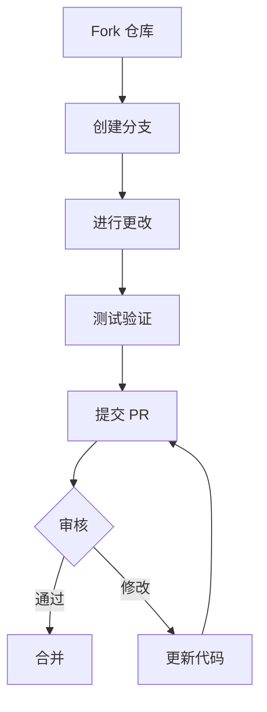
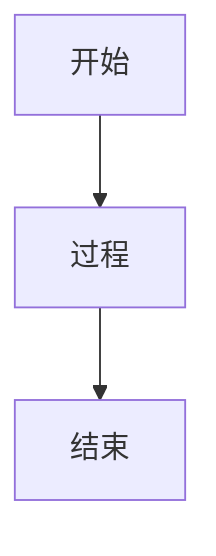
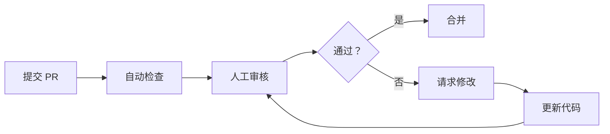

# 贡献指南

感谢你考虑为 Cursor 使用指南做出贡献！

---

## 目录

- [行为准则](#行为准则)
- [如何贡献](#如何贡献)
- [开发设置](#开发设置)
- [目录结构](#目录结构)
- [写作指南](#写作指南)
- [提交规范](#提交规范)
- [Pull Request 流程](#pull-request-流程)

---

## 行为准则

### 我们的承诺

为了营造一个开放和友好的环境，我们承诺：

- 使用包容性语言
- 尊重不同的观点和经验
- 优雅地接受建设性批评
- 关注对社区最有利的事情
- 对其他社区成员表示同理心

### 不可接受的行为

- 使用性化的语言或图像
- 挑衅、侮辱/贬损评论和人身攻击
- 公开或私下骚扰
- 未经许可发布他人的私人信息
- 其他在专业环境中可能被合理认为不适当的行为

---

## 如何贡献

### 贡献类型

我们欢迎以下类型的贡献：

| 类型 | 描述 | 示例 |
|------|------|------|
| **示例** | 新的使用示例 | 新的工作流示例 |
| **文档** | 文档改进 | 修正错别字、改进说明 |
| **功能** | 新功能建议 | 新的 Skill 模板 |
| **Bug** | 错误修复 | 修复文档中的错误 |
| **反馈** | 使用反馈 | 提出改进建议 |

### 贡献流程



---

## 开发设置

### 环境要求

- Git
- 文本编辑器（推荐 Cursor）
- Markdown 基础知识

### 克隆仓库

```bash
# Fork 后克隆
git clone https://github.com/YOUR_USERNAME/cursor-howto.git
cd cursor-howto

# 添加上游仓库
git remote add upstream https://github.com/original/cursor-howto.git
```

### 保持同步

```bash
git fetch upstream
git checkout main
git merge upstream/main
```

---

## 目录结构

```
cursor-howto/
├── 01-shortcuts/           # 快捷键模块
│   ├── README.md           # 模块文档
│   └── *.md                # 相关文件
├── 02-rules/               # Rules 模块
├── 03-codebase-indexing/   # 代码库索引模块
├── 04-chat/                # 聊天模块
├── 05-composer/            # Composer 模块
├── 06-mcp/                 # MCP 模块
├── 07-advanced-features/   # 高级功能模块
├── 08-best-practices/      # 最佳实践模块
├── 09-skills/              # Skills 模块
├── 10-subagents/           # Subagents 模块
├── 11-hooks/               # Hooks 模块
├── 12-plugins/             # Plugins 模块
├── CATALOG.md              # 功能目录
├── CONTRIBUTING.md         # 本文件
└── README.md               # 主文档
```

### 添加新内容

1. **新模块示例** - 添加到对应模块目录
2. **新模板** - 添加到对应模块目录
3. **文档改进** - 直接编辑相关文件

---

## 写作指南

### Markdown 规范

```markdown
# 一级标题（每个文件一个）

## 二级标题（主要章节）

### 三级标题（子章节）

#### 四级标题（细节）

**粗体** 用于强调重要内容
*斜体* 用于术语
`代码` 用于命令和代码片段

> 引用用于重要提示

- 无序列表
- 用于列举

1. 有序列表
2. 用于步骤
```

### 文档结构模板

```markdown
# 模块标题

> **级别：** 初学者/中级/高级 | **时间：** XX 分钟 | **前置条件：** XXX

---

## 目录

- [概述](#概述)
- [核心内容](#核心内容)
- [实战示例](#实战示例)
- [最佳实践](#最佳实践)
- [故障排查](#故障排查)

---

## 概述

[简要描述模块内容和目标]

---

## 核心内容

[详细内容]

---

## 实战示例

[具体示例]

---

## 最佳实践

### ✅ 应该做的

### ❌ 不应该做的

---

## 故障排查

[常见问题和解决方案]

---

## 下一步

- [下一模块](../next-module/)

---

<p align="center">
  <a href="../README.md">返回首页</a>
</p>
```

### 写作原则

1. **清晰简洁** - 避免冗长的句子
2. **结构化** - 使用标题和列表组织内容
3. **示例驱动** - 提供可运行的代码示例
4. **视觉化** - 使用 Mermaid 图表
5. **实用** - 提供可复制粘贴的模板

### Mermaid 图表

```markdown

```

---

## 提交规范

### Commit 消息格式

```
<type>(<scope>): <subject>

<body>

<footer>
```

### Type 类型

| Type | 描述 | 示例 |
|------|------|------|
| `feat` | 新功能 | 添加新的 Skill 模板 |
| `fix` | Bug 修复 | 修复文档中的错误 |
| `docs` | 文档更新 | 更新 README |
| `style` | 格式调整 | 修正 Markdown 格式 |
| `refactor` | 重构 | 重组目录结构 |
| `test` | 测试 | 添加测试 |
| `chore` | 杂项 | 更新依赖 |

### 示例

```
feat(skills): 添加代码审查 Skill 模板

- 添加 code-review Skill
- 包含审查规则和输出模板
- 提供使用示例

Closes #123
```

---

## Pull Request 流程

### 创建 PR 前检查

```
□ 代码风格符合规范
□ 文档格式正确
□ 所有链接有效
□ 没有敏感信息
□ Commit 消息规范
```

### PR 模板

```markdown
## 描述

[描述这个 PR 的目的和内容]

## 变更类型

- [ ] 文档更新
- [ ] 新示例
- [ ] Bug 修复
- [ ] 新功能

## 检查清单

- [ ] 我已阅读贡献指南
- [ ] 我的代码遵循项目风格
- [ ] 我已更新相关文档
- [ ] 所有链接都已验证

## 相关 Issue

Closes #XXX
```

### 审核流程



---

## 获取帮助

- 开 Issue 提问
- 在 Discussions 中讨论
- 查看现有 PR 学习

---

## 许可证

通过贡献代码，你同意你的贡献将根据 MIT 许可证授权。

---

<p align="center">
  感谢你的贡献！
</p>
