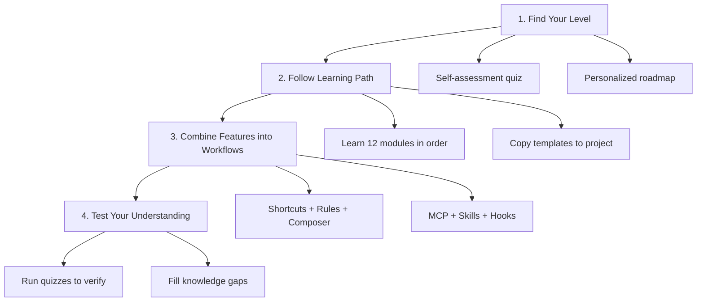

# Cursor How-To Guide

> Master Cursor AI Editor in a Weekend — From basic operations to advanced Agent workflows, with visual tutorials, copy-paste templates, and a progressive learning path.

[Get Started in 15 Minutes](#get-started-in-15-minutes) | [Find Your Level](#find-your-level) | [Browse Feature Catalog](CATALOG.md)

---

## Table of Contents

- [The Problem](#the-problem)
- [How This Guide Fixes It](#how-this-guide-fixes-it)
- [How It Works](#how-it-works)
- [Find Your Level](#find-your-level)
- [Get Started in 15 Minutes](#get-started-in-15-minutes)
- [What Can You Build](#what-can-you-build)
- [Feature Comparison](#feature-comparison)
- [Quick Reference](#quick-reference)
- [Directory Structure](#directory-structure)
- [Best Practices](#best-practices)
- [Troubleshooting](#troubleshooting)
- [Contributing](#contributing)

---

## The Problem

You installed Cursor, used AI completion a few times, and then what?

- **Official docs describe features but don't teach how to combine them** — You know `Cmd+K` can generate code, but not how to chain it with Rules, Composer, and MCP into an automated workflow
- **No clear learning path** — Should you learn Rules or Composer first? MCP or Skills? You end up skimming everything and mastering nothing
- **Examples are too basic** — A simple code completion example doesn't help you build a production-grade code review pipeline

**You're leaving 90% of Cursor's power on the table — and you don't know what you don't know.**

---

## How This Guide Fixes It

This isn't another feature reference. It's a **structured, visual, example-driven guide** that teaches you to use every Cursor feature with real-world templates you can copy into your project today.

| Dimension | Official Docs | This Guide |
|-----------|---------------|------------|
| **Format** | Reference documentation | Visual tutorials + Mermaid diagrams |
| **Depth** | Feature descriptions | Under-the-hood mechanics |
| **Examples** | Basic snippets | Production-ready templates, ready to use |
| **Structure** | Feature-organized | Progressive learning path (beginner to advanced) |
| **Self-assessment** | None | Built-in quizzes to identify knowledge gaps |

**You'll get:**

- **12 tutorial modules** — Covering every Cursor feature, from shortcuts to custom Agents
- **Copy-paste configurations** — Rules templates, Skills definitions, MCP configs, Hooks scripts, complete plugin bundles
- **Mermaid diagrams** — Showing how each feature works internally, so you understand "why" not just "how"
- **Progressive learning path** — From beginner to power user, estimated 10-12 hours
- **Built-in self-assessment** — Run quizzes directly in Cursor to identify gaps

---

## How It Works



### 1. Find Your Level

Take the self-assessment quiz to get a personalized learning roadmap based on what you already know.

### 2. Follow Learning Path

Work through 12 modules in order — each builds on the last. Copy templates directly to your project as you learn.

### 3. Combine Features into Workflows

The real power is in combining features. Learn to wire shortcuts + Rules + Composer + MCP + Hooks into automated pipelines for code reviews, deployments, and documentation generation.

### 4. Test Your Understanding

Run quizzes after each module. Quizzes pinpoint what you missed so you can fill gaps fast.

---

## Find Your Level

Take the self-assessment or pick your level:

| Level | You Can... | Start Here | Time |
|-------|------------|------------|------|
| **Beginner** | Open Cursor and use basic completion | Shortcuts | ~2 hours |
| **Intermediate** | Use Rules and Chat | Composer | ~3.5 hours |
| **Advanced** | Configure MCP and Skills | Advanced Features | ~5 hours |

### Complete Learning Path

| Order | Module | Level | Time |
|-------|--------|-------|------|
| 1 | [Shortcuts](01-shortcuts/) | Beginner | 30 min |
| 2 | [Rules System](02-rules/) | Beginner+ | 45 min |
| 3 | [Codebase Indexing](03-codebase-indexing/) | Beginner+ | 30 min |
| 4 | [Chat](04-chat/) | Intermediate | 45 min |
| 5 | [Composer](05-composer/) | Intermediate | 1 hour |
| 6 | [MCP Integration](06-mcp/) | Intermediate+ | 1 hour |
| 7 | [Advanced Features](07-advanced-features/) | Advanced | 1.5 hours |
| 8 | [Best Practices](08-best-practices/) | Advanced | 1 hour |
| 9 | [Skills](09-skills/) | Advanced | 1 hour |
| 10 | [Subagents](10-subagents/) | Advanced | 1 hour |
| 11 | [Hooks](11-hooks/) | Advanced | 45 min |
| 12 | [Plugins](12-plugins/) | Advanced | 45 min |

---

## Get Started in 15 Minutes

```bash
# 1. Clone the guide
git clone https://github.com/DDR187/cursor-howto.git
cd cursor-howto

# 2. Copy your first Rules file
cp 02-rules/project-.cursorrules /path/to/your-project/.cursorrules

# 3. In Cursor, open your project and try:
# - Press Cmd+K (Mac) or Ctrl+K (Windows) for inline edit
# - Press Cmd+L (Mac) or Ctrl+L (Windows) for chat panel
# - Press Cmd+I (Mac) or Ctrl+I (Windows) for Composer

# 4. Ready for more? Set up project Rules:
cp 02-rules/project-.cursorrules /path/to/your-project/.cursorrules

# 5. Install a Skill:
cp -r 09-skills/code-review /path/to/your-project/.cursor/skills/
```

### 1-Hour Essential Setup

```bash
# Rules configuration (15 min)
cp 02-rules/*.md /path/to/your-project/.cursor/rules/

# Project-level Rules (15 min)
cp 02-rules/project-.cursorrules /path/to/your-project/.cursorrules

# Install a Skill (15 min)
cp -r 09-skills/code-review /path/to/your-project/.cursor/skills/

# Weekend goal: add MCP, Hooks, and Plugins
# Follow the learning path for guided setup
```

---

## What Can You Build

| Use Case | Combined Features |
|----------|-------------------|
| **Automated Code Review** | Rules + Composer + MCP + Skills |
| **Team Onboarding** | Rules + Plugins + Doc Templates |
| **CI/CD Automation** | CLI + Hooks + Background Tasks |
| **Documentation Generation** | Skills + Subagents + Plugins |
| **Security Audit** | Subagents + Skills + Hooks (read-only mode) |
| **DevOps Pipeline** | Plugins + MCP + Hooks + Background Tasks |
| **Complex Refactoring** | Composer + Plan Mode + Rules |

---

## Feature Comparison

| Feature | Invocation | Persistence | Best For |
|---------|------------|-------------|----------|
| **Shortcuts** | Manual (Cmd+K/L/I) | Session only | Quick edits and queries |
| **Rules** | Auto-loaded | Cross-session | Long-term project standards |
| **Skills** | Auto-triggered | Filesystem | Automated workflows |
| **Subagents** | Auto-delegated | Isolated context | Task distribution |
| **MCP** | Auto-queried | Real-time | Live data access |
| **Hooks** | Event-triggered | Configured | Automation and validation |
| **Plugins** | One-click install | All features | Complete solutions |
| **Composer** | Manual/Auto | Session snapshots | Multi-file editing |

---

## Quick Reference

### Shortcuts

| Shortcut | Mac | Windows | Function |
|----------|-----|---------|----------|
| Inline Edit | `Cmd+K` | `Ctrl+K` | Inline code generation/modification |
| Chat Panel | `Cmd+L` | `Ctrl+L` | AI Q&A dialogue |
| Composer | `Cmd+I` | `Ctrl+I` | Multi-file editing mode |
| Command Palette | `Cmd+Shift+P` | `Ctrl+Shift+P` | Quick command access |
| Settings | `Cmd+,` | `Ctrl+,` | Open settings |

### Rules Hierarchy

```
project-root/
├── .cursorrules          # Project-level rules (deprecated)
├── .cursor/
│   └── rules/            # New rules directory
│       ├── general.mdc   # General rules
│       ├── frontend.mdc  # Frontend rules
│       └── backend.mdc   # Backend rules
└── ...
```

### MCP Configuration Example

```json
{
  "mcpServers": {
    "github": {
      "command": "npx",
      "args": ["-y", "@modelcontextprotocol/server-github"],
      "env": {
        "GITHUB_TOKEN": "your_token"
      }
    }
  }
}
```

### Skills Structure

```
.cursor/skills/
└── code-review/
    ├── SKILL.md          # Skill definition
    ├── scripts/          # Helper scripts
    └── templates/        # Template files
```

---

## Directory Structure

```
cursor-howto/
├── 01-shortcuts/           # Shortcuts tutorial
│   ├── README.md
│   └── shortcuts-cheatsheet.md
├── 02-rules/               # Rules system
│   ├── README.md
│   ├── project-.cursorrules
│   ├── frontend-rules.mdc
│   └── backend-rules.mdc
├── 03-codebase-indexing/   # Codebase indexing
│   ├── README.md
│   └── indexing-config.md
├── 04-chat/                # Chat functionality
│   ├── README.md
│   └── chat-templates.md
├── 05-composer/            # Composer multi-file editing
│   ├── README.md
│   └── composer-workflows.md
├── 06-mcp/                 # MCP integration
│   ├── README.md
│   ├── github-mcp.json
│   └── database-mcp.json
├── 07-advanced-features/   # Advanced features
│   ├── README.md
│   ├── plan-mode.md
│   └── parallel-agents.md
├── 08-best-practices/      # Best practices
│   ├── README.md
│   └── workflow-examples.md
├── 09-skills/              # Skills
│   ├── README.md
│   └── code-review/
├── 10-subagents/           # Subagents
│   ├── README.md
│   └── templates/
├── 11-hooks/               # Hooks
│   ├── README.md
│   └── scripts/
├── 12-plugins/             # Plugins
│   ├── README.md
│   └── examples/
├── CATALOG.md              # Feature catalog
├── CONTRIBUTING.md         # Contributing guide
└── README.md               # This file
```

---

## Best Practices

### ✅ Do's

- Start with shortcuts, add features incrementally
- Use Rules to document team coding standards
- Test configurations locally first
- Document custom implementations
- Version control project configurations
- Share Plugins with team

### ❌ Don'ts

- Create redundant features
- Hardcode credentials
- Skip documentation
- Over-complicate simple tasks
- Ignore security best practices
- Commit sensitive data

---

## Troubleshooting

### Feature Not Loading

1. Check file location and naming
2. Verify YAML frontmatter syntax
3. Check file permissions
4. Check Cursor version compatibility

### MCP Connection Failed

1. Verify environment variables
2. Check MCP server installation
3. Test credentials
4. Check network connection

### Composer Not Working as Expected

1. Check if task description is clear
2. Verify file paths are correct
3. Check if project Rules conflict
4. Try splitting into smaller tasks

### Subagent Not Delegating

1. Check tool permissions
2. Verify agent description clarity
3. Check task complexity
4. Test agent independently

---

## Contributing

Found an issue or want to contribute an example? We'd love your help!

Please read [CONTRIBUTING.md](CONTRIBUTING.md) for detailed guidelines:

- Contribution types (examples, docs, features, bugs, feedback)
- How to set up development environment
- Directory structure and how to add content
- Writing guidelines and best practices
- Commit and PR process

Quick start:

1. Fork and clone the repository
2. Create a descriptive branch (add/feature-name, fix/bug, docs/improvement)
3. Make changes following the guidelines
4. Submit a Pull Request with a clear description

Need help? Open an issue or discussion, and we'll guide you through the process.

---

## License

MIT License - See [LICENSE](LICENSE). Free to use, modify, and distribute. The only requirement is including the license notice.

---

**Last Updated:** April 2026  
**Cursor Version:** 0.48+  
**Compatible Models:** Claude 4.6 Sonnet/Opus, GPT-5.4, Gemini 3.1 Pro, Grok 4.2

---

<p align="center">
  <strong>Start Mastering Cursor Today</strong><br>
  You already have Cursor installed. The only thing between you and 10x productivity is knowing how to use it.<br>
  This guide gives you the structured path, visual explanations, and copy-paste templates to get there.<br><br>
  <a href="01-shortcuts/">Start Learning Path</a> | <a href="CATALOG.md">Browse Feature Catalog</a>
</p>
