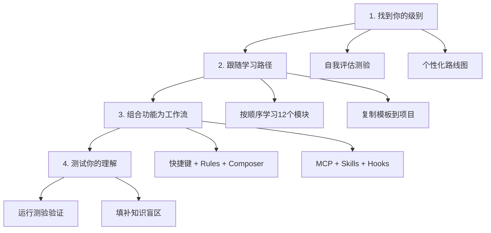

# Cursor 使用指南

> 用一个周末掌握 Cursor AI 编辑器 —— 从基础操作到高级 Agent 工作流，附带可视化教程、可复制模板和渐进式学习路径。

[15分钟快速开始](#15分钟快速开始) | [选择你的级别](#选择你的级别) | [浏览功能目录](CATALOG.md)

---

## 目录

- [核心痛点](#核心痛点)
- [本指南如何解决](#本指南如何解决)
- [工作原理](#工作原理)
- [选择你的级别](#选择你的级别)
- [15分钟快速开始](#15分钟快速开始)
- [你能构建什么](#你能构建什么)
- [功能对比](#功能对比)
- [快速参考](#快速参考)
- [目录结构](#目录结构)
- [最佳实践](#最佳实践)
- [故障排查](#故障排查)
- [贡献指南](#贡献指南)

---

## 核心痛点

你安装了 Cursor，用了几次 AI 补全，然后呢？

- **官方文档只描述功能，不教组合使用** —— 你知道 `Cmd+K` 可以生成代码，但不知道如何与 Rules、Composer、MCP 串联成自动化工作流
- **没有清晰的学习路径** —— 应该先学 Rules 还是 Composer？先配置 MCP 还是 Skills？结果什么都看了一点，什么都没掌握
- **示例太基础** —— 一个简单的代码补全示例，无法帮你构建生产级的代码审查流水线

**你正在浪费 Cursor 90% 的能力 —— 而你不知道自己不知道什么。**

---

## 本指南如何解决

这不是另一个功能参考文档。这是一个**结构化、可视化、示例驱动**的指南，教你使用 Cursor 的每一个功能，并提供可以立即复制到项目中的实战模板。

| 维度 | 官方文档 | 本指南 |
|------|----------|--------|
| **格式** | 参考文档 | 可视化教程 + Mermaid 图表 |
| **深度** | 功能描述 | 底层原理 + 工作机制 |
| **示例** | 基础片段 | 生产就绪模板，立即可用 |
| **结构** | 功能组织 | 渐进式学习路径（初级到高级）|
| **自测** | 无 | 内置测验定位知识盲区 |

**你将获得：**

- **12 个教程模块** —— 覆盖 Cursor 每一个功能，从快捷键到自定义 Agent
- **可复制粘贴的配置** —— Rules 模板、Skills 定义、MCP 配置、Hooks 脚本、完整插件包
- **Mermaid 图表** —— 展示每个功能的内部工作原理，让你理解"为什么"而不只是"怎么做"
- **渐进式学习路径** —— 从初学者到高级用户，预计 10-12 小时
- **内置自我评估** —— 直接在 Cursor 中运行测验，识别知识盲区

---

## 工作原理



### 1. 找到你的级别

进行自我评估测验，根据你已有的知识获得个性化学习路线图。

### 2. 跟随学习路径

按顺序学习 12 个模块 —— 每个模块都建立在前一个的基础上。学习时直接复制模板到你的项目。

### 3. 组合功能为工作流

真正的力量在于功能组合。学习如何将快捷键 + Rules + Composer + MCP + Hooks 连接成自动化流水线，处理代码审查、部署和文档生成。

### 4. 测试你的理解

每个模块后运行测验。测验会精确定位你遗漏的内容，快速填补盲区。

---

## 选择你的级别

进行自我评估或选择你的级别：

| 级别 | 你能... | 从这里开始 | 时间 |
|------|---------|-----------|------|
| **初学者** | 打开 Cursor 并使用基本补全 | 快捷键 | ~2 小时 |
| **中级** | 使用 Rules 和 Chat | Composer | ~3.5 小时 |
| **高级** | 配置 MCP 和 Skills | 高级功能 | ~5 小时 |

### 完整学习路径

| 顺序 | 模块 | 级别 | 时间 |
|------|------|------|------|
| 1 | [快捷键](01-shortcuts/) | 初学者 | 30 分钟 |
| 2 | [规则系统](02-rules/) | 初学者+ | 45 分钟 |
| 3 | [代码库索引](03-codebase-indexing/) | 初学者+ | 30 分钟 |
| 4 | [聊天功能](04-chat/) | 中级 | 45 分钟 |
| 5 | [Composer](05-composer/) | 中级 | 1 小时 |
| 6 | [MCP 集成](06-mcp/) | 中级+ | 1 小时 |
| 7 | [高级功能](07-advanced-features/) | 高级 | 1.5 小时 |
| 8 | [最佳实践](08-best-practices/) | 高级 | 1 小时 |
| 9 | [Skills](09-skills/) | 高级 | 1 小时 |
| 10 | [Subagents](10-subagents/) | 高级 | 1 小时 |
| 11 | [Hooks](11-hooks/) | 高级 | 45 分钟 |
| 12 | [Plugins](12-plugins/) | 高级 | 45 分钟 |

---

## 15分钟快速开始

```bash
# 1. 克隆指南
git clone https://github.com/your-username/cursor-howto.git
cd cursor-howto

# 2. 复制你的第一个 Rules 文件
cp 02-rules/project-.cursorrules /path/to/your-project/.cursorrules

# 3. 在 Cursor 中打开你的项目，尝试：
# - 按 Cmd+K (Mac) 或 Ctrl+K (Windows) 打开内联编辑
# - 按 Cmd+L (Mac) 或 Ctrl+L (Windows) 打开聊天面板
# - 按 Cmd+I (Mac) 或 Ctrl+I (Windows) 打开 Composer

# 4. 准备更多？设置项目 Rules：
cp 02-rules/project-.cursorrules /path/to/your-project/.cursorrules

# 5. 安装一个 Skill：
cp -r 09-skills/code-review /path/to/your-project/.cursor/skills/
```

### 1小时核心设置

```bash
# Rules 配置 (15 分钟)
cp 02-rules/*.md /path/to/your-project/.cursor/rules/

# 项目级 Rules (15 分钟)
cp 02-rules/project-.cursorrules /path/to/your-project/.cursorrules

# 安装 Skill (15 分钟)
cp -r 09-skills/code-review /path/to/your-project/.cursor/skills/

# 周末目标：添加 MCP、Hooks 和 Plugins
# 按照学习路径进行引导式设置
```

---

## 你能构建什么

| 用例 | 组合的功能 |
|------|-----------|
| **自动化代码审查** | Rules + Composer + MCP + Skills |
| **团队入门指南** | Rules + Plugins + 文档模板 |
| **CI/CD 自动化** | CLI + Hooks + 后台任务 |
| **文档生成** | Skills + Subagents + Plugins |
| **安全审计** | Subagents + Skills + Hooks（只读模式）|
| **DevOps 流水线** | Plugins + MCP + Hooks + 后台任务 |
| **复杂重构** | Composer + Plan Mode + Rules |

---

## 功能对比

| 功能 | 调用方式 | 持久性 | 最佳用途 |
|------|----------|--------|----------|
| **快捷键** | 手动 (Cmd+K/L/I) | 仅会话 | 快速编辑和查询 |
| **Rules** | 自动加载 | 跨会话 | 长期项目规范 |
| **Skills** | 自动触发 | 文件系统 | 自动化工作流 |
| **Subagents** | 自动委托 | 隔离上下文 | 任务分发 |
| **MCP** | 自动查询 | 实时 | 实时数据访问 |
| **Hooks** | 事件触发 | 配置 | 自动化和验证 |
| **Plugins** | 一键安装 | 所有功能 | 完整解决方案 |
| **Composer** | 手动/自动 | 会话快照 | 多文件编辑 |

---

## 快速参考

### 快捷键

| 快捷键 | Mac | Windows | 功能 |
|--------|-----|---------|------|
| 内联编辑 | `Cmd+K` | `Ctrl+K` | 行内代码生成/修改 |
| 聊天面板 | `Cmd+L` | `Ctrl+L` | AI 对话问答 |
| Composer | `Cmd+I` | `Ctrl+I` | 多文件编辑模式 |
| 命令面板 | `Cmd+Shift+P` | `Ctrl+Shift+P` | 快速命令访问 |
| 设置 | `Cmd+,` | `Ctrl+,` | 打开设置 |

### Rules 层级

```
项目根目录/
├── .cursorrules          # 项目级规则（即将弃用）
├── .cursor/
│   └── rules/            # 新版规则目录
│       ├── general.mdc   # 通用规则
│       ├── frontend.mdc  # 前端规则
│       └── backend.mdc   # 后端规则
└── ...
```

### MCP 配置示例

```json
{
  "mcpServers": {
    "github": {
      "command": "npx",
      "args": ["-y", "@modelcontextprotocol/server-github"],
      "env": {
        "GITHUB_TOKEN": "your_token"
      }
    }
  }
}
```

### Skills 结构

```
.cursor/skills/
└── code-review/
    ├── SKILL.md          # Skill 定义
    ├── scripts/          # 辅助脚本
    └── templates/        # 模板文件
```

---

## 目录结构

```
cursor-howto/
├── 01-shortcuts/           # 快捷键教程
│   ├── README.md
│   └── shortcuts-cheatsheet.md
├── 02-rules/               # Rules 规则系统
│   ├── README.md
│   ├── project-.cursorrules
│   ├── frontend-rules.mdc
│   └── backend-rules.mdc
├── 03-codebase-indexing/   # 代码库索引
│   ├── README.md
│   └── indexing-config.md
├── 04-chat/                # 聊天功能
│   ├── README.md
│   └── chat-templates.md
├── 05-composer/            # Composer 多文件编辑
│   ├── README.md
│   └── composer-workflows.md
├── 06-mcp/                 # MCP 集成
│   ├── README.md
│   ├── github-mcp.json
│   └── database-mcp.json
├── 07-advanced-features/   # 高级功能
│   ├── README.md
│   ├── plan-mode.md
│   └── parallel-agents.md
├── 08-best-practices/      # 最佳实践
│   ├── README.md
│   └── workflow-examples.md
├── 09-skills/              # Skills 技能
│   ├── README.md
│   └── code-review/
├── 10-subagents/           # Subagents 子代理
│   ├── README.md
│   └── templates/
├── 11-hooks/               # Hooks 钩子
│   ├── README.md
│   └── scripts/
├── 12-plugins/             # Plugins 插件
│   ├── README.md
│   └── examples/
├── CATALOG.md              # 功能目录
├── CONTRIBUTING.md         # 贡献指南
└── README.md               # 本文件
```

---

## 最佳实践

### ✅ 应该做的

- 从快捷键开始，逐步添加功能
- 使用 Rules 记录团队编码规范
- 在本地先测试配置
- 文档化自定义实现
- 版本控制项目配置
- 与团队分享 Plugins

### ❌ 不应该做的

- 创建冗余功能
- 硬编码凭证
- 跳过文档
- 过度复杂化简单任务
- 忽略安全最佳实践
- 提交敏感数据

---

## 故障排查

### 功能未加载

1. 检查文件位置和命名
2. 验证 YAML frontmatter 语法
3. 检查文件权限
4. 检查 Cursor 版本兼容性

### MCP 连接失败

1. 验证环境变量
2. 检查 MCP 服务器安装
3. 测试凭证
4. 检查网络连接

### Composer 未按预期工作

1. 检查任务描述是否清晰
2. 验证文件路径是否正确
3. 检查项目 Rules 是否冲突
4. 尝试拆分为更小的任务

### Subagent 未委托

1. 检查工具权限
2. 验证 agent 描述清晰度
3. 检查任务复杂度
4. 独立测试 agent

---

## 贡献指南

发现问题或想贡献示例？我们欢迎你的帮助！

请阅读 [CONTRIBUTING.md](CONTRIBUTING.md) 了解详细指南：

- 贡献类型（示例、文档、功能、Bug、反馈）
- 如何设置开发环境
- 目录结构和如何添加内容
- 写作指南和最佳实践
- Commit 和 PR 流程

快速开始：

1. Fork 并克隆仓库
2. 创建描述性分支（add/feature-name, fix/bug, docs/improvement）
3. 按照指南进行更改
4. 提交带有清晰描述的 Pull Request

需要帮助？开一个 issue 或讨论，我们会指导你完成流程。

---

## 许可证

MIT License - 详见 [LICENSE](LICENSE)。免费使用、修改和分发。唯一要求是包含许可证声明。

---

**最后更新：** 2026年4月  
**Cursor 版本：** 0.48+  
**兼容模型：** Claude 4.6 Sonnet/Opus, GPT-5.4, Gemini 3.1 Pro, Grok 4.2

---

<p align="center">
  <strong>今天开始掌握 Cursor</strong><br>
  你已经安装了 Cursor。你和 10 倍效率之间的唯一障碍是知道如何使用它。<br>
  本指南为你提供结构化路径、可视化解释和可复制模板。<br><br>
  <a href="01-shortcuts/">开始学习路径</a> | <a href="CATALOG.md">浏览功能目录</a>
</p>
